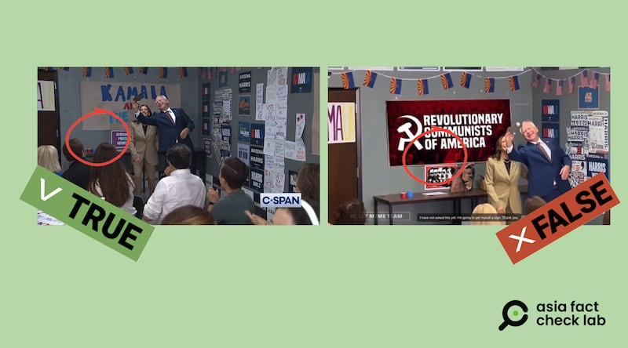
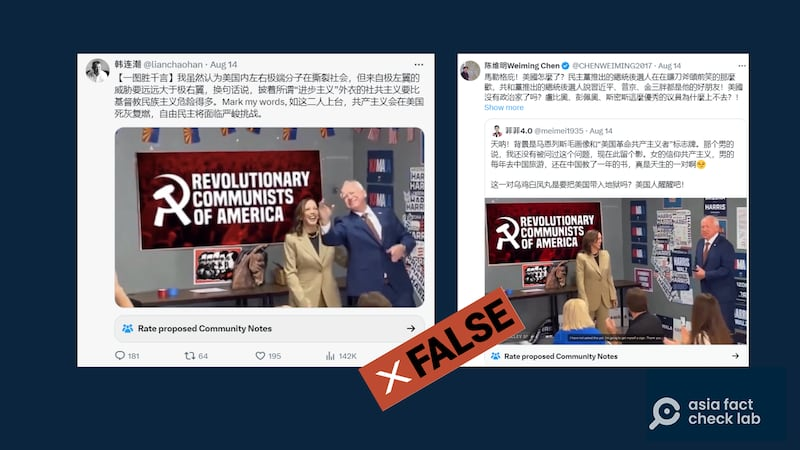
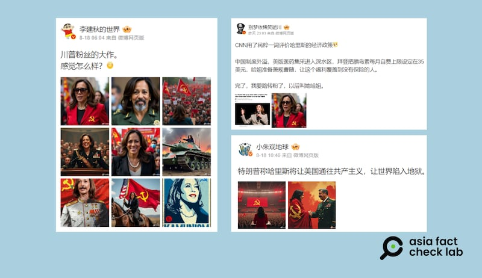

# 事實查覈｜哈里斯和沃爾茲在共產主義海報前自拍？

作者：鄭崇生

2024.08.21 14:40 EDT

## 標籤：錯誤

## 一分鐘完讀：

美國民主黨召開黨代表大會前夕，社交媒體平臺流傳一段美國民主黨總統候選人、現任副總統的哈里斯（Kamala Harris，又譯：賀錦麗）與其搭檔，現任明尼蘇達州州長的沃爾茲（Tim Walz）在一張帶有共產主義元素的海報前開心自拍的視頻與截圖。傳播這些影像的帳號貼文質疑兩人是披着“進步主義”外衣的“社會主義共產黨人”。

經查覈,影片中部分內容經過變造合成,疑似最早是由X平臺上一 [個英文賬號"VeBee](https://archive.li/6F7Lj)"在8月12日發出,儘管她在衆多網民留言質疑影片造假後已經刪除發文及視頻,但相關影像仍在中文社羣傳播開來。

## 深度分析：

在X上最早發出變造視頻的"VeBee"已經將發文內容刪除,但在保存網路檔案資料的archive.today網站上,仍能找到 [存檔內容](https://archive.li/6F7Lj)。亞洲事實查覈實驗室(Asia Fact Check Lab, 下簡稱AFCL)以圖溯源則發現,這一視頻的部分內容經變造,而原始視頻出自8月9日哈里斯與沃爾茲訪問亞利桑那州,與當地助選人員談話時的現場。

## "共產主義自拍"爲變造影像

美國公共事務衛星有線電視網(C-SPAN)媒體公關主任莫特曼(Howard Mortman)活動隔天在其 [X賬號上](https://x.com/HowardMortman/status/1822265695683412232)上傳約2分多鐘相關影片,在視頻約2"00處、沃爾茲離開前詢問哈里斯能否在一張寫着"Kamala and The Coach(卡瑪拉與教練)"的海報前自拍留念,(AFCL注:"教練"是沃爾茲的暱稱,他曾是高中美式足球教練)於是兩人以這一海報爲背景的自拍(圖1左)。

哈里斯-沃爾茲在亞利桑那州的活動影像（左圖）被變造爲右圖，背景改換爲共產主義海報。（C-span截圖，網傳圖片）

但這段影像遭到變造,例如X用戶 ["菲菲4.0"上傳的視頻中](https://archive.ph/BAif3),對照天花板都懸掛着亞利桑那州旗旗及右方牆上的相同裝飾,可確認是在同一現場的另一個拍攝角度,但變造視頻中把"卡瑪拉與教練"的海報改成深紅色底、繪有共產主義標誌"鐮刀與錘子",並寫着"美國革命共產黨人"(Revolutionary Communists of America)字樣,原視頻中牆上保護墮胎權的海報,則被換成共產主義海報"馬恩列斯毛"頭像,桌上還多放了一個雕像(圖1右)。

這一經變造的視頻，沒有加註相關說明，讓一些X上的中文用戶信以爲真，並進一步轉傳。

哈里斯-沃爾茲和共產主義海報自拍的假信息在中文X賬號之間傳播（X截圖）

## 多張AI生成圖片傳播哈里斯相關虛假信息

帶有“共產主義元素”的哈里斯還出現在網傳多個AI生成圖片中。

中國社交媒體微博和X上,都有不少認證用戶在轉傳圖片,將哈里斯和共產主義聯繫起來,評價她的意識形態立場與共產黨相近。這些說法有些 [直接取材](https://archive.ph/4Ms1C)自美國媒體對她政策的評價,一些則是 [轉發特朗普對她的批評](https://archive.ph/Ubemh),而這些貼文的共同特點,就是用AI生成哈里斯身披帶鐮刀錘頭logo的紅旗等共產主義標誌作爲配圖。

中國社交媒體上盛傳AI生成圖片，體現哈里斯的"共產主義元素"。（微博截圖）

## 變造視頻被指正，發佈者仍不撤回

上述"共產主義自拍"影像廣爲傳播、引發不少網友質疑、指正。有傳播者發現影像爲假造之後發文更正,例如X賬號"韓連潮"就發佈 [致歉](https://archive.ph/70ryH),承認自己未經覈實發佈了來自虛假視頻的截圖,但有亦有傳播 [變造影像的用戶](https://archive.ph/WppsY)經人指證後並不以爲然,仍然稱該僞造視頻是"最好證據"。

在美國總統拜登(Joe Biden)退選後,美國大選進入新一輪熱潮。有關哈里斯與沃爾茲搭檔組合的其他虛假訊息,亞洲事實查覈實驗室曾發表 [事實快查報告](2024-08-14_事實快查｜哈里斯-沃爾茲組合登場美國大選，哪些相關假信息正在流行？.md)。另外,AFCL也針對特朗普及他的副手萬斯(J.D. Vance)進行查覈( [1](2024-07-15_事實快查｜特朗普被槍擊後，哪些錯假信息在中文媒體流傳？.md)、 [2](2024-07-16_事實查覈｜美國“特勤人員”爆料：局長坐視特朗普遇刺？.md)、 [3](2024-07-17_事實快查｜特朗普遇襲隔天就打高爾夫？稱上帝"爲他投票"？.md)、 [4](2024-08-05_事實查覈｜J.D.萬斯要烏克蘭人“接受國家被摧毀”的事實？.md)),澄清中文輿論中關於美國大選的不實資訊。

*亞洲事實查覈實驗室(Asia Fact Check Lab)針對當今複雜媒體環境以及新興傳播生態而成立。我們本於新聞專業主義,提供專業查覈報告及與信息環境相關的傳播觀察、深度報道,幫助讀者對公共議題獲得多元而全面的認識。讀者若對任何媒體及社交軟件傳播的信息有疑問,歡迎以電郵*  [*afcl@rfa.org*](mailto:afcl@rfa.org)  *寄給亞洲事實查覈實驗室,由我們爲您查證覈實。* *亞洲事實查覈實驗室在X、臉書、IG開張了,歡迎讀者追蹤、分享、轉發。X這邊請進:中文*  [*@asiafactcheckcn*](https://twitter.com/asiafactcheckcn)  *;英文:*  [*@AFCL\_eng*](https://twitter.com/AFCL_eng)  *、*  [*FB在這裏*](https://www.facebook.com/asiafactchecklabcn)  *、*  [*IG也別忘了*](https://www.instagram.com/asiafactchecklab/)  *。*

[Original Source](https://www.rfa.org/mandarin/shishi-hecha/hc-harris-walz-selfie-with-communist-poster-fact-check-08212024143314.html)