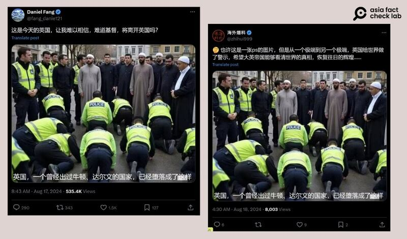
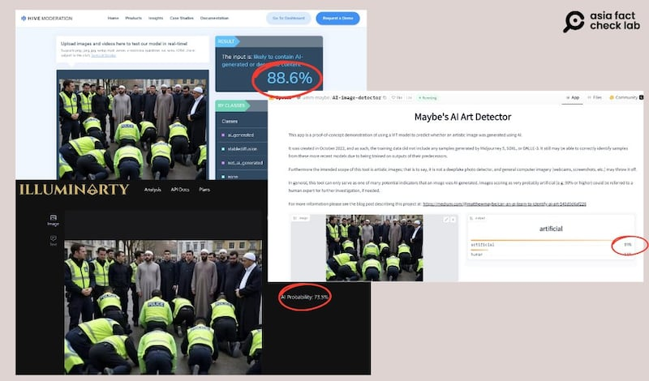
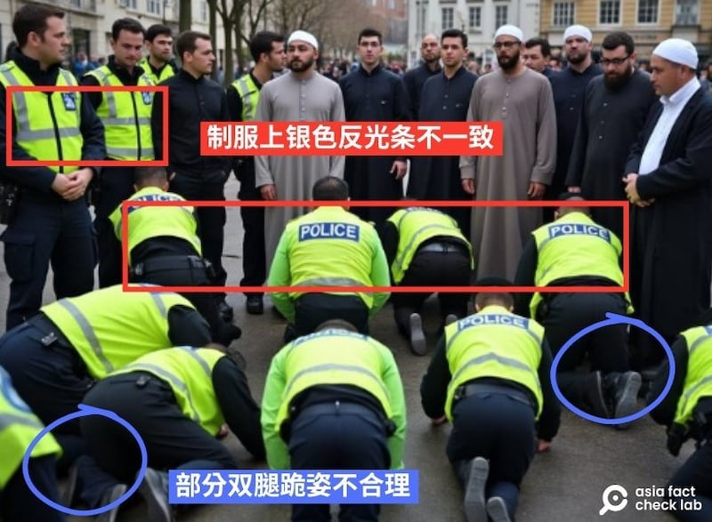
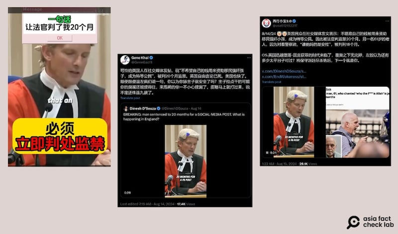

# 事實查覈 | 英國騷亂假消息肆虐，AI假圖和誤導視頻再起

作者：艾倫

2024.08.22 15:44 EDT

7月底，一名17歲青少年持刀襲擊一個兒童舞蹈班，造成3名兒童死亡、多人受傷，網上當時謠傳此案是穆斯林非法移民所爲，引爆英國部分民衆反穆斯林、反移民的情緒。

亞洲事實查覈實驗室（Asia Fact Check Lab，下稱AFCL）針對一張廣傳“英國警察向穆斯林移民下跪磕頭”的影像進行了查覈。此外，一位讀者來信，希望查覈一支相關的短影音的真假。

## 一、一羣英國警察向穆斯林下跪磕頭？

## 查覈結果：錯誤

X上認證賬號"Daniel Fang"於8月17日 [發文](https://x.com/fang_danie121/status/1824607852448846117?s=46&t=OcwRl26KwGrlCoefgaqyvw),配上一張數名警察向著穆斯林服裝的人下跪磕頭的圖片,文案寫道:"這是今天的英國,讓我難以相信,難道基督,將離開英國嗎?"同張照片也經藍勾勾賬號"海外爆料" [轉發](https://x.com/zhihui999/status/1824906615533035624)。

八月中，中文社媒用戶廣傳一張警察向移民下跪磕頭的照片，直指英國目前已經被穆斯林移民“佔領”。圖取自X

“Daniel Fang”的原文經大量轉載後，兩天內已超過50萬觀看次數及1500個贊，網民紛紛評論：“穆斯林幾乎要武統英國了”、“自甘墮落的大英帝國”，諷刺英國現在已被移民人口把持。

AFCL以圖反搜,找到原發文者爲X賬號 [RadioGeona](https://archive.ph/fV0th),發文時間爲8月15日。但該用戶卻在文案中明確表示:"這是AI如何看待倫敦的"(How AI sees London),顯見發文者早已承認該圖爲AI製作。

細查曾轉發同張圖的X賬號會發現，許多貼文都已被讀者標示社羣筆記（community note），並指出該圖爲AI生成。

其中一個例子是X賬號Bakalaofresco,該賬號於8月16號 [轉發此圖](https://x.com/i/communitynotes/t/1824181248694128880),並以西班牙文發表以下說法:"英國還有什麼能讓我們感到驚訝的嗎?現在事情都更加清楚了。"(¿Hay algo más que pueda sorprendernos en el Reino Unido? Ahora se entienden mucho mejor las cosas.)

該X貼文被有一則社羣筆記，有讀者明確指出文章使用的照片爲AI生成圖，不僅一些警察的四肢扭曲，且AI檢測工具皆認定其爲生成圖。

AFCL將"警察跪地磕頭"照放入AI檢測工具如 [Hive Moderation](https://hivemoderation.com/ai-generated-content-detection)、 [Hugging Face](https://huggingface.co/spaces/umm-maybe/AI-image-detector)及 [Illuminarty AI](https://illuminarty.ai/en/),分別得出88.6%、89%和73.5%的結果,三個網站皆認定該圖經過人工智能產出,而非真圖。

多個AI檢測工具都判斷網傳照片大概率爲AI生成 圖截自Hive Moderation、Hugging Face和Illuminarty AI

此外，研究機器學習和影像處理的臺灣成功大學副教授許志仲向AFCL指出，圖片裏警察的衣服大多都有上下兩個銀色反光條，但是跪下的右上警察與左上站著的警察沒有，是很明顯AI生成後內容不一致的狀況。

專長爲人工智慧與機器學習的臺灣陽明交大副教授遊家牧則在受訪時說，除了反光條的不一致外，跪下的警察中，“左下方的腿與右下方的腿都有些違反自然”，不符合人體跪姿會出現的狀態。

專家展示用肉眼能夠判斷出照片不自然、可能爲AI生成的地方。AFCL製圖

因此，可判定網傳“警察向穆斯林移民下跪”的圖及說法，爲錯假信息。

## 二、一名英國人只因在網上發表反移民言論，被判處二十個月監禁？

## 查覈結果：誤導

8月19日，AFCL收到一名讀者來信，附上一則30秒短視頻。視頻內容是英國利茲市刑事法院（Leeds Crown Court）的法官，指出被告曾在社媒上發表自己不願把納稅錢用在移民身上，因爲這些移民“強暴我們的孩子還享有特權”，法官認爲這個說法情節嚴重，必須判處立即監禁，最後判罰被告20個月有期徒刑。

AFCL以圖反搜,找到多個獲得認證的簡體中文賬號曾在X轉發同個視頻及類似說法,包含 ["西行小寶2.0"](https://x.com/usa912152217/status/1823772237100671305)及 ["Gene Khal"](https://x.com/GeneGao11/status/1823499692803809460),兩者皆稱英國"言論自由已死"、"因言獲罪的時代來了"。

讀者來信詢問，中文社媒賬號傳出一則短視頻，內容爲法官針對因說出反移民言論而判刑的錄像。圖取自Bilibili、X

AFCL以英文關鍵字"利茲市刑事法院""社媒""移民""判刑"等關鍵字搜索,找到英國《泰晤士報》和《星期日泰晤士報》的YouTube頻道,曾在8月9日時 [發佈](https://www.youtube.com/watch?v=rcb5YhGBXqo)這起事件的法庭審理直播,扣除視頻前半部的等待時間,當天審理時間約爲12分鐘,而事件主角的名字爲喬丹∙帕洛(Jordan Parlour)。

直播視頻從14分25秒開始，法官開始講述案件內容，明確提到8月2日和3日晚上，利茲的布里塔尼亞酒店遭到襲擊，襲擊者投擲物品，導致酒店窗戶受損，當時酒店內共有210名住客，其中許多是外國難民和尋求庇護者。8月4日，酒店再次遭到類似襲擊，兩次襲擊之間，帕洛在臉書上曾發佈一則貼文，“鼓勵他人蔘與對酒店的襲擊”。

視頻的17分07秒，法官提及帕洛在8月5日凌晨被逮捕，在接受了警方的審訊中，承認自己“鼓勵攻擊布里塔尼亞酒店，是因爲對國內移民問題的憤怒和沮喪所導致”。

之後，法官才接著說了網傳視頻中的話：“你不希望你的錢被用在強姦我們的孩子且獲得優先待遇的移民身上”。

由此可知，網傳短視頻剪去了大部分的內容，法官最後的判決主要依據，是帕洛曾在網上煽動針對移民住處的暴力，而非僅因他說過反移民等歧視言論。

英國皇家檢控署(Crown Prosecution Service)也發佈 [消息](https://www.cps.gov.uk/cps/news/man-convicted-intending-stir-racial-hatred-after-posting-online),告知大衆帕洛曾在臉書上"鼓吹針對利茲飯店的攻擊"(advocating an attack on a hotel in Leeds)。

英國暴亂事件已經在半個月前平息,但相關的謠言仍持續傳播。AFCL此前也曾查覈過 [三則相關錯假信息](2024-08-09_事實快查｜英國爆發騷亂 中文社媒流傳哪些錯假信息？.md)。

*亞洲事實查覈實驗室（Asia Fact Check Lab）針對當今複雜媒體環境以及新興傳播生態而成立。我們本於新聞專業主義，提供專業查覈報告及與信息環境相關的傳播觀察、深度報道，幫助讀者對公共議題獲得多元而全面的認識。讀者若對任何媒體及社交軟件傳播的信息有疑問，歡迎以電郵afcl@rfa.org寄給亞洲事實查覈實驗室，由我們爲您查證覈實。*

*亞洲事實查覈實驗室在X、臉書、IG開張了,歡迎讀者追蹤、分享、轉發。X這邊請進:中文*  [*@asiafactcheckcn*](https://twitter.com/asiafactcheckcn)  *;英文:*  [*@AFCL\_eng*](https://twitter.com/AFCL_eng)  *、*  [*FB在這裏*](https://www.facebook.com/asiafactchecklabcn)  *、*  [*IG也別忘了*](https://www.instagram.com/asiafactchecklab/)  *。*

[Original Source](https://www.rfa.org/mandarin/shishi-hecha/hc-uk-riot-ai-images-08222024154352.html)