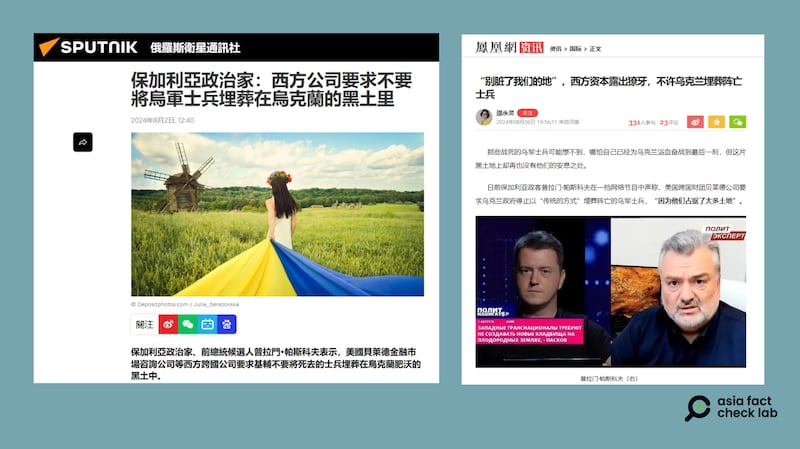

# 事實查覈｜美國公司不許烏克蘭埋葬陣亡士兵？

作者：莊敬

2024.08.22 15:53 EDT

## 查覈結果：錯誤

## 一分鐘完讀：

中國、俄羅斯媒體以及社媒平臺上近期盛傳一則消息，指一位保加利亞政客聲稱，美國跨國財團貝萊德公司要求烏克蘭政府不要將烏軍士兵埋葬在烏克蘭的黑土——也就是農業用地裏。

經查，此傳言是舊謠言重傳。貝萊德公司“擁有烏克蘭47%土地，要求基輔不要將士兵埋葬在烏克蘭的黑土裏”的說法，已被多個組織查覈過，查覈報告指出烏克蘭的法律明確禁止外國公司和外國人購買該國的農業用地，網傳消息爲“虛假信息”。

## 深度分析：

"鳳凰網"8月6日刊登軍事評論員邵永靈的 [文章](https://news.ifeng.com/c/8bphWfCMLaj),標題是《"別髒了我們的地",西方資本露出獠牙,不許烏克蘭埋葬陣亡士兵》。文章稱,日前保加利亞政客普拉門・帕斯科夫(Plamen Paskov)在一檔網路節目中聲稱,美國跨國財團貝萊德公司(BlackRock Inc.)要求烏克蘭政府停止以"傳統的方式"埋葬陣亡的烏軍士兵,"因爲他們佔據了太多土地"。

邵永靈的文章內容亦出現在" [觀察者網](https://user.guancha.cn/main/content?id=1280544)"" [網易](https://open.163.com/newview/movie/free?pid=TJ80F8TIC&mid=HJ80F8TIS)"" [西瓜視頻](https://www.ixigua.com/7399970946571371020)"等平臺," [超越新聞網](https://beyondnews852.com/20240812/156095/#google_vignette)"還寫成是根據"鳳凰網8月6日報道"。另在微博等社媒上,也有具影響力的用戶傳播這則消息。

亞洲事實查覈實驗室(Asia Fact Check Lab,下簡稱AFCL)進一步查詢發現," [俄羅斯衛星通訊社新聞](https://big5.sputniknews.cn/20240802/1060759436.html)"(Sputnik)8月2日即報道了這則消息,內文寫道"帕斯科夫在'政治專家'視頻博客節目中指出:貝萊德公司已經來過幾次了,他們說:不要再用你們傳統的方式埋葬⋯⋯死去的戰士了,因爲你們這樣做會佔用太多的土地,而我們原本想在這些土地上做點別的事情。你們的土地不是橡膠地,已經被買走了,47%是我們的,屬於我們的集團。"(注:橡膠地是一種比喻,用來形容一種可以被隨意拉伸或改變用途的資源或土地)

AFCL以上述文章上所附的一張帕斯科夫上節目的截圖反搜,在YouTube上找到了8月2日播出的 [節目](https://www.youtube.com/watch?v=QcViiH-4MS8),另在X上也有用戶分享該 [節目片段](https://twitter.com/AlexNovi/status/1820708781006676401)。再以英文關鍵字搜尋,發現在帕斯科夫的節目播出前,喬治亞查覈組織"Myth Detector"已於7月初發布有關 [查覈報告](https://mythdetector.ge/en/ukrainian-lands-and-banned-the-burial-of-military-personnel/)。

“俄羅斯衛星通訊社新聞”“鳳凰網”8月初刊文，引述保加利亞政客的說法，指美國公司不許烏克蘭埋葬陣亡士兵。圖取自網路

## 中俄媒體持續傳播已經被查覈過的假信息

根據“Myth Detector”的查覈報告，今年5月、6月間，有俄語社媒用戶發佈類似的帖子，稱在2023年成立的“烏克蘭發展基金”（Ukraine Development Fund, UDF），將1700萬公頃烏克蘭農業用地轉讓給國際公司，而美國貝萊德公司首席執行官拉里·芬克（Larry Fink）禁止在這片土地上埋葬死去的烏克蘭士兵，以免浪費寶貴的耕地。

查覈報告指出,貝萊德首席執行官禁止在烏克蘭土地上埋葬烏克蘭士兵的說法是錯誤的,這源自一個發表諷刺文的"電報(Telegram)"頻道;而所謂國際公司已購買1700萬公頃烏克蘭農業用地的說法也是錯誤的,烏克蘭 [法律](https://www.fao.org/faolex/results/details/en/c/LEX-FAOC043459/)禁止外國公司購買農業用地。

至於貝萊德與烏克蘭政府之間的合作關係,根據烏克蘭政府的 [新聞稿](https://www.president.gov.ua/en/news/prezident-obgovoriv-z-generalnim-direktorom-blackrock-koordi-80105),在2022年底,烏克蘭總統澤連斯基與芬克視訊會談,討論烏克蘭如何募得國家重建基金。2023年5月,烏克蘭政府與貝萊德簽署向UDF提供支援服務的 [協議](https://www.president.gov.ua/en/news/prezident-proviv-zustrich-iz-kerivnictvom-najbilshoyi-u-svit-82725),成立基金的主要目標是爲吸引資金,在敵對行動停止後,立即積極重建國家經濟。

AFCL兩度去信貝萊德公司查證，至截稿前尚未獲回覆。

保加利亞查覈組織"factcheck.bg"的記者Dafina Kandova回信AFCL表示,2023年底,類似的論述在保加利亞流傳,其組織已針對相關說法發佈多則查覈報告,查覈了包括" [美國貝萊德公司禁止烏克蘭埋葬陣亡士兵](https://factcheck.bg/ne-e-vyarno-che-amerikanskata-kompaniya-blackrock-zabranyava-na-ukrajna-da-pogrebva-ubitite-si-vojnici-si-v-grobishta/)"" [美國公司等西方資本擁有烏克蘭大部分土地](https://factcheck.bg/politicheck-ne-e-vyarno-che-dve-amerikanski-kompanii-i-edno-shotlandsko-uiski-pritezhavat-edna-treta-ot-ukrainskata-zemya/)"等傳言。

Dafina Kandova並提供了有關帕斯科夫的背景信息，表示他經常作爲民族主義政黨艾塔克黨（Ataka）的評論員出現，但並非正式黨員，也未當選過公職。帕斯科夫的知名度很大程度建立在社媒上，以傳播有關新冠疫苗、烏克蘭戰爭等熱點話題相關的陰謀論而獲得追隨者。

“美國貝萊德公司禁止烏克蘭埋葬陣亡士兵”的傳言已經多個組織查覈並判定爲不實消息，但“俄羅斯衛星通訊社新聞”在今年8月初發布的報道，僅引用帕斯科夫與俄羅斯官方的說法。中國軍事評論員、微博“大V”用戶，繼續在未經查證的情況下，持續傳播這一假消息。

*亞洲事實查覈實驗室（Asia Fact Check Lab）針對當今複雜媒體環境以及新興傳播生態而成立。我們本於新聞專業主義，提供專業查覈報告及與信息環境相關的傳播觀察、深度報道，幫助讀者對公共議題獲得多元而全面的認識。讀者若對任何媒體及社交軟件傳播的信息有疑問，歡迎以電郵afcl@rfa.org寄給亞洲事實查覈實驗室，由我們爲您查證覈實。*

*亞洲事實查覈實驗室在X、臉書、IG開張了,歡迎讀者追蹤、分享、轉發。X這邊請進:中文*  [*@asiafactcheckcn*](https://twitter.com/asiafactcheckcn)  *;英文:*  [*@AFCL\_eng*](https://twitter.com/AFCL_eng)  *、*  [*FB在這裏*](https://www.facebook.com/asiafactchecklabcn)  *、*  [*IG也別忘了*](https://www.instagram.com/asiafactchecklab/)  *。*

[Original Source](https://www.rfa.org/mandarin/shishi-hecha/hc-us-company-ukraine-soldiers-rumor-08222024155311.html)