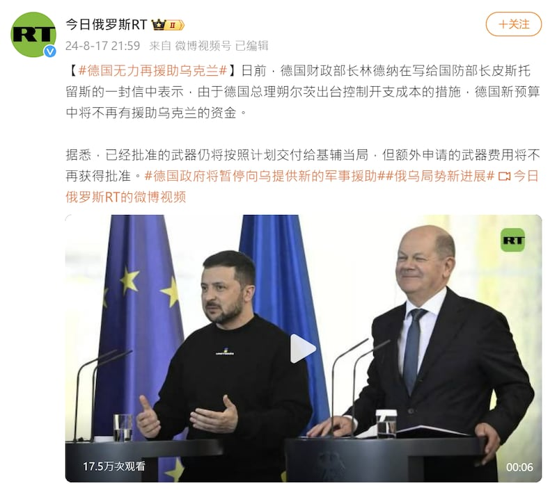

# 事實查覈｜德國將不再軍援烏克蘭？

作者：艾倫

2024.08.23 19:09 EDT

## 查覈結果：誤導

## 一分鐘完讀：

八月中，中文網上出現一則消息，稱根據外媒報道，德國因財政緊縮，未來將不再撥款給援烏預算，微博賬號“今日俄羅斯RT”更是直接以標籤“#德國無力再援助烏克蘭”來形容目前德國的援烏處境。

亞洲事實查覈實驗室（Asia Fact Check Lab，下稱AFCL）找到原德媒報道，發現該網路傳言並非事件全貌。德國政府的新政策是改以凍結中的俄羅斯資產援烏，財政部也聲稱，“並不預期烏克蘭的資金會突然中斷”

## 深度分析：

8月17至19日,俄媒"今日俄羅斯"的中文微博賬號 ["今日俄羅斯RT"](https://weibo.com/6244553417/OsJsU9sG8)發佈消息,稱根據德媒報道,德國財政部長林德納(Christian Lindner)在寫給國防部長皮斯托留斯(Boris Pistorius)的一封信中表示,由於德國總理朔爾茨(Olaf Scholz)爲了控制國家開支成本,德國新預算中將不再有援助烏克蘭的資金。

消息傳出不到一週，該貼文已累積超過千贊及接近150次轉發。

"今日俄羅斯RT"在微博發文，稱德國已無力繼續援助烏克蘭。(微博截圖）

AFCL以關鍵字搜尋,找到"今日俄羅斯"所引述的德媒爲《法蘭克福匯報》(Frankfurter Allgemeine Zeitung)。該媒體於8月17日發表 [文章](https://archive.ph/m1V6s#selection-3973.0-3973.36),題爲"烏克蘭將不再獲得新的援助資金"(原文:Kein neues Geld mehr für die Ukraine)。

根據報道原文，《法蘭克福匯報》通過獲取德國財政部及國防部之間的信件往來，以及聯邦政府多個會議及部門間的對話記錄得知，財政部長林德納確實在8月5日時寄信給國防部長皮斯托裏烏斯，提及德國政府因爲沒有額外資金可用，新的預算計劃將不再批准烏克蘭軍事援助。

但前述事實不能解讀爲“德國不再提供烏克蘭軍援”。因爲《法蘭克福匯報》的報道也稱，儘管財政部在信中提及不再撥新的烏克蘭援助預算，財政部“並不預期烏克蘭的資金會突然中斷”。

新的援助金額將會來自被凍結的俄羅斯中央銀行存款。在普京發動大規模攻擊後，烏克蘭的盟友扣押了俄國銀行約3000億美元，G7國家在意大利峯會上決定利用這筆資金的利息爲基輔提供一筆500億美元的貸款。林德納預期烏克蘭將用這筆錢“滿足其軍事需求的主要部分”。

德國外交部發言人塞巴斯蒂安·費舍爾(Sebastian Fischer)於8月18日在X上 [駁斥](https://x.com/SFischer_EU/status/1824850738238902452)德國不再援助烏克蘭的說法,並強調,今年(2024)將提供烏國超過70億歐元的軍事援助。

總理朔爾茨也在X [發文](https://x.com/Bundeskanzler/status/1825559216490418231)重申對烏克蘭的支持,並提到和G7合作的500億美元貸款。

而朔爾茨的回應正是《法蘭克福匯報》所報道、但“今日俄羅斯RT”的微博發文中忽略的信息。

路透社也在《法蘭克福匯報》發佈新聞後 [跟進報道](https://archive.ph/VQJG6#selection-1425.0-1451.63),指出目前德國2024年的援烏預算已預留80億歐元,而2025年則是40億歐元。據路透社報道中的消息人士稱,"2024 年和 2025 年的預算計劃沒有改變"。

而"2025年德國援烏資金將減半"的消息,7月17日《今日俄羅斯》旗下的俄羅斯衛星通訊社就曾 [報道](https://sputniknews.cn/20240717/1060462503.html)過,並非全然不提供軍事援助。

綜合原德媒報道、德國官方回應及俄媒此前針對2025年德國援烏的說法，可判斷“德國將不再提供烏克蘭軍援”的說法爲誤導信息。

*亞洲事實查覈實驗室（Asia Fact Check Lab）針對當今複雜媒體環境以及新興傳播生態而成立。我們本於新聞專業主義，提供專業查覈報告及與信息環境相關的傳播觀察、深度報道，幫助讀者對公共議題獲得多元而全面的認識。讀者若對任何媒體及社交軟件傳播的信息有疑問，歡迎以電郵afcl@rfa.org寄給亞洲事實查覈實驗室，由我們爲您查證覈實。*

*亞洲事實查覈實驗室在X、臉書、IG開張了,歡迎讀者追蹤、分享、轉發。X這邊請進:中文*  [*@asiafactcheckcn*](https://twitter.com/asiafactcheckcn)  *;英文:*  [*@AFCL\_eng*](https://twitter.com/AFCL_eng)  *、*  [*FB在這裏*](https://www.facebook.com/asiafactchecklabcn)  *、*  [*IG也別忘了*](https://www.instagram.com/asiafactchecklab/)  *。*

[Original Source](https://www.rfa.org/mandarin/shishi-hecha/hc-wain-ukraine-fact-check-08232024190430.html)