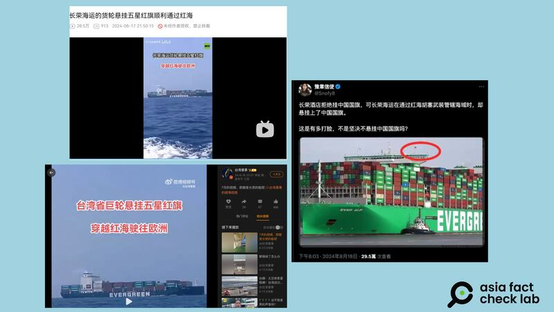
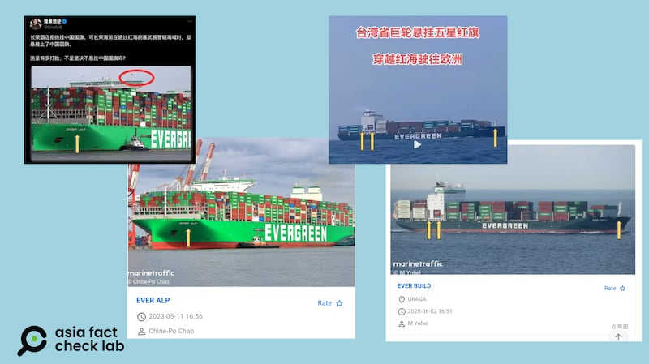
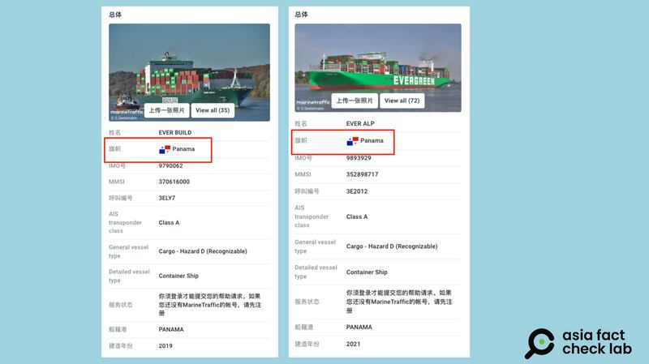
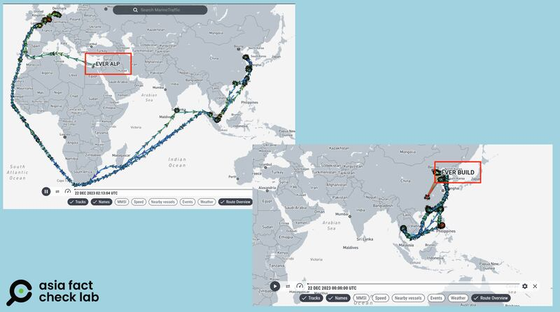

# 事實查覈｜臺灣長榮海運爲保船隻順利通過紅海掛起五星紅旗？

作者：董喆

2024.08.23 19:02 EDT

## 查覈結果：錯誤

## 一分鐘完讀：

最近，臺資巴黎長榮桂冠酒店因拒絕懸掛五星紅旗遭遇中國網民抵制，中文社羣平臺上出現傳言，稱長榮航運的船舶今年7月靠着懸掛五星紅旗才得以通過因胡塞武裝而危機四伏的紅海，認爲長榮集團是“雙重標準”。

經查，長榮航運旗下船隻自2023年12月起就不再行經紅海，長榮海運向亞洲事實查覈實驗室說明，船隻改道繞行好望角，至今並未改變。

根據船舶追蹤服務Marine Traffic，網傳的兩艘船隻的確自去年12月23日起就沒有行經紅海的航跡，而網傳照片亦未能清楚辨識出五星紅旗，因此傳言稱長榮海運船舶近日靠五星紅旗通過紅海是錯誤資訊。

## 深度分析：

長榮集團旗下巴黎長榮桂冠酒店在奧運期間拒絕懸掛五星紅旗，遭中國旅遊博主拍成視頻，引發中國網友揚言抵制長榮桂冠酒店，但近期中國網友將焦點轉到了同集團的長榮海運公司。

微博大V“臺灣傻事”出示影片，稱7月間捕捉到“臺灣巨輪懸掛五星紅旗穿越紅海駛往歐洲”，影片中船身印有EVERGREEN字樣，爲臺灣長榮海運集團企業識別。Ｘ帳號“豫章信使”則貼出另一則照片，指長榮海運在通過胡塞武裝管轄海域時，懸掛了中國國旗。雖然上述貼文皆無法看見清晰的五星紅旗，仍獲俄羅斯官媒“今日俄羅斯”轉發。

多名網絡"大V"貼出照片指長榮海運的船隻懸掛五星紅旗（X、新浪、B站截圖）

亞洲事實查覈實驗室（Asia Fact Check Lab，下簡稱AFCL）以船身噴漆字樣以及船隻外觀，並用以圖反搜輔助，辨識出網傳的兩艘船隻分別爲長榮旗下的“EVER ALP”以及“EVER BUILD”。

"EVER ALP"以及"EVER BUILD"與網傳圖片對比（AFCL 製圖）

根據船舶追蹤服務Marine Traffic,此二艘船隻的船旗國皆屬於巴拿馬。根據 [聯合國海洋法公約](https://www.un.org/zh/documents/treaty/UNCLOS-1982)第七部分公海,"每個國家應確定對船舶給予國籍、船舶在其領土內登記及船舶懸掛該國旗幟的權利的條件。船舶具有其有權懸掛的旗幟所屬國家的國籍"且"船舶航行應僅懸掛一國的旗幟",因此"EVER ALP"以及"EVER BUILD"最有可能懸掛的是巴拿馬國旗。

Marine Traffic追蹤的長榮海運兩艘船的航行軌跡（Marine Traffic官網截圖）

船旗國爲巴拿馬的船隻有可能懸掛五星紅旗嗎？一位臺灣海巡署前官員告訴AFCL，實務上確實有遭遇或聽聞在特殊海域懸掛非船旗國旗的情形，有以下幾種原因，一是經過他國領海時表示友好或是致意，這時會將他國旗幟與船旗國旗同時懸掛。二是經過爭議地區，擔心受他國公務船或民兵船干擾。三則是經過危險地區，如海盜猖獗海域，懸掛較強勢國家國旗起到嚇阻效果。不過第二及三種情形，在臺灣並非法律所允許。

不過網傳影像並無法清楚識別是否懸掛五星紅旗，更遑論是實務上的哪一種特殊狀況，但指涉長榮船隻“爲了順利通過紅海，因此懸掛五星紅旗”的說法仍可以航跡進行覈查。

根據長榮海運於2023年12月22日發佈的 [針對紅海局勢的緊急應變計劃](https://www.evergreen-marine.com/emc/latestnews/jsp/EMC_NewsDetail.jsp?lang=zh-tw&newsId=NEWS2023122200017237),表示由於紅海地區商船遭受的襲擊對通過這些水域的船隻構成了嚴重威脅。連接亞洲至地中海、歐洲和美國東岸的長程航線,原定途經紅海的貨櫃船將改道繞行好望角。

AFCL 以船舶追蹤服務Marine Traffic追蹤2023年12月22日起“EVER ALP”以及“EVER BUILD”的航跡，發現“EVER ALP”自長榮發佈應變計劃以來，就已沒有航經過紅海，“EVER BUILD”則是隻航行於中國東北至泰國之間，與紅海無關。

"EVER ALP"和"EVER BUILD"船隻信息（Marine Traffic官網截圖）

長榮航運回復AFCL，“長榮海運自去年12月將船隻改道繞行好望角，至今並未改變。關於貨櫃船上的掛旗，長榮遵行國際間採用的掛旗規範與航海旗幟禮儀，此亦爲航運業的慣例。”

因此根據航跡就可以判斷，網傳“7月間捕捉到‘臺灣巨輪懸掛五星紅旗穿越紅海駛往歐洲’”一事爲不實謠言。

*亞洲事實查覈實驗室（Asia Fact Check Lab）針對當今複雜媒體環境以及新興傳播生態而成立。我們本於新聞專業主義，提供專業查覈報告及與信息環境相關的傳播觀察、深度報道，幫助讀者對公共議題獲得多元而全面的認識。讀者若對任何媒體及社交軟件傳播的信息有疑問，歡迎以電郵afcl@rfa.org寄給亞洲事實查覈實驗室，由我們爲您查證覈實。*

*亞洲事實查覈實驗室在X、臉書、IG開張了,歡迎讀者追蹤、分享、轉發。X這邊請進:中文*  [*@asiafactcheckcn*](https://twitter.com/asiafactcheckcn)  *;英文:*  [*@AFCL\_eng*](https://twitter.com/AFCL_eng)  *、*  [*FB在這裏*](https://www.facebook.com/asiafactchecklabcn)  *、*  [*IG也別忘了*](https://www.instagram.com/asiafactchecklab/)  *。*

[Original Source](https://www.rfa.org/mandarin/shishi-hecha/hc-taiwan-ships-hang-chinese-flags-fact-check-08232024185254.html)