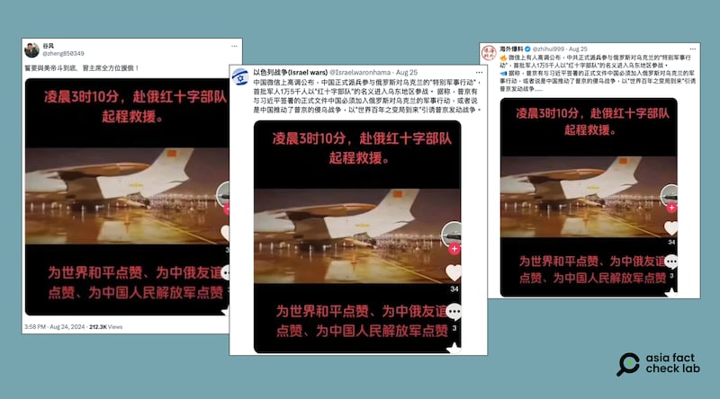
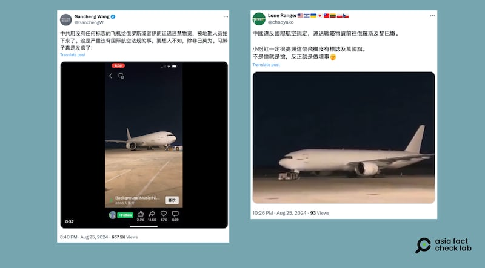

# 事實快查｜中國出兵烏克蘭支援俄國照片流出？

作者：莊敬

2024.08.27 18:40 EDT

烏克蘭在8月初跨境突襲俄羅斯庫爾斯克地區，被視爲2022年俄羅斯入侵烏克蘭以來烏克蘭最重要的反擊。隨著俄烏戰爭進入新階段，大量錯假信息開始流傳，近期在社媒上更出現多則有關中國援俄的消息與影像，亞洲事實查覈實驗室（Asia Fact Check Lab，下簡稱AFCL）針對其中兩則，進行查覈。

## 一、中國飛機搭載"紅十字部隊"參戰？

查覈結果：挪用無關舊影像

社媒X上的中文用戶( [1](https://twitter.com/zheng850349/status/1827254161140035737), [2](https://twitter.com/zhihui999/status/1827340143851655436), [3](https://twitter.com/Israelwaronhama/status/1827421320361222553))近日流傳一則消息,稱在微信上有人高調公佈,中共正式派兵參與俄羅斯對烏克蘭的"特別軍事行動",首批軍人1萬5千人以"紅十字部隊"的名義進入烏東地區參戰。他們的帖子附上同一張圖片,畫面是一架尾翼上有五星紅旗的白色飛機在停機坪上,中文字幕寫着"凌晨3時10分,赴俄紅十字部隊啓程救援。"這則消息也傳入臺灣網路論壇" [批踢踢實業坊](https://www.ptt.cc/bbs/Military/M.1724566825.A.82B.html)"(PTT)。

近日社媒上流傳中方正式派兵參與俄烏戰爭的消息（X平臺截圖）

AFCL以Google搜尋圖片發現,這個畫面曾出現在2020年 [澎湃新聞](https://m.thepaper.cn/newsDetail_forward_6386052)、 [中時新聞網](https://www.chinatimes.com/realtimenews/20200127002218-260417?chdtv)的報道中。根據報道內容,當時解放軍空軍出動軍機運輸上百名軍醫到武漢,馳援抗擊新冠肺炎任務。

也就是說，網傳畫面與俄烏戰爭無關，網民挪用了舊影像傳播錯誤信息。AFCL另以中、英文關鍵字查詢國際主流媒體，目前未找到有關中國正式出兵援俄的報道。

## 二、中共用沒有標誌的飛機運送物資給俄羅斯？

查覈結果：挪用無關舊影像

部分中文用戶在X上( [1](https://twitter.com/GanchengW/status/1827687418709094816), [2](https://x.com/chaoyako/status/1827714145044803634))發佈視頻或照片,聲稱中共用沒有任何標誌的飛機給俄羅斯或伊朗運送違禁物資,嚴重違背國際航空法規。

網傳中共用沒有任何標誌的飛機給俄羅斯運送違禁物資（X平臺截圖）

AFCL將視頻定格、放大檢視,發現艙門旁可看到"ATLAS",起落架上則寫著"704"。接着以這兩個線索搜尋,在飛機圖庫"JetPhotos"找到了這架飛機的其它照片( [1](https://www.jetphotos.com/photo/11053371), [2](https://www.jetphotos.com/photo/11197437)),發現它其實屬於美國貨運航空公司亞特拉斯航空(Atlas Air),機尾號N704GT。這些影像證據顯示,網傳視頻中的飛機並不屬於中國,部分網民挪用無關影像,傳播錯誤信息。

*亞洲事實查覈實驗室（Asia Fact Check Lab）針對當今複雜媒體環境以及新興傳播生態而成立。我們本於新聞專業主義，提供專業查覈報告及與信息環境相關的傳播觀察、深度報道，幫助讀者對公共議題獲得多元而全面的認識。讀者若對任何媒體及社交軟件傳播的信息有疑問，歡迎以電郵afcl@rfa.org寄給亞洲事實查覈實驗室，由我們爲您查證覈實。*

*亞洲事實查覈實驗室在X、臉書、IG開張了,歡迎讀者追蹤、分享、轉發。X這邊請進:中文*  [*@asiafactcheckcn*](https://twitter.com/asiafactcheckcn)  *;英文:*  [*@AFCL\_eng*](https://twitter.com/AFCL_eng)  *、*  [*FB在這裏*](https://www.facebook.com/asiafactchecklabcn)  *、*  [*IG也別忘了*](https://www.instagram.com/asiafactchecklab/)  *。*

[Original Source](https://www.rfa.org/mandarin/shishi-hecha/hc-china-sends-troops-to-ukraine-fact-check-08272024183539.html)