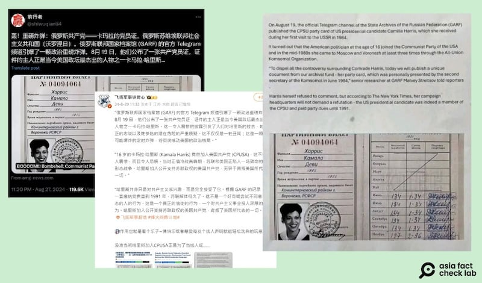
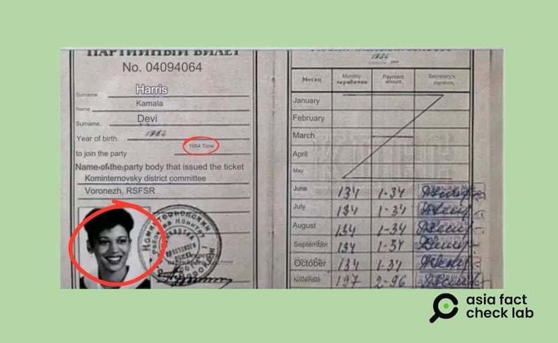
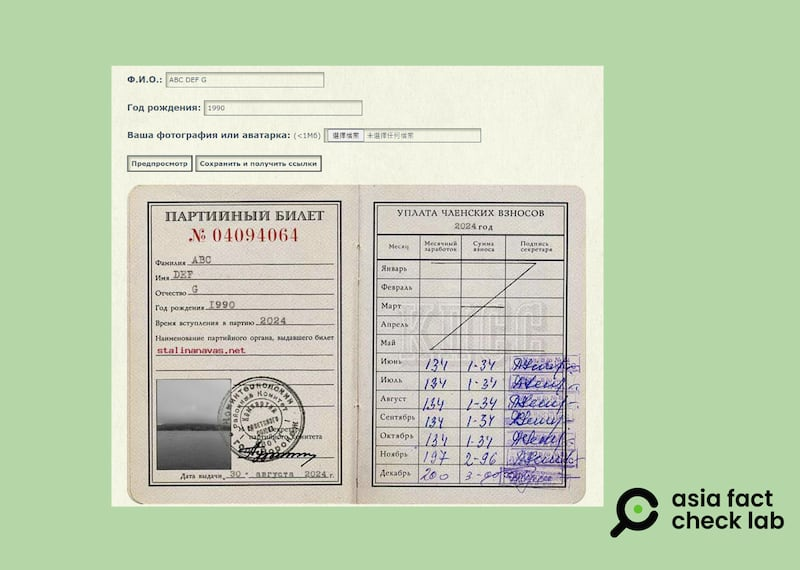

# 事實查覈 | 俄羅斯檔案機構曝光哈里斯共產黨證？

作者：艾倫

2024.08.30 14:42 EDT

## 查覈結果：錯誤

## 一分鐘完讀：

八月底，中英文網上出現傳言，內容爲現任美國副總統、也是2024年的總統參選人哈里斯（Kamala Harris，又譯賀錦麗）曾在16歲時加入美國共產黨（CPUSA），而這項“重磅消息”最近經由俄羅斯披露，並流出一張哈里斯的黨員證件。

亞洲事實查覈實驗室查覈這張所謂“哈里斯的黨證”，發現多處錯誤、不合邏輯，並且，這張“黨證”很可能來自是一個以玩笑爲目的的俄語網站，任何人上傳照片，都可以定製自己的“黨員證件”。

## 深度分析：

8月28日,有讀者在X上一則貼文標記亞洲事實查覈實驗室(Asia Fact Check Lab,下稱AFCL),希望查證真僞。該文的發文帳號"前行者"於8月27日 [發文](https://x.com/shiwuqianli4/status/1828452474304577901),,題爲"轟動消息!震撼彈:俄羅斯共產黨——哈里斯·卡馬拉的黨員證,俄羅斯蘇維埃聯邦社會主義共和國(沃羅涅日) ——可能摧毀她2024年總統競選活動的醜聞",並附上一則網站 [鏈接](https://archive.ph/nD6cj),指向一個英文網頁。

## X網站瘋傳哈里斯“黨員證”曝光

該英文網頁同樣以英文大號標題稱哈里斯的共產黨員證遭曝光,文章內引用名爲 ["Jack Straw"](https://x.com/JackStr42679640/status/1828358645459100043)的X英文用戶,並附有一張共產黨黨證,上方印有哈里斯的個人照片,並附上四段英文註解,AFCL翻譯後以中文呈現:

*“8月19日，俄羅斯聯邦國家檔案館（GARF）的官方Telegram頻道公佈了美國總統候選人卡米拉·哈里斯的蘇聯共產黨黨證，她在1984年首次訪問蘇聯時獲得了該證件。*

*原來，這位美國政治家在16歲時加入了美國共產黨，並且在1980年代中期至少三次通過全聯盟列寧主義青年共產主義聯盟（共青團）來到莫斯科和沃羅涅日。*

*爲了消除圍繞哈里斯同志的所有爭議，我們今天將公開一份獨特的檔案——她的黨證，這是1984年6月由共青團第二書記親自頒發的。 ’GARF的高級研究員馬特維·斯特列特佐夫對記者表示。*

*哈里斯本人拒絕評論，但根據《紐約時報》的報導，她的競選團隊不會要求闢謠——這位美國總統候選人確實曾是蘇聯共產黨的一員，並且繳納黨費直到1991年。 ”*

上述中文賬號“前行者”在貼文中繼續以中文補充說明，稱哈里斯並非只對共產主義有興趣，而是“完全接受了它”，成爲了“信徒”。該X賬號文章遭到迅速傳播，三天內已破十萬則觀看。一些評論附和這個說法，認爲哈里斯將讓美國變成一個社會主義國家，其中也不乏批評的聲音，認爲該帳號並未查證就傳播可疑信息。

相關消息也傳到微博,大V賬號" [飛揚軍事鐵背心](https://weibo.com/2139949234/OuuulmD86)"也轉發了該傳言,並開玩笑說哈里斯加入共產黨可能是爲了當線人。

社媒平臺X和微博上出現傳言，稱哈里斯年輕時曾加入美國共產黨，並附上一張據稱是俄羅斯聯邦國家檔案館流出的黨證照片。（圖取自X、微博）

## 所謂“黨證”照片、說明漏洞百出

儘管傳言聽上去言之鑿鑿，且附有所謂的“黨證”爲證，事實卻並非如此。

AFCL使用Google圖片翻譯原俄文的“哈里斯黨證”，發現”黨證”上哈里斯的出生年份爲1964年，加入美國共產黨的時間爲1954年，“入黨”早於出生，不符合邏輯。據官方信息，哈里斯確實在1964年出生，今年（2024年）59歲。

此外,"黨證"上這張哈里斯身着學士袍的照片,和哈里斯在美國霍華德大學(Howard University)的畢業照是同一張,不僅《紐約時報》曾有 [報道引用](https://www.nytimes.com/2020/10/14/us/politics/kamala-harris-howard.html),英國圖庫攝影機構"Alamy"也 [存有](https://www.alamy.com/1986-ca-washington-dc-usa-the-american-politician-and-attorney-kamala-harris-born-20-october-1964-when-was-young-aged-22-at-howard-university-in-washington-from-20-january-2021-the-vice-president-of-the-united-states-of-democrate-president-of-united-states-joe-biden-she-is-the-united-states-first-female-vice-president-the-highest-ranking-female-official-in-us-history-and-the-first-african-american-and-first-asian-american-vice-president-unknown-photographer-vice-presidente-alla-presidenza-presidente-stati-uniti-america-politico-donna-politica-politic-per-image415243161.html)這張照片,兩者皆說明該照片是1986年、哈里斯22歲時所拍,不可能用在1954年"入黨"之時。

網傳哈里斯的共產黨證照片存在多個疑點，包括入黨年份及證件照。（網傳“黨證”截圖，AFCL標註、製圖）

AFCL再以關鍵字反搜,發現這張黨證很可能是由一個 [俄文網站](https://archive.is/w1hFm)所制,該網站提供一些斯大林、蘇聯的搞笑圖片元素,任何人無須付費或註冊皆可輸入名字和基本資料來製作不同蘇聯元素的娛樂圖片,例如"黨證"、"光榮證","人民公敵文件"等。

AFCL在該網站“Сталина на вас.Нет”上實測，輸入名稱“ABC DEF G”，以及出生年份“1990”，再上傳查覈記者所攝風景照，會得出一份“客製化”的共產黨證。且細看會發現，證件右半邊繳費及簽章的數字及簽名皆和網傳哈里斯黨證上的一模一樣，應爲同個模板製成。

AFCL上傳風景圖片，做出一份與哈里斯“黨證”相似的證件。 （AFCL製圖）

至於傳言所說，《紐約時報》曾報道過哈里斯團隊針對此消息的反應，則是無中生有的情況。《紐約時報》網站查詢結果沒有相關新聞，其媒體聯繫辦公室也回覆AFCL，說該報從未發表過相關文章。

經AFCL查閱,並沒有主流媒體報道哈里斯曾訪問過蘇聯,以及她和美國共產黨的關係,而傳播此說法的 [網站](https://archive.ph/nD6cj)"AMG-News.com"曾被查覈網站"Media Bias / Fact Check"列爲傳播大量陰謀論假信息的網站之一。

AFCL致信白宮國安會，詢問哈里斯和美國共產黨的關係，至截稿日（8月30日）未獲回應。

哈里斯政治"立場親左"、"親共產主義"是本次大選討論中中文輿論圈經常出現的敘事,相關假消息已不只傳過一次。 AFCL曾發佈查覈報告" [哈里斯和沃爾茲在共產主義海報前自拍?](2024-08-21_事實查覈｜哈里斯和沃爾茲在共產主義海報前自拍？.md)"以及" [哈里斯-沃爾茲集會'連一面美國國旗都沒有](2024-08-14_事實快查｜哈里斯-沃爾茲組合登場美國大選，哪些相關假信息正在流行？.md)'?",這些假信息都試圖營造哈里斯極度左傾且不愛國的形象。

*亞洲事實查覈實驗室(Asia Fact Check Lab)針對當今複雜媒體環境以及新興傳播生態而成立。我們本於新聞專業主義,提供專業查覈報告及與信息環境相關的傳播觀察、深度報道,幫助讀者對公共議題獲得多元而全面的認識。讀者若對任何媒體及社交軟件傳播的信息有疑問,歡迎以電郵*  [*afcl@rfa.org*](mailto:afcl@rfa.org)  *寄給亞洲事實查覈實驗室,由我們爲您查證覈實。* *亞洲事實查覈實驗室在X、臉書、IG開張了,歡迎讀者追蹤、分享、轉發。X這邊請進:中文*  [*@asiafactcheckcn*](https://twitter.com/asiafactcheckcn)  *;英文:*  [*@AFCL\_eng*](https://twitter.com/AFCL_eng)  *、*  [*FB在這裏*](https://www.facebook.com/asiafactchecklabcn)  *、*  [*IG也別忘了*](https://www.instagram.com/asiafactchecklab/)  *。*

[Original Source](https://www.rfa.org/mandarin/shishi-hecha/hc-russian-fake-harris-document-08302024144155.html)