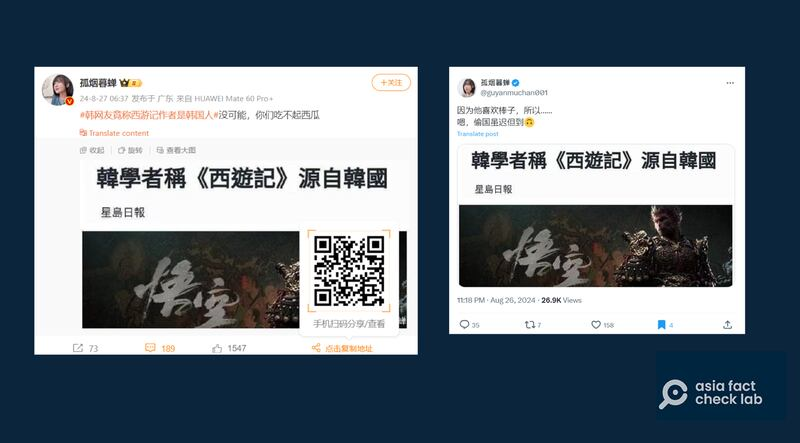
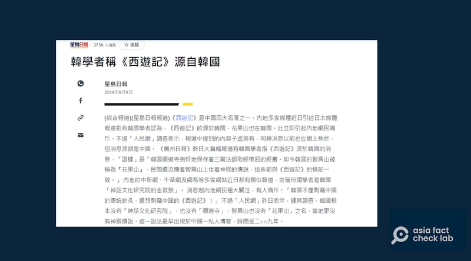
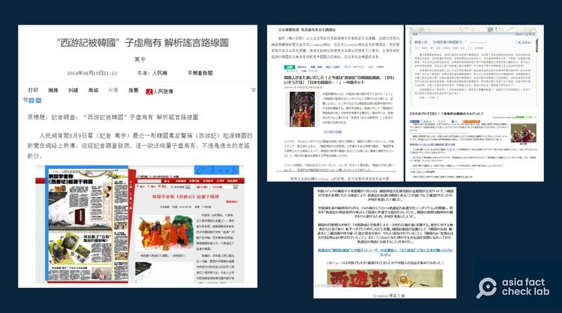

# 事實查覈｜蹭上《黑神話：悟空》， 韓國學者稱西遊記源自韓國？

作者：鄭崇生

2024.08.30 14:36 EDT

## 標籤：錯誤

## 一分鐘完讀：

近日，網絡遊戲《黑神話：悟空》廣受歡迎，再次引發輿論對《西遊記》的熱議，中國網絡“大V”孤煙暮蟬日前在其微博與X賬號發文，批評韓國是“偷國”，併發出一張“《星島日報》報道截圖”，截圖中呈現網遊宣傳圖，標題爲“韓學者聲稱《西遊記》源自韓國”。

亞洲事實查覈實驗室發現，《星島日報》十年前的報道此說法的原文是闢謠，其主題是證明根本沒有所謂“韓國學者聲稱《西遊記》源自韓國”，該報道和近日熱議的網絡遊戲也沒有關係。孤煙暮蟬發出的疑似“報道”截圖爲合成圖，將原報道部分截圖和網遊宣傳照放在一起。

## 深度分析：

孤煙暮蟬在兩個社交平臺上發文截取的圖片相同，看上去像是一個新聞網站頁面截圖，都引用標註有《星島日報》的標題，而標題下方是一張遊戲《黑神話：悟空》的劇照。另外，在微博上的貼文中，還加上“ #韓網友竟稱西遊記作者是韓國人#”的標籤，這一標籤也一度衝上微博熱搜榜。

中國網絡大V孤煙暮蟬發佈一張疑似星島日報報道截圖。（微博、X截圖）

## 疑似“報道截圖”爲後製合成

亞洲事實查覈實驗室(Asia Fact Check Lab,下簡稱AFCL)發現,這張"報道截圖"是合成的, [原報道](https://hk.news.yahoo.com/%E9%9F%93%E5%AD%B8%E8%80%85%E7%A8%B1-%E8%A5%BF%E9%81%8A%E8%A8%98-%E6%BA%90%E8%87%AA%E9%9F%93%E5%9C%8B-215826705.html#:~:text=%E3%80%8A%E5%BB%A3%E5%B7%9E%E6%97%A5%E5%A0%B1%E3%80%8B%E6%98%A8%E6%97%A5%E5%A4%A7%E7%AF%87%E5%B9%85,%E8%A8%98%E3%80%8B%E7%9A%84%E6%83%85%E7%AF%80%E4%B8%80%E8%87%B4%E3%80%82%E3%80%8D)由《星島日報》網站於2014年刊發,這則綜合報道標題雖然是"韓國學者稱《西遊記》源自韓國",但內容卻是澄清當時在中國熱烈傳播的這一話題並不是真的。因該報道發表於十年前,原報道中自然也沒有任何與遊戲《黑神話:悟空》相關的內容。

《星島日報》原報道發佈於十年前，爲闢謠報道，與近日熱議的網遊無關。（香港雅虎網站截圖）

## “韓國搶西遊”相關說法已多次被闢謠

AFCL進一步發現，“韓國學者稱西遊記來自韓國”這則謠言，已經流傳十年之久。目前可查考的較早的來源是2014年8月9日《廣州日報》的報道《韓國學者稱〈西遊記〉起源於韓國》，報道宣稱有韓國學者認爲，《西遊記》源自韓國。另外，報道還寫到部分韓國學者對即將在湖北隨州召開《西遊記》研討會“表示不滿”，並指韓國學者提出的證據包括“韓國順道寺完好地保存着三藏法師取經帶回來的經書、韓國的智異山被稱爲'花果山'，民間還流傳着智異山上住着神猴的傳說，這些都與《西遊記》的情節一致。”

這則報道當時被多家網絡媒體轉載改寫，中國文化資產被韓國“偷走”的說法一時廣爲流傳。

延伸閱讀：

* [事實查覈|韓國議員提案改國名爲"考瑞亞"?](2024-07-24_事實查覈｜韓國議員提案改國名爲“考瑞亞”？.md)
* [事實查覈|韓國政要在紀念烈士儀式上不鞠躬?](2024-07-12_事實查覈｜韓國政要在紀念烈士儀式上不鞠躬？.md)
* [事實查覈|韓國市長請求中國"贈送"一對大熊貓?](2024-06-03_事實查覈｜韓國市長請求中國“贈送”一對大熊貓？.md)
* [事實查覈|韓國大選期間,有在韓中國人因干擾候選人被捕?](2024-05-21_事實查覈｜韓國大選期間，有在韓中國人因干擾候選人被捕？.md)
* [事實查覈|韓國最大醫療協會主席"學舌"金正恩?](2024-04-05_事實查覈｜韓國最大醫療協會主席“學舌”金正恩？.md)

然而,這則當年的報道早已被證僞。當年,人民網就刊發了記者發自韓國的闢謠文章:《"西遊記被韓國"子虛烏有 解析謠言路線圖》, 這則於 [2014年8月10日刊發的闢謠文章](https://archive.ph/1YFcx)追蹤考據,2011年"天涯論壇"上一則貼文寫到,有中國與韓國網友論戰"孫悟空究竟是哪國猴?"而這則貼文被一個日本非新聞網站Livedoor轉載。

之後，傳言流進新華網日本語網站（xinhua.jp），新華網改寫時加上所謂的韓國學者抗議。最後到了《廣州日報》的筆下，就成了“日本媒體報導有韓國學者聲稱西遊記源自韓國。”

《人民日報》闢謠文章合成截圖3（截圖取自人民網/AFCL製圖）

因此，這則流言的傳播路徑最早源自中國國內網路論壇，經出口加工到日本，然後重回中國媒體視野,。如今《黑神話 悟空》爆紅，舊謠言再度出現。而諷刺的是《星島日報》的報道原本是闢謠，在網絡大V孤煙暮蟬發出的截圖裏，卻被斷章取義，並和近日廣受關注的網絡遊戲聯繫到一起。

*亞洲事實查覈實驗室(Asia Fact Check Lab)針對當今複雜媒體環境以及新興傳播生態而成立。我們本於新聞專業主義,提供專業查覈報告及與信息環境相關的傳播觀察、深度報道,幫助讀者對公共議題獲得多元而全面的認識。讀者若對任何媒體及社交軟件傳播的信息有疑問,歡迎以電郵*  [*afcl@rfa.org*](mailto:afcl@rfa.org)  *寄給亞洲事實查覈實驗室,由我們爲您查證覈實。* *亞洲事實查覈實驗室在X、臉書、IG開張了,歡迎讀者追蹤、分享、轉發。X這邊請進:中文*  [*@asiafactcheckcn*](https://twitter.com/asiafactcheckcn)  *;英文:*  [*@AFCL\_eng*](https://twitter.com/AFCL_eng)  *、*  [*FB在這裏*](https://www.facebook.com/asiafactchecklabcn)  *、*  [*IG也別忘了*](https://www.instagram.com/asiafactchecklab/)  *。*

[Original Source](https://www.rfa.org/mandarin/shishi-hecha/hc-journey-to-the-west-korea-08302024143551.html)