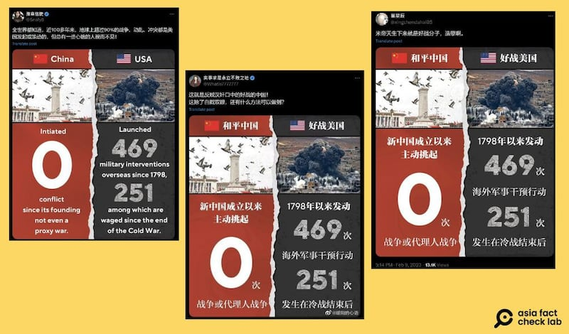
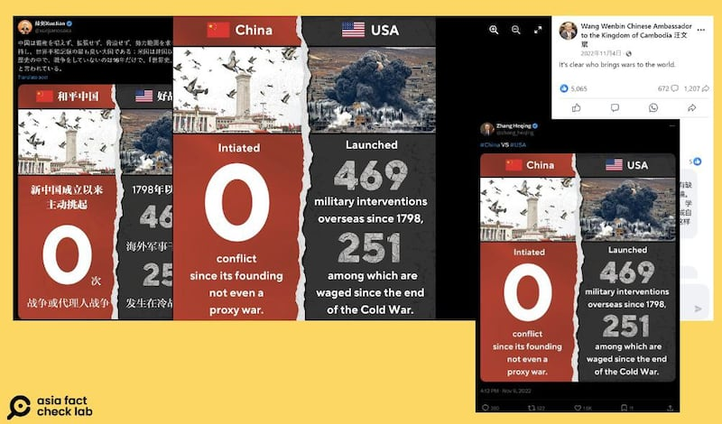

# 事實查覈｜ 中華人民共和國從未發動過戰爭？

作者：艾倫

2024.09.03 18:04 EDT

## 查覈結果：片面立場

## 一分鐘完讀：

八月底，社媒平臺X上一位中文“大V”轉發一張英文圖表，內容爲中國和美國發動的戰爭數量比較。圖表中，包括直接參戰或代理人戰爭，中國發動的次數爲“零”。文案也稱：“近100多年來，地球上超過90%的戰爭、動亂、衝突都是美國發起或策動的”。該圖表過去也曾被幾位中國外交官轉發傳播。

亞洲事實查覈實驗室（Asia Fact Check Lab，下稱AFCL）翻閱歷史文獻及查訪專家意見，發現圖表所稱“完全未發動或參與戰爭”，只是中國“官版歷史”的片面說法。

## 深度分析：

8月24日,X上獲認證的中文賬號"豫章信使" [發文](https://x.com/Snofy8/status/1827132907351372002),文章內附上一張英文圖表,比較中美在發動國際戰事的數量差異,其中中國自1949年以來數字爲零,而美國從1798年起共發動469起戰爭。

網傳圖表除了英文外,也有中文版本,認證賬號"實事求是永立不敗之地"就曾在今年4月 [發佈](https://x.com/Whatis7777777/status/1776401993743090021)中文圖表,附上文案稱:"這就是反賊漢奸口中的好戰的中國",總觀看數至截稿(8月30日)前達45萬,並被多個簡體中文用戶轉發。

多名獲認證的中文賬號曾在X上轉發中美髮起戰爭的數量圖表，並且有中英文版本。（X截圖）

這波"美國比中國好戰"的敘事已經是舊聞重傳,且中國多個外交官賬號也多次在X上轉傳同張圖表,如中國駐巴基斯坦外交官 [張和清](https://x.com/zhang_heqing/status/1590255947012018176)、中國駐日本外交官 [薛劍](https://x.com/xuejianosaka/status/1623324863103647744)及中國駐柬埔寨大使 [汪文斌](https://www.facebook.com/photo/?fbid=538168218123497&set=a.395332982407022),其中薛劍以日文表示,"中國堅持不稱霸、不擴張、不威脅、不尋求勢力範圍,是世界和平紀錄最好的大國;而美國自建國以來的240多年曆史中,只有16年沒有參與戰爭,被稱爲'世界歷史上最偉大的戰爭國'"。這則貼文收穫超過八十萬閱讀量。

中美戰爭數量比較圖近年來曾被多名中國外交官轉發，營造"美國比中國好戰"的敘事。（X截圖）

除了社媒上的傳播，中國官方也有相同敘事。

中國國家主席習近平也曾在2021年和拜登的 [通話](https://www.euractiv.com/section/politics/short_news/did-china-really-never-start-a-single-war-or-conflict/)中提到,"中華人民共和國從建國以來,從未挑起過任何衝突和戰爭,也未曾奪取任何他國的領土"。

目前"豫章信使"在X上的原文已被標記 [社羣筆記](https://x.com/i/birdwatch/n/1826628817534025922)(Community Note),筆記內容指出中國曾發動直接及代理人戰爭,包含和印度及越南的衝突,截稿前已有 [22篇帖文](https://x.com/i/communitynotes/m/1826628817534025922)被附上該筆記。

透過網傳圖表內的五星旗圖案可得知，該圖比較的是“中華人民共和國”和美國主動挑起的戰爭，因此AFCL回顧了自1949年中華人民共和國成立起，幾場中國曾參與的重大沖突及戰爭歷史。

AFCL翻閱學術論文、研究書籍,也查閱經查覈網站"Media Bias / Fact Check" [認證](https://mediabiasfactcheck.com/encyclopedia-britannica/)的,立場較爲客觀中立的大英百科全書(Encyclopedia Britannica),統整出中國和西方針對不同戰爭所描述的史實及史觀。

## 中印戰爭：連接西藏和新疆的軍用道路，爭議不休

爲期一個月的中印戰爭，其實早從1959年就已陸續出現小規模的衝突。

根據大英百科全書的世界歷史及戰爭記載(Britannica World History: Wars, Battles & Armed Conflicts),北京政權在1950年佔領西藏後,試圖在阿克賽欽修建一條連接西藏和新疆的軍用道路,而印度則提出異議,稱該地區屬於印度管理下的拉達克地區。這些斷斷續續的小衝突最後導致1962年10月20日,中國解放軍針對阿克賽欽地區,也就是印度自1947年分裂後留下的和巴基斯坦及中國交匯處的爭議邊界,發動 [攻擊](https://www.britannica.com/topic/Sino-Indian-War)。

中國方面則將此役定調爲"自衛反擊戰"。中國南亞問題專家王宏緯曾在《南亞研究》期刊發表的 [論文](https://www.zxls.com/UploadFiles/2021/6/1962%E5%B9%B4%E8%BE%B9%E7%95%8C%E6%88%98%E4%BA%89%E5%8F%8A%E5%85%B6%E5%AF%B9%E4%B8%AD%E5%8D%B0%E5%85%B3%E7%B3%BB%E7%9A%84%E5%BD%B1%E5%93%8D_%E7%8E%8B%E5%AE%8F%E7%BA%AC_20216285830.pdf)《1962年邊界戰爭及其對中印關係的影響》中提到,中印戰爭來源於當時印度尼赫魯政府任意劃定中印邊界,即便在周恩來訪問新德里後,仍在1961年下令實施"前進政策",軍隊全面向中國境內推進,襲擊中國哨所、打死中方邊防人員,並於1962年下達印軍把中國人從東北邊境特區趕出去的命令,才導致這場衝突發生。

## 中越戰爭：一場"懲戒"越南的軍事行動

現任美國哈德遜研究所中國中心主任餘茂春,曾在2022年於斯坦福大學胡佛研究所網站 [撰文](https://www.hoover.org/research/1979-sino-vietnamese-war-and-its-consequences),題爲《1979年中越戰爭及其影響》。

內容提到，中國共產黨於1979年2月至3月對同樣實行共產制度的越南發動了侵略戰爭。起因爲越南背棄了北京，與蘇聯簽訂了互防條約，併入侵推翻了中國在柬埔寨的傀儡政府——紅色高棉，而此時正值中共和蘇聯爭奪全球共產主義運動領導權的鬥爭時期。

文章強調，中國稱這場戰爭爲“對越自衛反擊戰”，越南則稱其爲“抗擊中國擴張的戰爭”，而國際上普遍稱之爲1979年中越戰爭。戰爭於1979年2月17日清晨爆發，中國閃電進攻越南沿兩國800英里邊界，動員了九個解放軍軍團和27個師，總兵力達22萬人，兵力比越南防禦方多出一倍。

中國官方網站"中華英烈網"在《紀念對越自衛反擊戰:那些埋葬忠魂的烈士墓園(上)》文中 [提及](http://www.chinamartyrs.gov.cn/x_xwzx/zhzx/202102/t20210218_45060.html),越南在1970年代中期打完越戰後,漸漸將中國視爲敵人,不僅在國內鼓動排華,也在邊界挑起武裝衝突、打傷邊民。

官方敘事提到，這場中國的“反侵略鬥爭”，真正的引爆點是1978年越南入侵併佔領柬埔寨，使得中國中央軍委在1978年12月8日下達對越自衛還擊作戰的命令，並在1979年達成作戰目標。

臺灣淡江大學中共政軍與作戰概念研究所學者舒孝煌告訴AFCL，中越戰爭明顯算是“中國主動發起”，但中方的立場是要“懲罰”越南，而非“侵略”。

## 中蘇邊界衝突：小島成共產國家爭奪領導地位的犧牲品

曾任美國海軍分析中心的學者邁克爾格爾森(Michael S. Gerson)發表 [研究](https://www.cna.org/archive/CNA_Files/pdf/d0022974.a2.pdf)《中蘇邊界衝突:1969年的威懾、升級與核戰爭威脅》,指出1969年3月2日,中國軍隊在珍寶島(Zhenbao Island)伏擊並殺害了一羣蘇聯邊防衛兵。

分析提到，位於烏蘇里江上且看似戰略地位較低的珍寶島，隨著中蘇關係在1960年代的緊張升級，河島的所有權成爲了一個爭議問題。

北京方面的說法是，珍寶島的所有權象徵著俄羅斯數百年來通過迫使中國簽署“不平等”條約，將大塊中國領土割讓給俄國（當時的蘇聯）。而蘇聯則辯稱，中國對珍寶島沒有法律主張。

3月15日，中蘇再次於珍寶島交戰，這次使用了更大規模的兵力和火力。研究提到，雖然檔案證據仍不完整，但這次衝突是蘇聯爲報復兩週前中國的襲擊而發起。在隨後的幾個月裏，莫斯科和北京持續發生了數次衝突，導致了尚不明確的傷亡人數。

在珍寶島衝突後，莫斯科對北京採取了軟硬兼施的外交策略。這一策略除了提出與北京進行談判、以和平解決邊界爭端的提議，也強調中國若不配合將面臨一定威脅，包括核武。

那麼，中國是如何定調這場戰爭的呢？

鳳凰資訊網曾在2007年11月轉載《黨史博覽》雜誌文章 [《中蘇"珍寶島事件"始末》](https://news.ifeng.com/history/2/200711/1121_336_305551.shtml),指出珍寶島的衝突起因於中國的巡邏分隊在3月2日執行巡邏任務時遭蘇聯阻礙,中方無視蘇聯的插手而繼續巡邏,最後遭蘇方"突然開槍射擊"。官媒直指是當時的蘇聯引發戰事。

不過,並非所有中國學者都有相同見解。中國當代歷史學家李丹慧曾在刊物 [《文革博物館》刊文](http://www.cnd.org/cr/ZK10/cr592.gb.html),稱珍寶島發生衝突當天,中國東北當時正值冬季、冰天雪地,當中國士兵發現蘇聯巡邏隊時直接"跳起來用匕首刺殺他們",且根據當時瀋陽軍區司令陳錫聯的說法,"第一槍"也是中國所開。

## 其它衝突：中國立場下的"內戰"

除了上述的三個對外戰爭,中華人民共和國在建國以來,也曾在1949年發動 [古寧頭戰役](https://www.cma.edu.tw/uploads/5dcd306d-5fd5-4e7e-ac6b-269ab16e5573-7.%E5%BC%B5%E9%8A%98%E5%85%A8-1949%E5%B9%B4%E5%85%B1%E8%BB%8D%E9%87%91%E9%96%80%E7%99%BB%E9%99%B8%E6%88%B0%E4%B9%8B%E7%A0%94%E7%A9%B6-%E5%85%A8%E6%96%87.pdf)(金廈戰役)、1958年 [炮擊金門](https://books.google.com.tw/books?hl=en&lr=&id=2kwCEAAAQBAJ&oi=fnd&pg=PA75&dq=%E5%85%AB%E4%BA%8C%E4%B8%89%E7%82%AE%E6%88%B0&ots=pL0My8ghfe&sig=zfUy5l4monxvl5cqb61ZJGXn0Y8&redir_esc=y#v=onepage&q&f=false)(八二三炮戰)、以及鎮壓1959年的 [西藏事變](https://direct.mit.edu/jcws/article-abstract/8/3/54/12800/The-Tibetan-Rebellion-of-1959-and-China-s-Changing)(西藏抗暴運動)等。但北京政府基於本身政治立場,一概宣稱這些均屬"內戰"或者"國家統一過程"。

## 專家說法：網傳圖表本身的不合理性

現任哈佛大學中國歷史教授宋怡明（Michael Szonyi）回覆AFCL時說，儘管美國確實在全世界參與過多起在戰爭，但中國“從未發動戰爭”的說法是“荒謬的”。

除了提到中越、西藏及金門等上述衝突，宋怡明也指出網傳圖表的不合理之處：美國的統計年份從1798年開始，但中國卻從建國年份（1949）纔開始統計，一開始比較的基準就已經無法讓人信服。

舒孝煌則補充，除了針對越南的是“懲罰性”戰爭，中國大多將曾參與的衝突定調爲“維護主權”“保護核心利益及邊界完整”，無論是否帶有侵略意圖，都不能說完全沒發起過戰爭。

此外，舒孝煌也提到，若細究美國曾參與的戰爭，如2003年推翻海珊政權，或是參加1950年代的韓戰，美國的參與也都沒有涉及奪取領土主權。網傳圖表不僅在比較的時間軸上不符邏輯，也未明確細說針對戰爭的定義。

*亞洲事實查覈實驗室（Asia Fact Check Lab）針對當今複雜媒體環境以及新興傳播生態而成立。我們本於新聞專業主義，提供專業查覈報告及與信息環境相關的傳播觀察、深度報道，幫助讀者對公共議題獲得多元而全面的認識。讀者若對任何媒體及社交軟件傳播的信息有疑問，歡迎以電郵afcl@rfa.org寄給亞洲事實查覈實驗室，由我們爲您查證覈實。*

*亞洲事實查覈實驗室在X、臉書、IG開張了,歡迎讀者追蹤、分享、轉發。X這邊請進:中文*  [*@asiafactcheckcn*](https://twitter.com/asiafactcheckcn)  *;英文:*  [*@AFCL\_eng*](https://twitter.com/AFCL_eng)  *、*  [*FB在這裏*](https://www.facebook.com/asiafactchecklabcn)  *、*  [*IG也別忘了*](https://www.instagram.com/asiafactchecklab/)  *。*

[Original Source](https://www.rfa.org/mandarin/shishi-hecha/hc-china-never-starts-war-fact-check-09032024175618.html)