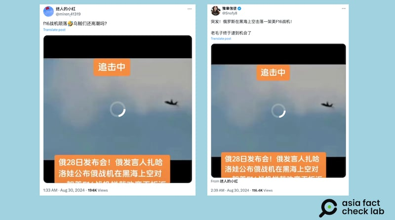

# 事實查覈｜俄飛行員擊落美國F16戰機視頻曝光？

作者：董喆、艾倫

2024.09.04 16:01 EDT

## 查覈結果：錯誤

## 一分鐘完讀：

近期，中國社羣平臺抖音以及X（原推特）流傳一則視頻，內容顯示一架戰機遭擊毀，視頻字幕宣稱這是俄羅斯飛行員在黑海上空擊落美國F-16戰機的畫面，並稱消息源自俄羅斯外交部發言人扎哈羅娃在8月28日的發佈。

亞洲事實查覈實驗室（AFCL）檢視俄羅斯外交部新聞發佈會視頻以及逐字稿，確認當日扎哈羅娃並沒有談及此事。軍事專家也告訴AFCL，該影片很可能爲電子遊戲畫面，並且，視頻中遭“擊毀”的戰機外型與F-16並不相符，更像是Su-25。美國國防部亦在回覆中告訴AFCL，此事爲假。

## 深度分析：

抖音帳號"最後一顆子彈"近期在微博貼出 [一則視頻](https://www.douyin.com/user/MS4wLjABAAAA_FlSI4r4ctpOuGkOxATo-xZN9jwja8E9yDDpcy-fXP8?from_tab_name=main&modal_id=7408081472617319707),稱俄羅斯發言人扎哈羅娃在8月28日的新聞發佈會中,公佈俄羅斯戰機在黑海上空擊落美國F16戰機的視頻,起因是美國F16戰機不接受勸離。相同的視頻也被轉貼到X的多個帳號( [鏈接1](https://archive.ph/ZIkmX), [鏈接2](https://archive.ph/cwZzD))。

亞洲事實查覈實驗室檢視由俄羅斯官方發佈的8月28日 [新聞簡報視頻](https://www.youtube.com/watch?v=HPrdJDH63fs),當日的主持人確實是外交部發言人扎哈羅娃,但長達2小時54分13秒的記者會中,扎哈羅娃並未發佈任何視頻,根據俄羅斯外交部Youtube頻道的視頻時間戳記,該發佈會也並未有任何一個主題與F-16有關。當天發佈的 [新聞簡報逐字稿](https://mid.ru/en/press_service/spokesman/briefings/1966922/),也未見扎哈羅娃有談及與F-16有關的內容。

AFCL採訪了臺灣國防安全研究院“中共政軍與作戰概念研究所”副研究員舒孝煌，他告訴AFCL，該視頻畫面中並沒有F-16，影片中攻擊敵機的戰機是F-22，被擊落的應該是Su -25，並且這段視頻看上去很像是空戰遊戲的畫面。

AFCL檢視影片，發現畫質相當模糊，爆炸煙霧與火光並不寫實，且網傳影片中有多處剪輯痕跡且用三段畫面重複播放，分別爲F-22由左至右飛行的畫面，以及Su-25由右往左的飛行畫面，最後是Su-25被擊落，但背景的環境音卻是連貫的，且爆破聲晚於擊落爆炸發生的時間。

針對黑海上空是否可能有美國戰機，舒孝煌亦說明，“F16主要在德國和意大利有聯隊，不會在黑海”，且從俄烏戰爭以來，爲了避免擴大沖突，美國就不再於黑海上飛戰機。雖然仍有美國的大型飛機在周邊活動，以提供烏克蘭的情報知識，但不會主動進入戰爭範圍。

美國國防部則以兩封信件回覆AFCL，首先表明“這是假的（This is false.）”接着以第二封信件表示，美國國防部不驗證非國防部來源的影片。 AFCL亦同步去信俄羅斯外交部，至截稿前未獲回應。

*亞洲事實查覈實驗室(Asia Fact Check Lab)針對當今複雜媒體環境以及新興傳播生態而成立。我們本於新聞專業主義,提供專業查覈報告及與信息環境相關的傳播觀察、深度報道,幫助讀者對公共議題獲得多元而全面的認識。讀者若對任何媒體及社交軟件傳播的信息有疑問,歡迎以電郵*  [*afcl@rfa.org*](mailto:afcl@rfa.org)  *寄給亞洲事實查覈實驗室,由我們爲您查證覈實。* *亞洲事實查覈實驗室在X、臉書、IG開張了,歡迎讀者追蹤、分享、轉發。X這邊請進:中文*  [*@asiafactcheckcn*](https://twitter.com/asiafactcheckcn)  *;英文:*  [*@AFCL\_eng*](https://twitter.com/AFCL_eng)  *、*  [*FB在這裏*](https://www.facebook.com/asiafactchecklabcn)  *、*  [*IG也別忘了*](https://www.instagram.com/asiafactchecklab/)  *。*

[Original Source](https://www.rfa.org/mandarin/shishi-hecha/hc-russian-pilot-shoots-down-us-fighter-jet-fact-check-09042024155807.html)