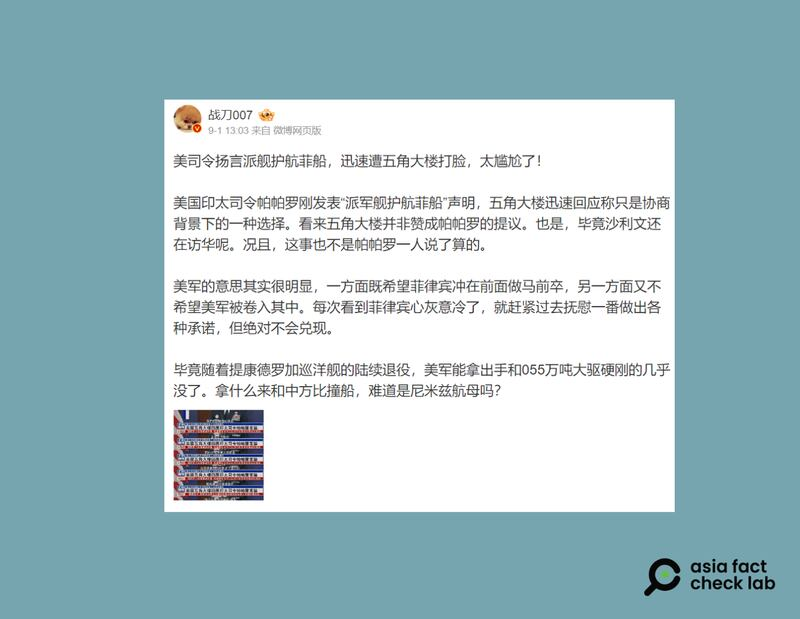
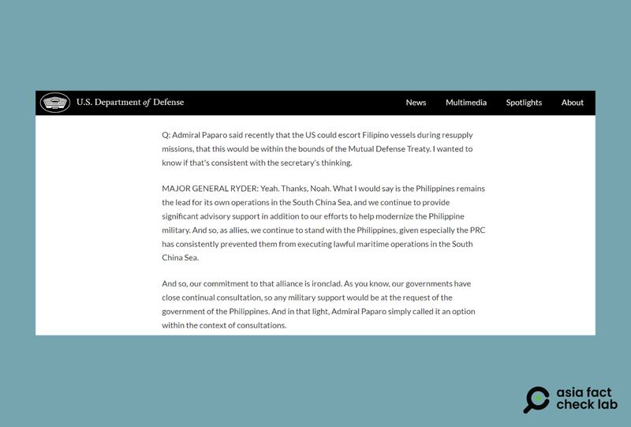

# 事實查覈｜美司令揚言在南海護航菲律賓 遭五角大樓"打臉"？

作者：莊敬

2024.09.04 16:12 EDT

## 查覈結果：誤導

## 一分鐘完讀：

近日微博等平臺有用戶發文，稱“美國印太司令帕帕羅發表‘派軍艦護航菲船’聲明”， 但卻被五角大樓“打臉”，並稱美國國防部並不贊成帕帕羅的提議。

亞洲事實查覈實驗室檢視了多家主流媒體報道，並比對美國國防部新聞稿，確認帕帕羅的原意是，美艦護送在南海執行運補任務的菲律賓船隻，是“一個完全合理的選項”，並強調須經美、菲協商，而美國國防部的說法，也與這項表態一致，因此，網傳所謂“帕帕羅的提議遭五角大樓打臉”爲誤導信息。

## 深度分析：

在微博擁有逾百萬粉絲的 [軍事博主"戰刀007"](https://m.weibo.cn/detail/5073780414353173)於9月1日發文:"美司令揚言派艦護航菲船,迅速遭五角大樓打臉,太尷尬了!美國印太司令帕帕羅( Samuel Paparo)剛發表'派軍艦護航菲船'聲明,五角大樓迅速回應稱只是協商背景下的一種選擇,看來五角大樓並非贊成帕帕羅的提議。"在 [其他平臺](https://www.ckhq.net/html/849f60102271ccc574a3855ae78fe4cd.html)上,也有網民發表類似內容。

"大V"軍事博主發文，稱美國印太司令揚言派艦護航菲船，卻遭五角大樓"打臉"。（微博截圖）

## 帕帕羅的原話是什麼？

亞洲事實查覈實驗室(Asia Fact Check Lab,下簡稱AFCL)以中文關鍵字查詢,找到《 [路透社](https://www.reuters.com/world/asia-pacific/philippines-says-china-is-biggest-disruptor-peace-region-2024-08-27/)》、《 [美國之音](https://www.voanews.com/a/7758497.html)》、《 [南華早報](https://www.google.com/search?q=Admiral+Paparo+said+recently+that+the+US+could+escort+Filipino+vessels&oq=Admiral+Paparo+said+recently+that+the+US+could+escort+Filipino+vessels&gs_lcrp=EgZjaHJvbWUqBggAEEUYOzIGCAAQRRg70gEHMTU3ajBqNKgCALACAA&sourceid=chrome&ie=UTF-8)》等媒體的相關報道。根據報道,帕帕羅8月底在馬尼拉參加一個由美國印太司令部組織的國際軍事會議,期間他與菲律賓參謀總長布勞納(Romeo Brawner)在場邊和記者交談,面對記者詢問華府是否考慮派艦護航菲律賓船只經過爭議海域時, [帕帕羅表示](https://www.youtube.com/watch?v=dOQR1wmTyFA):

“當然，在磋商的前提之下，兩個主權國家鑑於共同防禦，每個選項，包括護送一艘船前往另一艘船，都是完全合理的選項，都是在我們的共同防禦條約之內，屬於我們雙方緊密聯盟關係的一部份。（原文：I mean certainly, within the context of consultations, every option between the two sovereign nations, in terms of our mutual defense, escort of one vessel to the other is an entirely reasonable option within our Ｍutual Ｄefense Treaty, among this close alliance between the two of us.）”

路透社還在報道說明，帕帕羅沒有說明具體動用何種船隻執行上述任務。

對此布勞納表示，菲律賓會嘗試自己能夠採取的各種方法與渠道，“只要是我們能夠獨立完成的事情，我們就會自己做。”

## 美國國防部如何回應？

美國國防部發言人萊德(Pat Ryder)在 [8月27日記者會](https://www.defense.gov/News/Transcripts/Transcript/Article/3886761/pentagon-press-secretary-air-force-maj-gen-pat-ryder-holds-a-press-conference/)上,被問到帕帕羅有關美國可以護航菲船的說法,他回應:"美國與菲律賓政府一直密切磋商,任何軍事支援都將應菲律賓政府的請求進行。因此,帕帕羅只是說這是一個雙方磋商之下的選項。"

美國國防部發言人萊德在8月27日記者會上，回應有關美國可以護航菲船的說法。（美國國防部網站截圖）

萊德和帕帕羅的說法相符，都認爲這是一個選項，但強調須經美菲政府磋商。因此，帕帕羅並沒有“揚言派艦護航菲船”，網傳所謂“遭五角大樓打臉”的說法，是誤導信息。

近期,中國與菲律賓在南海爭議海域衝突加劇,已發生多起船隻碰撞事件,雙方互相指責。美國國務院於8月底 [發表聲明](https://www.state.gov/u-s-support-for-the-philippines-in-the-south-china-sea-12/)譴責中國的危險行爲,並重申1951年《美國菲律賓共同防禦條約》第四條適用於菲律賓武裝部隊、公務船隻或飛機,包括其海岸警衛隊船隻或飛機,一旦在南海的任何地方遭到他國武裝攻擊,美國有義務出兵提供援助。

*亞洲事實查覈實驗室(Asia Fact Check Lab)針對當今複雜媒體環境以及新興傳播生態而成立。我們本於新聞專業主義,提供專業查覈報告及與信息環境相關的傳播觀察、深度報道,幫助讀者對公共議題獲得多元而全面的認識。讀者若對任何媒體及社交軟件傳播的信息有疑問,歡迎以電郵*  [*afcl@rfa.org*](mailto:afcl@rfa.org)  *寄給亞洲事實查覈實驗室,由我們爲您查證覈實。* *亞洲事實查覈實驗室在X、臉書、IG開張了,歡迎讀者追蹤、分享、轉發。X這邊請進:中文*  [*@asiafactcheckcn*](https://twitter.com/asiafactcheckcn)  *;英文:*  [*@AFCL\_eng*](https://twitter.com/AFCL_eng)  *、*  [*FB在這裏*](https://www.facebook.com/asiafactchecklabcn)  *、*  [*IG也別忘了*](https://www.instagram.com/asiafactchecklab/)  *。*

[Original Source](https://www.rfa.org/mandarin/shishi-hecha/hc-us-commander-says-to-provide-escort-for-philippines-refuted-by-pentagon-fact-check-09042024160615.html)