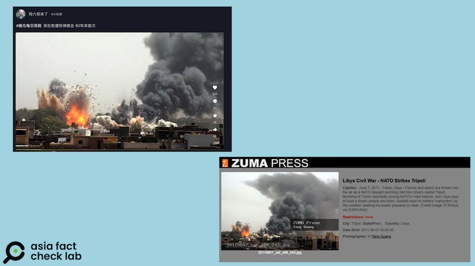

# 事實查覈｜英國倫敦遭到不明導彈襲擊？

作者：董喆

2024.09.05 13:30 EDT

## 查覈結果：錯誤

## 一分鐘完讀：

中國社羣平臺抖音與微博近日盛傳，英國倫敦遭到不明導彈襲擊，一座體育館爆炸。

亞洲事實查覈實驗室確認，抖音視頻是真的，但這場爆炸是8月30日倫敦市中心O2體育館電影拍攝的計劃性爆炸，火勢不慎蔓延，但並未造成傷亡。另有賬號貼出宣稱爲爆炸現場的照片，但經查這是2011年利比亞內戰時的舊照片。因此，所謂倫敦遭不明導彈攻擊爲錯誤訊息。

## 深度分析：

9月1日起,中國社羣平臺抖音與微博大量傳播宣稱"英國倫敦遭到不明導彈襲擊"的視頻與照片,其中抖音號 ["焦點時空"](https://www.douyin.com/user/MS4wLjABAAAAgR6V9QuyVyLi7QQOH1zN-TMOat219pYaD7ptBrERnMzaORBxCDrYNZT_HLb4phI4?from_tab_name=main&modal_id=7409574549861256474)發佈的視頻有破萬點贊以及超過4千則評論。網民稱"不管誰發的導彈,都必須點贊""英國是要內戰的節奏",甚至有稱可能導致第三次世界大戰。

近日，中文互聯網上有博主傳播“英國遭遇導彈襲擊”並獲廣泛關注 圖截取自抖音、新浪

視頻中火光熊熊，並有黑色濃煙竄起，許多抖音博主繪聲繪色描繪這場爆炸，稱英國於凌晨遇襲，是80年來首次遭到導彈攻擊。部分抖音號藉此拍起分析視頻，推測攻擊方是以色列或是俄羅斯，亦有博主認爲是美方與俄方的共謀，更有微博賬號稱“英方震驚，拜登發呆”。

各路視頻煞有其事地分析這場爆炸，但亞洲事實查覈實驗室（以下簡稱AFCL）以關鍵字搜尋，並未發現英國政府或國際媒體有提到英國遭到導彈襲擊一事。

## 視頻爲真，但是電影拍攝的計劃性爆炸

亞洲事實查覈實驗室以爆炸畫面反搜,英國 [《標準晚報》](https://www.standard.co.uk/news/london/o2-fire-explosion-greenwich-paedophile-film-set-bbc-london-b1179504.html) [《每日郵報》](https://www.dailymail.co.uk/news/article-13802231/explosion-london-o2-naked-paedophile-mastermind.html) [《太陽報》](https://www.thesun.co.uk/news/30190733/london-fire-o2-arena-blaze-thames-smoke/?utm_medium=Social&utm_campaign=sunmaintwitter&utm_source=Twitter#Echobox=1725132150-4)皆報道了相同的畫面,但內容與導彈襲擊毫無關聯。

網傳視頻與英國當地媒體的報道畫面對比 圖截取自抖音、《太陽報》和《標準晚報》

綜合上述媒體以及英國 [BBC報道](https://www.bbc.com/news/articles/c74jv94ggl0o),事發在9月1日倫敦O2體育館附近,是一處電影片廠正在進行拍攝,原先有計劃性的爆炸不慎引發火災。根據倫敦消防局的 [火災通報](https://www.london-fire.gov.uk/incidents/2024/august/fire-silvertown/),火警地點在倫敦銀鎮(Silvertown)碼頭路(Dock Road)的一處露天庭院,一輛貨車被燒燬,一輛汽車和一輛卡車受損,但沒有人員傷亡。這場火災派出了4輛消防車與25名消防員,於晚間7時51分獲報,9時02分控制了火勢,事故發生的時間也與網傳的"凌晨"不符。

## 照片爲假，是2011利比亞內戰舊照

中國社羣平臺亦流傳另一張清晰影像，稱是這次倫敦遭到導彈攻擊的真實畫面。

AFCL以圖反搜,發現這張照片出自美國 [ZUMA通訊社](https://zuma.press/zpdtl.html?IMG=20110607_zaf_x99_243.jpg&CNT=82),時間爲2011年6月7日,當時正值利比亞內戰,北約對其首都的黎波里進行轟炸。這張照片是13年前利比亞戰事現場的照片。

利比亞戰爭舊照被挪用作英國遇襲證據 圖截取自抖音、ZUMA

## “英國被導彈襲擊”謠言傳播的背景

AFCL觀察到，網民在討論英國遭導彈襲擊時，紛紛提到這可能是第三次世界大戰的前奏，且這些視頻多數被加上“俄烏局勢”的標籤。

經查,這樣的評論其實不是空穴來風,根據英國 [《獨立報》](https://www.independent.co.uk/news/world/europe/vladimir-putin-ally-london-bomb-world-war-3-b2108980.html)2022年的報道,親普京的統一俄羅斯黨成員安德列·古魯廖夫 (Andrey Gurulyov) 在俄羅斯國家電視臺上表示,如果第三次世界大戰爆發,倫敦將成爲第一個被俄羅斯導彈擊中的北約戰略目標。

另外,2023年5月英國確定 [向烏克蘭提供暴風影導彈(Storm Shadow)](https://www.rfi.fr/tw/%E4%B8%AD%E5%9C%8B/20230511-%E5%A6%82%E8%99%8E%E6%B7%BB%E7%BF%BC-%E7%83%8F%E5%85%8B%E8%98%AD%E7%8D%B2%E5%BE%97%E8%8B%B1%E5%9C%8B%E6%9A%B4%E9%A2%A8%E5%BD%B1%E9%81%A0%E7%A8%8B%E5%B0%8E%E5%BD%88),提供烏克蘭打退"烏克蘭境內"的俄羅斯武裝。但俄羅斯衛星通訊社今年7月在報道克里姆林宮批評倫敦允許烏克蘭使用暴風影導彈攻擊"俄羅斯境內"不負責任。俄方對飛彈使用限制的說法與英方不同,但仍然激起不少中國網民在 [微博留言](https://archive.ph/hb0wL),要俄羅斯向英國發動攻擊。

這次英國火災影片曝光,變成了炒作俄烏戰爭錯假資訊的素材。災難影片經常被挪用爲戰爭假資訊,過去AFCL曾針對此類型假資訊查覈( [事實查覈|臺灣軍演釀事故 導彈炸燬民宅?](2024-07-26_事實查覈｜臺灣軍演釀事故　導彈炸燬民宅？.md))。

【勘誤：2023年5月英國確定向烏克蘭提供暴風影導彈（Storm Shadow），提供烏克蘭打退“烏克蘭境內”的俄羅斯武裝。原文在發表時寫成了“今年”，現已更正。】

*亞洲事實查覈實驗室（Asia Fact Check Lab）針對當今複雜媒體環境以及新興傳播生態而成立。我們本於新聞專業主義，提供專業查覈報告及與信息環境相關的傳播觀察、深度報道，幫助讀者對公共議題獲得多元而全面的認識。讀者若對任何媒體及社交軟件傳播的信息有疑問，歡迎以電郵afcl@rfa.org寄給亞洲事實查覈實驗室，由我們爲您查證覈實。*

*亞洲事實查覈實驗室在X、臉書、IG開張了,歡迎讀者追蹤、分享、轉發。X這邊請進:中文*  [*@asiafactcheckcn*](https://twitter.com/asiafactcheckcn)  *;英文:*  [*@AFCL\_eng*](https://twitter.com/AFCL_eng)  *、*  [*FB在這裏*](https://www.facebook.com/asiafactchecklabcn)  *、*  [*IG也別忘了*](https://www.instagram.com/asiafactchecklab/)  *。*

[Original Source](https://www.rfa.org/mandarin/shishi-hecha/hc-uk-london-attack-rumor-09052024133038.html)