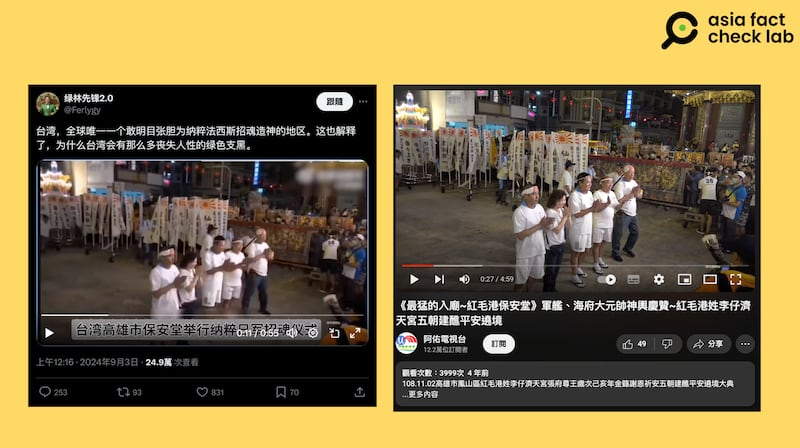

# 事實查覈｜網傳視頻顯示臺灣高雄保安堂爲日軍招魂？

作者：董喆

2024.09.06 14:35 EDT

## 查覈結果：部分錯誤

## 一分鐘完讀：

社媒平臺X上有帳號貼出視頻，稱臺灣高雄有一所廟宇替日軍舉行招魂儀式。亞洲事實查覈實驗室查證，發現視頻中的廟宇是紅毛港保安堂，雖然這座廟宇確實有供奉有日軍官兵。但網傳視頻內容儀式則是2019年在另一廟宇“濟天宮”舉辦的五朝建醮活動，與所謂招魂儀式無關。

## 深度分析：

近期 X（原推特）上有帳號貼出視頻，稱臺灣高雄保安堂替日軍舉行招魂儀式。

亞洲事實查覈實驗室（以下簡稱AFCL ）以保安堂、高雄作爲關鍵字搜索，確定高雄僅有一家保安堂，爲紅毛港保安堂，位於高雄市鳳山區，是全臺唯一供奉日本軍艦官兵的日式廟宇。

接着以影片中出現的“光輝機車行”招牌，在Google地圖中確認高雄僅此一家，位在鳳山區國慶六街。因此可判斷影片事發地爲在國慶六街周邊。

再以保安堂、國慶六街作爲關鍵字搜索,AFCL找到一則由" [廟會先鋒報](https://www.facebook.com/xianfengbao2009/photos/a.624463717615751/2683717781690324/?type=3&locale=sr_RS)"發佈的臉書貼文,內容爲2019年11月2日的五朝建醮活動,主辦單位爲紅毛港濟天宮,紅毛港保安堂爲參與神輿之一,且路線行經國慶六街。

網傳視頻中的祈福活動爲另一廟宇，與紀念日軍無關（臉書截圖）

AFCL以活動名稱"紅毛港姓李仔濟天宮五朝建醮"在影音平臺Youtube搜索,找到以紀錄廟會活動的頻道"阿財電視臺",有一與活動名稱相符的 [播放清單](https://www.youtube.com/watch?v=lhEfDDbzGLY&list=PLE5QxqAZZGS6r6UZIfIsUA00OGUsGGRek&ab_channel=%E9%98%BF%E4%BD%91%E9%9B%BB%E8%A6%96%E5%8F%B0),當中《《最猛的入廟~紅毛港保安堂》軍艦、海府大元帥神輿慶贊~紅毛港姓李仔濟天宮五朝建醮平安繞境》,影片49秒起至2分50秒處,多處畫面與網傳畫面符合。

網傳視頻截圖與2019年的建醮祈福活動的活動截圖對比（X、Youtube截圖）

因此，X上網民所稱的日軍招魂儀式，實際上是2019年的建醮祈福活動。

不過紅毛港保安堂供奉的"海府大元帥"確實爲二戰日本海軍軍官造型,陪祀一艘名爲"蓬38號哨戒艇"的日本軍艦。根據紅毛港保安堂自行錄製的 [訪談紀錄](https://youtu.be/56uExb9hSkg?si=LZpxKKlrvlUI6L2h&t=96),主委張吉雄表示"蓬38號哨戒艇"二戰時長期在高雄港巡防,二戰時遭美軍潛水艇擊沉,艦上145人全數陣亡,2018年才查出艦長"海府大元帥"的實際身份爲日軍中尉高田又男。

保安堂確實曾在2018年9月 [舉辦海上繞境招魂法會](https://www.chinatimes.com/realtimenews/20180915002449-260405?chdtv),將145位日軍英靈引回保安堂奉祀。廟方表示未來會再找機會讓官兵魂歸日本。

綜合查覈結果，AFCL確認高雄紅毛港保安堂的確曾經爲日軍舉辦招魂儀式，但網傳影片與此事無關。

*亞洲事實查覈實驗室(Asia Fact Check Lab)針對當今複雜媒體環境以及新興傳播生態而成立。我們本於新聞專業主義,提供專業查覈報告及與信息環境相關的傳播觀察、深度報道,幫助讀者對公共議題獲得多元而全面的認識。讀者若對任何媒體及社交軟件傳播的信息有疑問,歡迎以電郵*  [*afcl@rfa.org*](mailto:afcl@rfa.org)  *寄給亞洲事實查覈實驗室,由我們爲您查證覈實。* *亞洲事實查覈實驗室在X、臉書、IG開張了,歡迎讀者追蹤、分享、轉發。X這邊請進:中文*  [*@asiafactcheckcn*](https://twitter.com/asiafactcheckcn)  *;英文:*  [*@AFCL\_eng*](https://twitter.com/AFCL_eng)  *、*  [*FB在這裏*](https://www.facebook.com/asiafactchecklabcn)  *、*  [*IG也別忘了*](https://www.instagram.com/asiafactchecklab/)  *。*

[Original Source](https://www.rfa.org/mandarin/shishi-hecha/hc-taiwanese-worship-war-criminals-rumor-09062024143445.html)