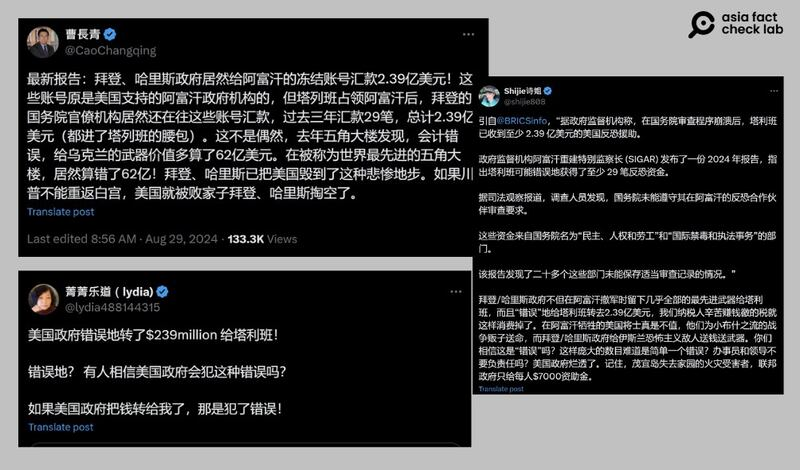
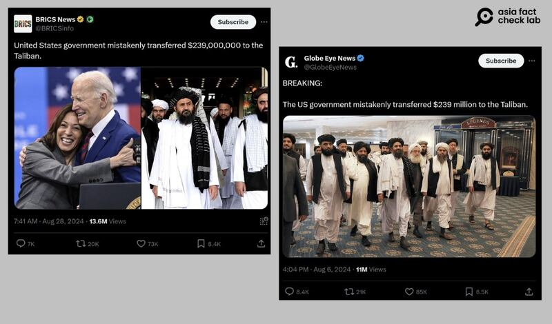

# 事實查覈｜美國政府送錢2.39億給塔利班？

作者：艾倫

2024.09.06 14:30 EDT

## 查覈結果：證據不足

## 一分鐘完讀：

八月底，中英文社媒流傳一則消息，內容稱拜登政府在2021年撤軍阿富汗後，仍持續給予阿富汗政府資金協助，最後都“流入了塔利班的口袋”，共計2.39億美元。

亞洲事實查覈實驗室（Asia Fact Check Lab，下稱AFCL）查閱阿富汗重建特別監察長辦公室的監察資料，發現並沒有直接證據證明有美國資金被塔利班收爲己有；網傳“2.39億”的數字也有誤。

## 深度分析：

8月29日,美籍華裔評論員曹長青在X上 [發文](https://x.com/CaoChangqing/status/1828959944671989989),稱美國拜登政府在塔利班佔領阿富汗後,還持續往已經被凍結的賬戶匯款,他具體指出:"過去三年的匯款有29筆,共2.39億美元"。相關消息也曾被其他獲認證的中文X用戶轉傳( [1](https://x.com/shijie808/status/1828691471471694206), [2](https://x.com/lydia488144315/status/1821334850659369411))。

曹長青發文後一週內，觸及率已破十萬，轉發超過250則，網民紛紛評論這是“洗錢”、拜登和賀錦麗是“無能的敗家子”。

多名中文獲認證用戶於八月時在社媒平臺上指出，稱美國政府誤轉了2.39億美金給塔利班政府。（X截圖）

AFCL以關鍵字搜尋,找到英文世界也曾流傳類似說法。經過企業認證的"黃勾勾"X帳號"BRICS News"在8月28日 [發文](https://x.com/BRICSinfo/status/1828578648577716597),稱"美國政府誤轉兩億三千九百萬美元給塔利班",帳號"Global Eye News"也曾在8月6日時發表相同 [文章](https://x.com/GlobeEyeNews/status/1820732559782969602),兩者的觸及率至截稿日(9月5日)皆已突破一千萬。

拜登政府轉錢給塔利班的消息也在英文社媒流傳，且流量極高。（X截圖）

## 監察報告怎麼說

[阿富汗重建特別監察長辦公室](https://www.sigar.mil/)(SIGAR)是美國針對重建阿富汗的監察機構,它評估重建的效率和效益,並且發表公開報告。 SIGAR曾在今年7月發佈調查報告,提及和前述傳聞相關的情況。

這份報告調查在2022年3月1日至11月30日期間阿富汗重建經費的執行情況。不過在這段期間美軍已逐步撤離阿富汗，塔利班政權基本上已經掌控整個國家。

塔利班自2021年8月掌權以來，試圖通過不同手段獲取美國原本用於惠及阿富汗人民的資金，其中包括設立非政府組織（NGO）。 SIGAR報告提到，國務院官員在2023年9月曾告知，並未發現有任何接受資金的人被認定是新成立的親塔利班相關組織。

不過，報告也警示，美國國際開發署（USAID）的官員告知SIGAR，USAID“聽說有報告稱超過1,000家新的（阿富汗）國內NGO已在所謂的經濟部門（Ministry of Economy）註冊，並有傳言稱其中許多新註冊的NGO可能與塔利班有關聯。”

SIGAR在2023年10月發佈的另一份報告 —- " [阿富汗的教育現況](https://www.sigar.mil/pdf/evaluations/SIGAR-24-01-IP.pdf)"中提到,塔利班即使沒有直接收取金錢,也能透過很多"間接"的方式取得美國重建阿富汗計劃的資金。

例如，徵收此計劃所僱員工所得稅、以及其組織的水電費、銷售稅等；塔利班政府也透過滲透、勒索現有提供教育援助的阿富汗組織，從中獲得美國補助的教育資金；最後則是強迫NGO僱用塔利班支持者、或從塔利班所持的公司購買商品。

## 美國政府資金確有流向塔利班的“風險”

SIGAR的報告確實指出了美國政府資金有進入塔利班口袋的"風險"(risk),但並不是如網傳所稱直接進了塔利班政權的口袋。對於這一點,SIGAR也在8月6日於X上 [推文澄清](https://x.com/SIGARHQ/status/1820550350731973104)。

美國國務院回應AFCL再次強調，SIGAR沒有提供任何證據表明國務院的資金被轉移給塔利班，而是塔利班可能從中獲益的“風險增加”。“儘管國務院已向SIGAR督察長提供證據，表明這些資助項目（被點名的DRL及INL）已通過同樣嚴格的標準進行審查。令人失望的是，SIGAR選擇不在其報告中傳達這些信息”，國務院說。

此外,根據AFCL [查閱文件](https://www.sigar.mil/pdf/audits/SIGAR-24-31-AR.pdf)所見,SIGAR也指出美國國務院兩個局處提供的審計文件資料不夠充足,無法判斷是否遵守審查要求。

最後，報告也指出國務院在本次調查期間，於阿富汗的支出共“2.93”億美元，而非如X用戶所稱的“2.39”億。

因此，對比公開信息，網傳信息稱美國給塔利班“送錢”的說法，並沒有依據。

*亞洲事實查覈實驗室(Asia Fact Check Lab)針對當今複雜媒體環境以及新興傳播生態而成立。我們本於新聞專業主義,提供專業查覈報告及與信息環境相關的傳播觀察、深度報道,幫助讀者對公共議題獲得多元而全面的認識。讀者若對任何媒體及社交軟件傳播的信息有疑問,歡迎以電郵*  [*afcl@rfa.org*](mailto:afcl@rfa.org)  *寄給亞洲事實查覈實驗室,由我們爲您查證覈實。* *亞洲事實查覈實驗室在X、臉書、IG開張了,歡迎讀者追蹤、分享、轉發。X這邊請進:中文*  [*@asiafactcheckcn*](https://twitter.com/asiafactcheckcn)  *;英文:*  [*@AFCL\_eng*](https://twitter.com/AFCL_eng)  *、*  [*FB在這裏*](https://www.facebook.com/asiafactchecklabcn)  *、*  [*IG也別忘了*](https://www.instagram.com/asiafactchecklab/)  *。*

[Original Source](https://www.rfa.org/mandarin/shishi-hecha/hc-us-donation-rumor-09062024142928.html)