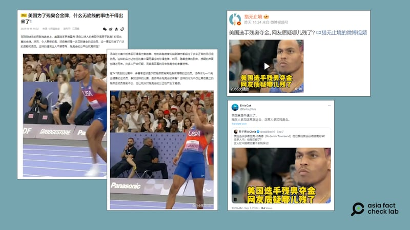

# 事實查覈｜美國派出健全運動員參加殘奧會？

作者：莊敬

2024.09.10 13:04 EDT

## 查覈結果：錯誤

## 一分鐘完讀：

近日在社媒平臺上，有多名中文用戶質疑在巴黎殘奧會獲得金牌的美國跳高選手湯森德的參賽資格，稱湯森德“是一名四肢健全的運動員”，嘲諷“美國殘疾人蔘加正常奧運會，正常人蔘加殘奧會”。

根據媒體報道與相關單位的網站介紹，湯森德出生時右臂和肩膀受到永久性神經損傷，符合男子跳遠T47級（上肢功能障礙）參賽資格。部分中文社媒用戶傳播了錯誤信息。

## 深度分析：

2024年巴黎殘奧會(Paralympic Games,又稱帕運或殘奧會)於8月28日至9月8日舉行,美國運動員湯森德(Roderick Townsend,又譯湯森)在男子跳高T47級比賽中奪得金牌。隨後在 [X](https://x.com/Dafoo_Elvis/status/1832241527050977482)、 [微博](https://m.weibo.cn/detail/5076760354101640)、 [搜狐](https://www.sohu.com/a/806926400_121929064)等平臺上,出現質疑湯森德參賽資格的聲音,多名中文用戶問"他殘在哪了?",還有網民稱湯森德"是一名四肢健全的運動員"。

其中，搜狐作者“小陳言社會”9月6日發佈的文章指出，“在T47級別的比賽中，參賽者應該是下肢殘疾或有其他身體障礙的運動員。湯森作爲一個完全健康的運動員，參加這樣的比賽，是否符合殘奧會的宗旨？”

近日在社媒平臺上，多位中文用戶發文質疑美國跳高選手湯森德參加巴黎帕奧會的資格。（圖取自X、微博、搜狐）

根據國際殘奧委員會(IPC)的 [分級](https://www.paralympic.org/athletics/classification),湯森德所參加的男子跳遠T47級,是針對上肢功能障礙的運動員。而根據 [美國哥倫比亞廣播公司(CBS)](https://www.cbsnews.com/news/paralympics-roderick-townsend-high-jump-gold-medal-showman-hairstyle/)報道與IPC的 [網站介紹](https://www.paralympic.org/news/5-facts-usa-s-roderick-townsend-roberts),湯森德出生時右臂和肩膀受到永久性神經損傷。

因此，湯森德符合帕奧男子跳高T47級參賽資格，部分中文網民所指湯森德“完全健康”、“四肢健全”、不符合參賽資格等說法，爲錯誤信息。

*亞洲事實查覈實驗室(Asia Fact Check Lab)針對當今複雜媒體環境以及新興傳播生態而成立。我們本於新聞專業主義,提供專業查覈報告及與信息環境相關的傳播觀察、深度報道,幫助讀者對公共議題獲得多元而全面的認識。讀者若對任何媒體及社交軟件傳播的信息有疑問,歡迎以電郵*  [*afcl@rfa.org*](mailto:afcl@rfa.org)  *寄給亞洲事實查覈實驗室,由我們爲您查證覈實。* *亞洲事實查覈實驗室在X、臉書、IG開張了,歡迎讀者追蹤、分享、轉發。X這邊請進:中文*  [*@asiafactcheckcn*](https://twitter.com/asiafactcheckcn)  *;英文:*  [*@AFCL\_eng*](https://twitter.com/AFCL_eng)  *、*  [*FB在這裏*](https://www.facebook.com/asiafactchecklabcn)  *、*  [*IG也別忘了*](https://www.instagram.com/asiafactchecklab/)  *。*

[Original Source](https://www.rfa.org/mandarin/shishi-hecha/hc-paralympic-games-paris-2024-09102024130203.html)