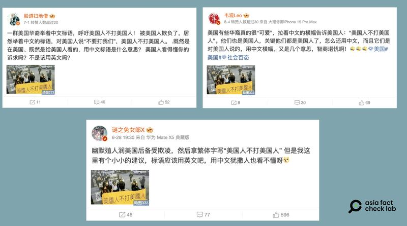
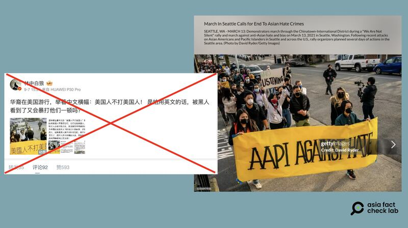

# 事實查覈｜在美華人拉"美國人不打美國人"橫幅求饒？

作者：董喆

2024.09.11 13:12 EDT

## 查覈結果：錯誤

## 一分鐘完讀：

近期中國社羣平臺轉傳一張照片，稱華裔人士在美國遭遇欺凌，拉着“美國人不打美國人”的橫幅遊行告饒。經查，該原圖出自Getty Images，是亞裔社區反仇恨的遊行活動照片，橫幅上實際寫着“AAPI AGAINST HATE”，該標語遭到P圖篡改，中文社羣上流傳的網帖文圖皆不屬實。

## 深度分析：

微博賬號"林中白狼"在微博 [發文](https://archive.ph/ihnsx),稱華裔在美國遊行,舉着中文標語"美國人不打美國人",嘲諷遊行羣衆"是怕用英文的話,被黑人看到了又會暴打他們一頓嗎? ​​​"

同樣的照片與評論自今年6月起零星出現在微博，多數是在嘲諷“潤”到美國的中國移民，認爲他們移民後遭到“欺凌”，卻不懂得用英文表達維權訴求。

在新浪微博上被反覆傳播的美國華裔遊行呼籲"美國人不打美國人"資訊（微博截圖）

亞洲事實查覈實驗室以圖片反搜,發現這張照片 [原圖](https://www.gettyimages.hk/detail/%E6%96%B0%E8%81%9E%E7%85%A7%E7%89%87/demonstrators-march-through-the-chinatown-international-district-%E6%96%B0%E8%81%9E%E7%85%A7%E7%89%87/1231697933?adppopup=true)出自美國圖片交易公司Getty Images,攝影師爲David Ryder,照片記錄的是2021年3月西雅圖唐人街的遊行場景,該事件背景是新冠疫情期間,美國發生多起與亞裔仇恨有關的暴力犯罪事件,因此包括華人社區在內的亞裔社區組織了這次活動。原圖橫幅上的文字爲"AAPI AGAINST HATE"(亞裔和太平洋島民社區反仇恨),網傳圖片將其編輯篡改爲繁體中文"美國人不打美國人"。

2021年3月西雅圖AAPI社區反仇恨遊行新聞圖片遭到篡改後在中文社區傳播和曲解（微博、Getty Images截圖）

美國非營利媒體 [Real Change](https://www.realchangenews.org/news/2021/03/17/seattle-s-aapi-community-was-far-silent-against-hate-protest-hing-hay-park)和 [《西雅圖時報》](https://www.seattletimes.com/seattle-news/seattle-demonstration-decries-cowardly-violence-against-asian-americans-elders/)皆有報道這場活動。遊行標語中的AAPI(Asian Americans and Pacific Islanders,AAPI)指的是亞裔和太平洋島嶼裔美國人,包括但不限於華裔移民。新冠疫情期間 [AAPI社區](https://stopaapihate.org/)有一系列的反仇恨行動。

*亞洲事實查覈實驗室（Asia Fact Check Lab）針對當今複雜媒體環境以及新興傳播生態而成立。我們本於新聞專業主義，提供專業查覈報告及與信息環境相關的傳播觀察、深度報道，幫助讀者對公共議題獲得多元而全面的認識。讀者若對任何媒體及社交軟件傳播的信息有疑問，歡迎以電郵afcl@rfa.org寄給亞洲事實查覈實驗室，由我們爲您查證覈實。*

*亞洲事實查覈實驗室在X、臉書、IG開張了,歡迎讀者追蹤、分享、轉發。X這邊請進:中文*  [*@asiafactcheckcn*](https://twitter.com/asiafactcheckcn)  *;英文:*  [*@AFCL\_eng*](https://twitter.com/AFCL_eng)  *、*  [*FB在這裏*](https://www.facebook.com/asiafactchecklabcn)  *、*  [*IG也別忘了*](https://www.instagram.com/asiafactchecklab/)  *。*

[Original Source](https://www.rfa.org/mandarin/shishi-hecha/hc-banner-americans-do-not-beat-americans-fact-check-09112024130615.html)