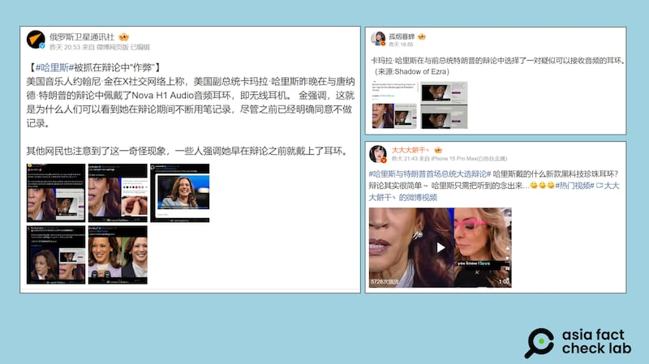
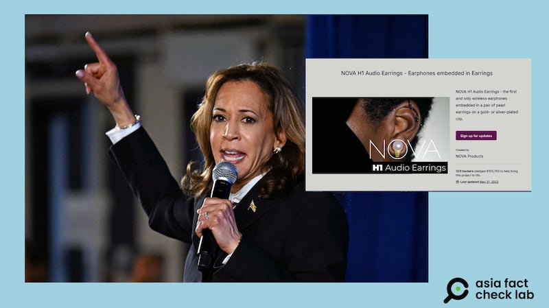
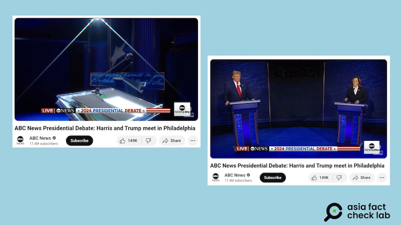

# 事實查覈｜哈里斯電視辯論被實錘"作弊"？

作者：莊敬

2024.09.12 15:58 EDT

## 查覈結果：錯誤

## 一分鐘完讀：

美國民主黨總統候選人哈里斯、共和黨候選人特朗普於美東時間9月10日進行首場電視辯論後，中文互聯網上多個“大V”盛傳哈里斯辯論時“作弊”，“證據”包括佩戴以耳環僞裝的耳機，違規用筆記錄等，俄羅斯衛星通訊社的中文賬號也同步傳播報道了這些消息。

亞洲事實查覈實驗室查覈比對後發現，哈里斯辯論時佩戴的耳環並非網傳的“耳機”。另根據辯論規定，候選人不得使用道具或預寫的筆記，但講臺上會提供一支筆、一疊紙和一瓶水，並沒有網傳所謂“不能做記錄”的規定。因此，前述有關哈里斯辯論“作弊”的傳言，爲錯誤信息。

## 深度分析：

美國民主黨總統候選人哈里斯(Kamala Harris,又譯賀錦麗)、共和黨候選人特朗普(Donald Trump,又譯川普)於美東時間9月10日晚間,在賓州費城進行首場電視辯論,這次總統大選辯論由美國廣播公司(ABC)主辦,安排在沒有現場觀衆的攝影棚內進行。ABC在辯論前幾日,發佈了 [辯論規定](https://abcnews.go.com/US/abc-news-releases-rules-sept-10-debate-harris/story?id=113019909)。

亞洲事實查覈實驗室(Asia Fact Check Lab,下簡稱AFCL)注意到,在辯論會後,中、英文社媒上出現質疑哈里斯"作弊"的聲音,中文世界的傳播者包括 ["孤煙暮蟬"](https://m.weibo.cn/u/2150758415)等微博用戶。其中,在微博擁有逾千萬粉絲的 [俄羅斯衛星通訊社](https://m.weibo.cn/detail/5077522792583550)在9月11日發文,稱"哈里斯被抓在辯論中作弊",內文如下:

“美國音樂人約翰尼·金在X社交網絡上稱，美國副總統卡瑪拉·哈里斯昨晚在與唐納德·特朗普的辯論中佩戴了Nova H1 Audio音頻耳環，即無線耳機。金強調，這就是爲什麼人們可以看到她在辯論期間不斷用筆記錄，儘管之前已經明確同意不做記錄。” 這則帖子附有約翰尼·金的原文，以及其他英文社媒用戶的類似言論。

9月10日美國總統大選辯論後，中國平臺盛傳民主黨候選人哈里斯佩戴特定音頻耳環，疑似"作弊"。（微博截圖）

## 哈里斯佩戴的是什麼耳環？

俄羅斯衛星通訊社帖文稱：一，哈里斯在辯論時佩戴特定品牌的音頻耳環，也就是耳機。二，哈里斯在辯論期間用筆記錄，違反了規定。

首先,AFCL比對了哈里斯在辯論時佩戴的耳環,以及網民所指的Nova H1 Audio音頻耳環,兩款耳環雖然都有珍珠,但金屬部分的造型明顯不同。而根據時尚博客蘇珊‧凱利(Susan Kelley)所設立有關哈里斯穿著的網站 ["What Kamala Wore"](https://whatkamalawore.com/tiffany-hardwear-pearl-earrings-necklace/),哈里斯這對耳環是蒂芬妮(Tiffany & Co.)的,她經常佩戴。

美國民主黨總統候選人哈里斯在電視辯論時佩戴的珍珠耳環（左），與網傳的音頻耳環（右）造型不同。（AFP/Jim WATSON、Ｘ截圖）

有關哈里斯佩戴音頻耳環的傳言,已有多個單位發佈查覈報告,包括 [《今日美國》](https://www.usatoday.com/story/news/factcheck/2024/09/11/kamala-harris-earrings-debate-fact-check/75174487007/)(USA Today)、 [FactCheck.org](http://factcheck.org)、 [PolitiFact](https://www.politifact.com/factchecks/2024/sep/11/social-media/no-kamala-harris-was-not-wearing-audio-earrings-du/),亦有相關 [報道](https://www.cbsnews.com/news/kamala-harris-earpiece-debate-false-claims-laura-loomer/)。另有中國平臺發佈 [闢謠文章](https://news.ifeng.com/c/8cnPX9lztM8)。

## 辯論時用筆記錄違反規定？

俄羅斯衛星通訊社所引述的社媒用戶稱，“（辯論會）之前已經明確同意不做記錄”，質疑哈里斯在辯論時不斷用筆記錄，違反規定。

根據主辦方發佈的 [辯論規定](https://abcnews.go.com/US/abc-news-releases-rules-sept-10-debate-harris/story?id=113019909),以及 [《紐約時報》](https://www.nytimes.com/2024/09/10/us/politics/debate-rules-harris-trump-microphone-audience.html) [《華爾街日報》](https://www.wsj.com/livecoverage/harris-trump-presidential-debate-election-2024/card/harris-takes-notes-trump-doesn-t-XVcwqZpa02T4f92hS0Ni)的報道,辯論不允許使用道具或預先寫好的筆記,但講臺上有一支筆、一疊紙和一瓶水,候選人可用講臺上的紙筆做記錄。

而根據ABC播出的總統辯論 [視頻](https://www.youtube.com/watch?v=kRh6598RmHM&t=137s),主持人在辯論開始前簡短說明規定,畫面可見講臺上已有紙筆。兩位候選人大約在2分20秒時步入辯論場地,兩人手上都沒有拿任何道具,雙方握手致意後在各自的講臺就位。在視頻2分35秒處,哈里斯拿起了講臺上的筆。

美國總統大選電視辯論會的畫面顯示，講臺上備有紙筆（左）、民主黨候選人哈里斯站上講臺後便拿起筆（右）。（YouTube截圖）

俄羅斯衛星通訊社雖是引述社媒用戶的發文，但作爲一個國家通訊社，未盡查證義務，也未提供重要背景資訊，在中文社媒平臺造成該消息的擴大傳播。在多個媒體機構發佈查覈報告後，仍未見其移除或修正該帖，任由不實信息持續被轉發擴散。

*亞洲事實查覈實驗室（Asia Fact Check Lab）針對當今複雜媒體環境以及新興傳播生態而成立。我們本於新聞專業主義，提供專業查覈報告及與信息環境相關的傳播觀察、深度報道，幫助讀者對公共議題獲得多元而全面的認識。讀者若對任何媒體及社交軟件傳播的信息有疑問，歡迎以電郵afcl@rfa.org寄給亞洲事實查覈實驗室，由我們爲您查證覈實。*

*亞洲事實查覈實驗室在X、臉書、IG開張了,歡迎讀者追蹤、分享、轉發。X這邊請進:中文*  [*@asiafactcheckcn*](https://twitter.com/asiafactcheckcn)  *;英文:*  [*@AFCL\_eng*](https://twitter.com/AFCL_eng)  *、*  [*FB在這裏*](https://www.facebook.com/asiafactchecklabcn)  *、*  [*IG也別忘了*](https://www.instagram.com/asiafactchecklab/)  *。*

[Original Source](https://www.rfa.org/mandarin/shishi-hecha/hc-us-elections-2024-presidential-debate-09122024154813.html)