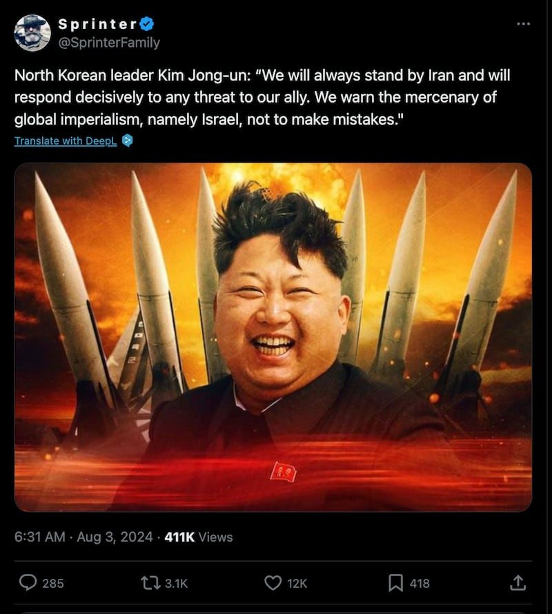
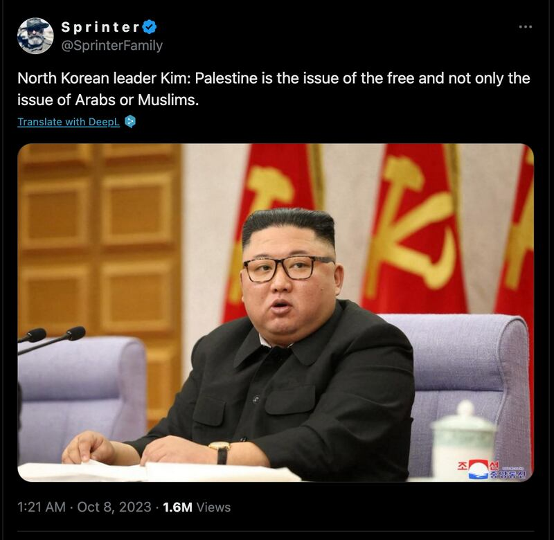
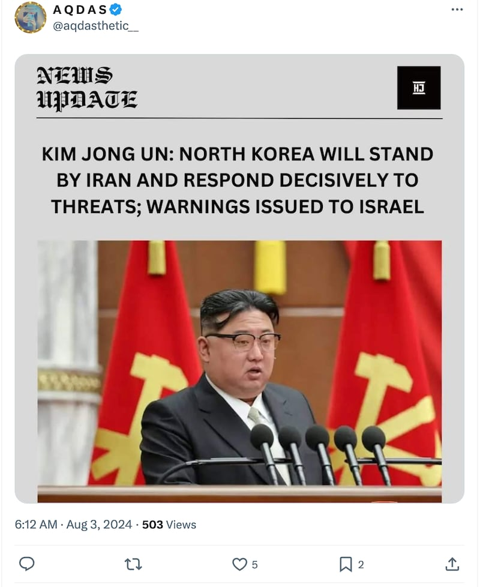

# 事實查覈 | 金正恩本人稱要對以色列採取軍事行動？

作者：Dukin Han

2024.09.16 12:48 EDT

## 查覈結果：缺乏證據

## 一分鐘完讀

X(Twitter)、Facebook和Instagram等社交平臺上從今年8月起流傳一則宣稱是朝鮮最高領導人金正恩本人發表的聲明，威脅要對以色列採取軍事行動，以此支持伊朗。

但記者查覈後發現，這些被認爲出自金正恩本人的言論並不屬實。沒有證據顯示金正恩曾以本人名義發表過任何有關朝鮮直接參與以色列-伊朗衝突、或揚言軍事威脅以色列的聲明。一個傳播這個說法的帳號，甚至貼出一張報紙風格的圖像，但這張照片來自去年的朝鮮黨代表大會，會上金正恩也沒有任何與以色列、伊朗議題相關的發言。

## 深度分析

多個社羣平臺宣稱金正恩在以色列與伊朗的衝突中曾經親自發表這一段談話:"我們將永遠與伊朗站在一起,並將堅決回應對盟友伊朗的任何威脅。我們也警告全球帝國主義的爪牙,也就是以色列,不要犯錯。" [這則貼文](https://x.com/SprinterFamily/status/1819501293574238558)在有些帳號下甚至獲得40萬次點看數。

有社媒賬號傳播金正恩“本人發表”的談話，稱要與伊朗站在一起。（X截圖）

這些散播所謂金正恩針對以色列聲明的主要來源,其中一個是X平臺上的帳號"@Sprinterfamily"。這個帳號過往就有傳播與朝鮮有關的虛假資訊紀錄。例如,去年10月該帳號 [聲稱](https://x.com/SprinterFamily/status/1710706840105820232),金正恩表示:"巴勒斯坦不只是關乎阿拉伯人或穆斯林的議題,也關乎自由"。這則貼文在過去10個月也獲得了約160萬次瀏覽。但與目前的情況類似,在朝鮮媒體同樣找不到金正恩曾經直接說過這樣的話。

@Sprinterfamily”之前就有發送朝鮮假消息的紀錄。 （X截圖）

## 朝鮮官媒的確曾經批以挺伊

記者審閱了所謂的“金正恩聲明”開始流傳之前、朝鮮媒體有關伊朗和以色列的報道。 7月下旬，朝鮮的《勞動新聞》和英文週報《平壤時報》確實曾發表文章，批評以色列的行爲。然而，這些報道中並沒提及任何社媒流傳的所謂金正恩的聲明。

例如,7月21日的《勞動新聞》就刊登了 [一篇文章](http://www.rodong.rep.kp/cn/index.php?MTJAMjAyNC0wNy0yMS1IMDA5QDExQDBA5Lul6Imy5YiXQDBAMg==),譴責以色列強行擴大約旦河西岸的猶太領土。文章將以色列的行爲,成爲在國際社會注視下、所發生的"領土掠奪",並強烈批評以色列的暴力擴張政策。此外,文章還譴責以色列用"自衛"爲藉口,行屠殺和掠奪之實,批評美國和西方國家都對這些暴力行徑視而不見。

同樣，朝鮮英文週報《平壤時報》也在7月28日刊登了一篇文章，指責以色列在加沙地帶屠殺平民。文章指出，以色列正在對加沙平民實施轟炸和屠殺，並強烈譴責這些行爲，嚴重侵犯了國際人權和國際法。

## 金正恩直接發言並無證據

儘管官方媒體文章表達了支持伊朗的觀點，但記者查閱了金正恩之前的演說，以及朝鮮最近的官方聲明，結果顯示，並沒有金正恩本人直接發表過任何有關朝鮮直接參與以色列-伊朗衝突、或對以色列進行軍事威脅的聲明。

檢視朝鮮官媒如朝中社、勞動新聞的報道，記者也沒有發現金正恩的類似談話。換句話說，並沒有公開證據顯示，金正恩曾在8月初直接提及以色列，或對其發出過軍事威脅。

此外,一個X平臺的帳號還替所謂的"金正恩聲明"製作了一張報紙風格的 [圖像](https://x.com/aqdasthetic__/status/1819677681677455407)。然而,它所使用的照片實則來自去年的朝鮮黨代表大會,這場會議中,金正恩也沒有任何涉及以色列-伊朗的發言。

有貼文利用金正恩在去年的朝鮮黨代表大會的照片散播假新聞。(X截圖)

## 專家認爲“金正恩聲明”是假新聞

總部位於華府的智庫“國家利益中心”，其高級主任卡齊尼斯 (Harry Kazianis) 告訴記者，無法100%確定這些聲明是真是假。不過，考量到朝鮮的傳統通訊方式，他同意這樣的前提：“如果連朝中社（KCNA）都沒有記錄，它應該就能被認爲是假的。”卡齊亞尼斯相信，所謂的金正恩聲明很可能是假新聞。

卡齊亞尼斯還強調，“朝鮮有辦法給以色列製造麻煩，它一直藉由出售可隨時攻擊以色列的導彈技術來幫助伊朗”，所以即使金正恩沒有發表所謂的聲明，美國和韓國情報機構也都已經注意到，朝鮮站在伊朗那邊、間接干預中東事務。

專家也指出，這類軍事合作大多是祕密進行的，金正恩不太會公開提及。

廣島大學客座教授、《朝日新聞》外交記者牧野愛博(Makino Yoshihiro)也告訴記者，“雖然朝鮮和伊朗之間存在軍事技術合作，但目前並沒有採取軍事行動 的理由”。他評估朝鮮不太可能直接干預以色列與伊朗的衝突，而伊朗目前也在避免過度刺激美國，朝鮮的介入只會造成混亂。此外，發表此類言論對金正恩沒什麼好處，也無證據顯示，朝鮮和伊朗有進行聯合軍事訓練或準備工作。

美國智庫“蘭德公司”的高級研究員貝內特(Bruce Bennett)告訴記者，“當在伊朗的襲擊導致1名哈馬斯主要領導人死亡時，金正恩並沒有採取任何行動，這表明若他真有威脅要對抗以色列，應該已經有事情發生了纔對。”他並解釋說，金正恩的威脅主要是出於宣傳目的，不太可能付諸實行。

貝內特判斷，這些資訊有可能不是來自朝鮮，而是中國或俄羅斯，俄羅斯正試圖建立一個反西方聯盟，相關消息可能就源自俄國。貝內特進一步提到，雖然金正恩經常在“兩國論”下對南韓發表威脅言論，但多數是誇大其詞，並沒有轉化爲現實中的極端行動。他認爲，即使金正恩真的藉由極端修辭來宣傳，被執行的可能性也很低。

綜上所述，專家普遍認爲，金正恩不太會直接提及以色列，朝鮮通常也是透過外交部或官方聲明，間接提到國際議題。因此社媒傳聞中的所謂“金正恩聲明”，並沒有證據可證明出自金正恩。

(本查覈報告由RFA Korean Service提供，AFCL編輯。）

*亞洲事實查覈實驗室(Asia Fact Check Lab)針對當今複雜媒體環境以及新興傳播生態而成立。我們本於新聞專業主義,提供專業查覈報告及與信息環境相關的傳播觀察、深度報道,幫助讀者對公共議題獲得多元而全面的認識。讀者若對任何媒體及社交軟件傳播的信息有疑問,歡迎以電郵*  [*afcl@rfa.org*](mailto:afcl@rfa.org)  *寄給亞洲事實查覈實驗室,由我們爲您查證覈實。* *亞洲事實查覈實驗室在X、臉書、IG開張了,歡迎讀者追蹤、分享、轉發。X這邊請進:中文*  [*@asiafactcheckcn*](https://twitter.com/asiafactcheckcn)  *;英文:*  [*@AFCL\_eng*](https://twitter.com/AFCL_eng)  *、*  [*FB在這裏*](https://www.facebook.com/asiafactchecklabcn)  *、*  [*IG也別忘了*](https://www.instagram.com/asiafactchecklab/)  *。*

[Original Source](https://www.rfa.org/mandarin/shishi-hecha/hc-kim-north-korea-israel-action-09162024124808.html)