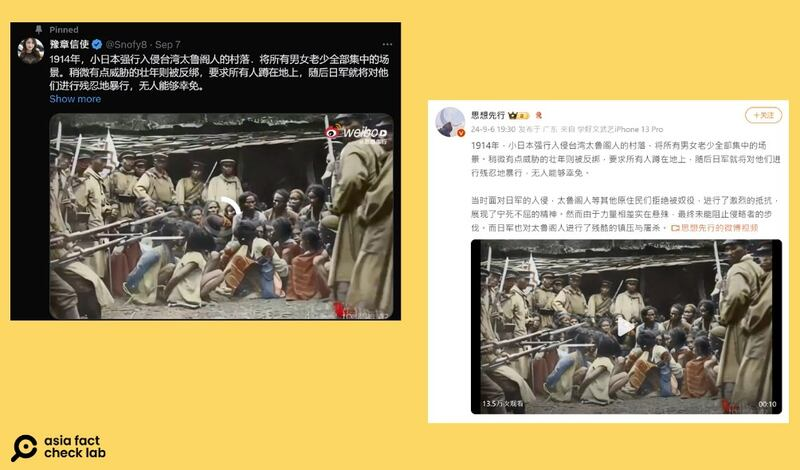
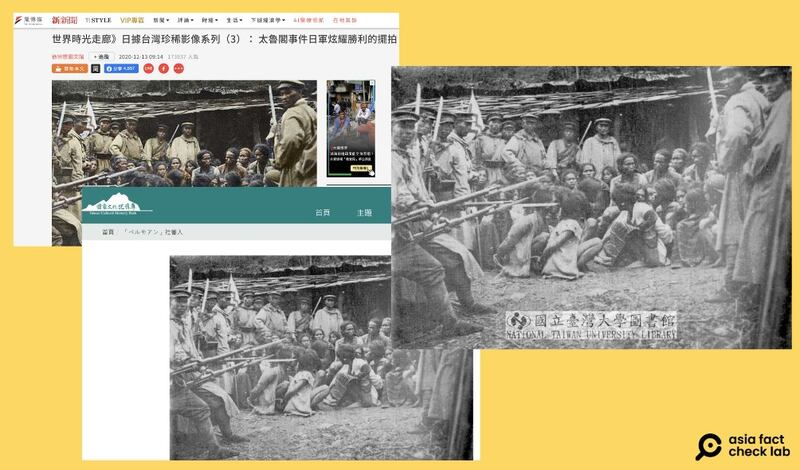
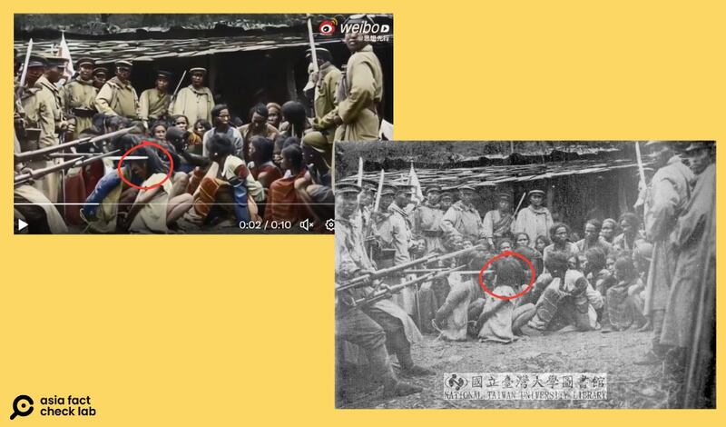
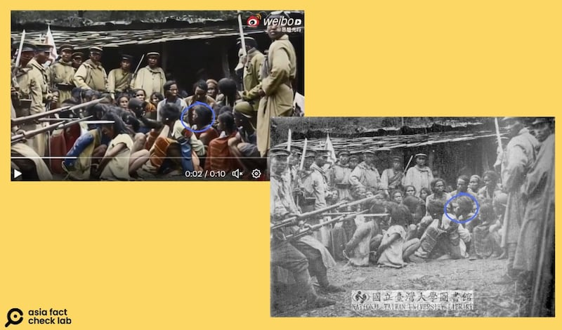
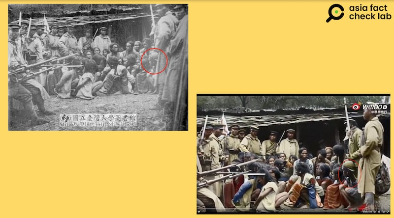

# 事實查覈｜日軍鎮壓臺灣原住民視頻曝光？

作者：艾倫

2024.09.17 14:59 EDT

## 查覈結果：變造畫面

## 一分鐘完讀：

九月初，有中文社媒賬號轉發一則視頻，以此“曝光”日軍鎮壓臺灣原住民太魯閣人的暴行，並予以指控。

亞洲事實查覈實驗室（Asia Fact Check Lab，下稱AFCL）查證後發現，臺灣官方機構與媒體都曾發佈與該視頻畫面高度相似的“日軍監視臺灣太魯閣原住民”照片，但是是黑白照片，且沒有視頻記錄。經過綜合分析和專家意見，這則視頻是根據歷史照片藉助人工智能工具變造生成，顏色也是加工產生，並非真實的歷史影像。

## 深度分析：

9月7日,X藍勾勾賬號"豫章信使"貼出一則 [視頻](https://archive.ph/3NnlY),稱該視頻顯示,1914年日本侵略至臺灣太魯閣人的村落時,反綁壯年、要求所有被集中的人蹲在地上,並施以"殘忍的暴行","無人能夠倖免"。

該貼文發佈一週內已接近六百萬次觀看，及超過八百次評論及轉發。

搜尋該文上的微博浮水印"@思想先行",會發現確實有個同名賬號先在9月6日 [發佈](https://archive.ph/q9PS7)該影音,文案和"豫章信使"的基本無異。網民紛紛評論:"有血性的臺灣人都被殺光了"、"日本人,不共戴天之仇"。

九月初，微博及X上出現一則揭露"日軍凌虐臺灣原住民"的視頻。（X、微博截圖）

目前"豫章信使"在X上的貼文已被附上 [社羣筆記](https://x.com/i/birdwatch/n/1833302081748230151)(Community Note),質疑視頻爲AI生成。且不僅視頻內的人動作不自然,所有人看起來都是非裔,而不是亞洲人。但撰寫筆記者沒有提出更多證據。

臺灣媒體、官方網站及學術機構皆曾發佈日軍監視太魯閣族人的歷史照片。（取自臺灣大學網站，日後徐宗懋圖文館收藏和《風傳媒》刊出的是本圖以電腦上色後的版本。）

## 確實有真實史料，但不是影音

AFCL將網傳視頻截圖反搜,找到臺媒《風傳媒》曾在2020年發佈一篇 [報道](https://www.storm.mg/lifestyle/3288042):《日據臺灣珍稀影像系列(3): 太魯閣事件日軍炫耀勝利的擺拍》,其中首圖便是網傳視頻的靜態版本。

該圖文案稱，“日軍鎮壓太魯閣族起義行動後，將倖存的族人集中一地，包括婦孺等族人畏縮一起，日軍官兵刻意拿著刺刀指著族人，同時臉朝著鏡頭看，做出炫耀勝利的擺拍姿態。”

提供《風傳媒》該張照片的“徐宗懋圖文館”創辦人徐宗懋向AFCL指出，該張照片出自於“1913年日軍‘討蕃紀念寫真帖’”。

AFCL再以關鍵字搜尋,在臺大圖書館數位典藏館的"臺灣舊照片資料庫" [頁面](https://dl.lib.ntu.edu.tw/s/photo/item/112570#?c=&m=&s=&cv=&xywh=-139%2C0%2C1447%2C828)上找到一模一樣的黑白圖,題名:""べルモアン"社蕃人",附註寫道,該圖呈現的是日本討伐隊當時正在監視企圖逃跑的太魯閣族"べルモア"社。發表時間正好是大正二年(1913年),和徐宗懋圖文館所提供的信息吻合。

臺灣國家文化記憶庫也存有 [同張圖片](https://tcmb.culture.tw/zh-tw/detail?indexCode=online_metadata&id=3226878),並附上國家文化資料庫網站上的 [圖片說明](https://nrch.culture.tw/view.aspx?keyword=%E8%A8%98%E6%86%B6%E5%BA%AB&s=3226878&id=T159500000&proj=MOC_IMD_001),內容和臺大圖書館大致相同。

不過，徐宗懋也告訴AFCL，原史料是印刷品，彩色的部分是他所經營的“圖文館”自行後製上色，並非如網傳的內容一樣是條“視頻”，臺大圖書館所及國家文化記憶庫呈現的也是靜態圖片。

## 由靜圖加工而成的視頻

爲了釐清社媒上流傳的視頻如何而來，AFCL諮詢了臺灣人工智慧與資安專家遊家牧，他指出了與原圖相比，視頻中幾處明顯不合理之處：

一、如下圖：AFCL以紅圈圈出一位位於中間位置的原住民，原圖中他被反綁雙手，臉朝向圖片右上方，動作自然。但在視頻裏，他的面部卻朝左下，形同頭直接反轉180度，完全不是正常的姿勢。

紅色圈選處爲網傳視頻內一名遭受監視的原住民頭部畫面，不僅和原圖有差異，也不合常理。（圖修改自微博、臺灣大學網站）

二、遊家牧指出在畫面的中間偏右下部位（藍圈處），視頻移動時，畫面中的兩張面孔發生了不正常的扭曲。

專家指出，可判斷網傳視頻爲加工影音的方法之一，是找出不自然、扭曲之處，此圖圈選之處便是其中一個。（圖修改自微博、臺灣大學網站）

此外，AFCL也發現原圖右下角的一名被監控的原住民少年，他的脖子在視頻版中變得長得離譜。

AFCL 另發現原圖右方的一名原住民（左圖紅圈處），他的脖子在視頻不正常地拉長（左圖紅圈處）。

對於視頻和原圖相比的種種變形，遊家牧向AFCL表示，他認爲網傳視頻就是人工後製而成。他還補充指出，獨立靜態圖片後製成影音的難度相當大，必須確定視頻內移動的部分數量不多，且移動幅度小，這比起傳統的深僞（deepfake）如換臉或是操縱臉的難度都大得多。

綜合前述的分析和專家意見， AFCL確定網傳的所謂“日軍鎮壓臺灣太魯閣人的視頻”，所根據的是真實的黑白歷史照片，但其動態是人工後期生成，顏色也是加工產生。

*亞洲事實查覈實驗室(Asia Fact Check Lab)針對當今複雜媒體環境以及新興傳播生態而成立。我們本於新聞專業主義,提供專業查覈報告及與信息環境相關的傳播觀察、深度報道,幫助讀者對公共議題獲得多元而全面的認識。讀者若對任何媒體及社交軟件傳播的信息有疑問,歡迎以電郵*  [*afcl@rfa.org*](mailto:afcl@rfa.org)  *寄給亞洲事實查覈實驗室,由我們爲您查證覈實。* *亞洲事實查覈實驗室在X、臉書、IG開張了,歡迎讀者追蹤、分享、轉發。X這邊請進:中文*  [*@asiafactcheckcn*](https://twitter.com/asiafactcheckcn)  *;英文:*  [*@AFCL\_eng*](https://twitter.com/AFCL_eng)  *、*  [*FB在這裏*](https://www.facebook.com/asiafactchecklabcn)  *、*  [*IG也別忘了*](https://www.instagram.com/asiafactchecklab/)  *。*

[Original Source](https://www.rfa.org/mandarin/shishi-hecha/hc-japan-crackdown-on-taiwan-aboriginal-fact-check-09172024144959.html)