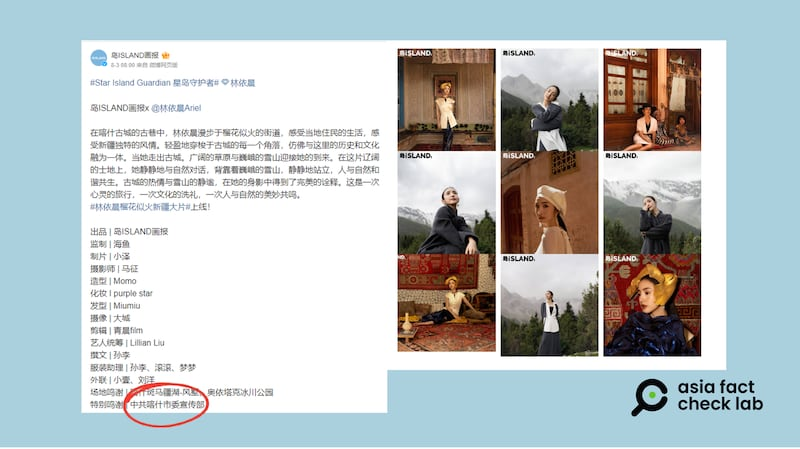
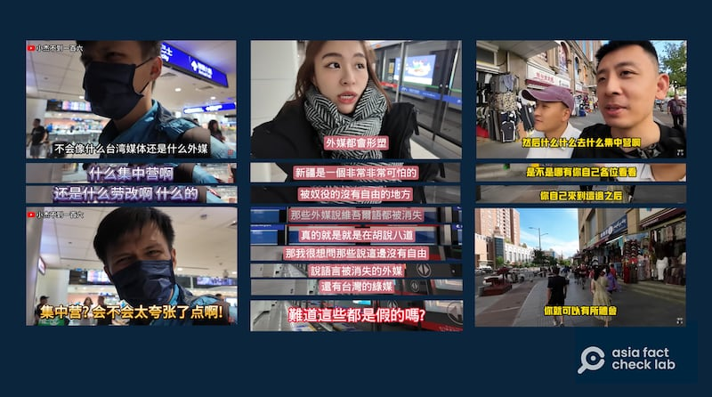
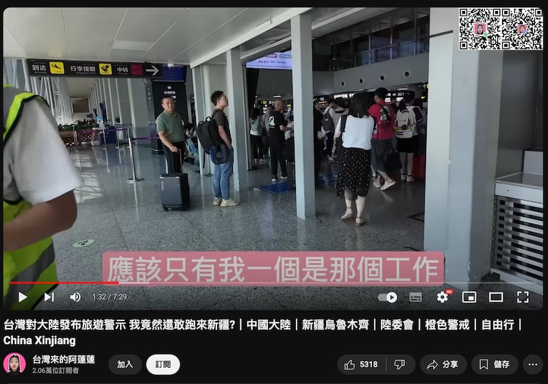

# 傳播觀察 | 暢遊新疆的臺灣網紅們，異口同聲說什麼？

作者：鄭崇生

2024.09.19 14:23 EDT

“第一次來到大巴扎嗎？怎麼樣，‘滅絕’得如何？”

8月底,一段來自油管(YouTube)帳戶"寒國人" [遊覽新疆的視頻內容](https://youtu.be/Fwn5w5O9KyA?t=51),博主和臺灣學者賴嶽謙、新黨發言人王炳忠一行結伴走進烏魯木齊市區的大巴扎,博主突然出聲向王炳忠問了這麼一句。

這句話乍聽突兀，但再看下去，進入視頻的脈絡之後就能理解，博主是出言諷刺國際人權組織和媒體所披露的“維吾爾人面臨種族滅絕”。也如同下頭這一段談話：

“以後新疆對付西方、綠媒，就只要走一個‘強迫風’，什麼都‘強迫’。”

它諷刺的是“維吾爾人遭強迫勞動”的報道和指控。

" [寒國人](https://www.youtube.com/@user-jf1ro3lv8o)"YouTube賬號追蹤人數達到52萬3千人,頻道內影片超過2000部。從2024年8月初起,這個頻道開始上傳博主 [造訪新疆](https://youtu.be/Fwn5w5O9KyA?si=RcbGPCPWmEKWNnWN)的紀錄,至少9部視頻中,部分是他在 [烏魯木齊市區](https://www.youtube.com/watch?v=8XyWW5Q_fWY),也有宣稱在 [木壘](https://www.youtube.com/watch?v=vqhM9E-CVU4)哈薩克自治縣等偏遠地區所拍攝。

臺灣時事評論員 [賴嶽謙的YouTube賬號](https://youtu.be/bOWx_Omwslk?si=JYklSX4wxO8bPTYp)上,他和妻子周玉琴除引述當地新疆民衆批評"歐美人醜化新疆,新疆人很生氣"的觀點外,兩人還表達與新疆生產建設兵團及新疆哈薩克人互動後的感受,包括"希望兩岸早日統一","新疆有的是快樂集中營、幸福集中營。"

賴嶽謙在Youtube上稱新疆是"幸福集中營"（賴嶽謙YouTube賬號截圖）

大約在同一時間,臺灣傳出中國當局通過臺灣網紅髮動"文化統戰",甚至邀請僅有數萬粉絲追隨的網紅赴新疆旅遊拍片。同時,在兩岸都享有極高知名度的演員林依晨爲中國雜誌《島ISLAND畫報》 [赴新疆拍攝封面](https://archive.ph/iF4Ac),留下與喀什古城老人與小孩的合照。

《島ISLAND畫報》在微博上的發文，標註了“特別鳴謝中共喀什市委宣傳部”。

截圖取自《島ISLAND畫報》新浪微博賬號 （AFCL製圖）

這些網紅、藝人的做法引發討論，一些人跟帖評論盛讚新疆的美麗富饒，並表達“也想去一趟”的意願，已有不少臺灣民衆對此不滿，認爲他們這是“爲中共在新疆的作爲洗白”。

## 異口同聲的網紅新疆遊

林依晨在新疆拍了一組沙龍照, [受訪時稱](https://archive.ph/XrpSx)很欣賞"當地人簡單樂天的生活態度",並沒有對爭議話題做出發言。但YouTube網紅則更有"針對性",亞洲事實查覈實驗室(Asia Fact Check Lab, AFCL)在YouTube上搜尋並觀察了多個在今年六到八月間上傳新疆旅遊視頻的賬號,包括前述的"寒國人"、賴嶽謙的 [個人賬號](https://www.youtube.com/watch?v=bOWx_Omwslk&t=2348s)、" [臺灣來的阿蓮蓮](https://youtu.be/CUrov0EUpOY?si=k9I_rJgsOkvzfBpq)"、" [威力臺灣人在大陸生活](https://youtu.be/SbFtykOvB1c?si=pA_duEhHS4mhL81Q)"以及" [小杰不到一百六](https://www.youtube.com/watch?v=v-65kEOr0lI&t=0s)"。

"小杰不到一百六"、"臺灣來的阿蓮蓮"及"威力臺灣人在大陸生活"YouTube賬號截圖） （AFCL製圖）

AFCL歸納、分析這些YouTube網紅髮布的內容，發現他們使用的是同一套敘事，一致地反駁西方媒體的報道，充斥着一種”我沒看到，就是沒有”的邏輯。

1. "外媒和臺灣綠媒都亂報,新疆集中營在哪裏?"

這些博主發佈的內容大部分都在烏魯木齊市區，少部分宣稱在偏遠地區，但他們不約而同的表達，這裏“沒有集中營”。例如，有博主在旅館裏拉開窗簾，拍攝烏魯木齊繁華的高樓大廈時稱 “集中營在哪裏？根本沒有。”

1. "維語哪有消失?"

有博主走進烏魯木齊地鐵站，拍攝站內以漢、維兩種語言標示的站名，接着宣稱“外媒都報道維語消失了，哪有消失？”

1. "這裏超多清真寺"

多位博主介紹烏魯木齊市區旅遊時，都特別拍攝了天山區的“白大寺”和“青海大寺”，還強調地鐵沿線還有“超多清真寺”，都可以參觀、拍攝。

1. "臺灣發佈橙色旅遊警戒,你還敢去大陸或新疆?"

臺灣政府今年6月針對中國公佈“懲治臺獨”相關法律，發佈了對中國的旅遊橙色警戒。但網紅們多以反諷的方式宣稱自己身爲臺灣人，走訪新疆各地都沒有被抓捕，“新疆很安全，都是遊客”。

除了上述幾點異口同聲的論述之外，，網紅髮布的內容也有誤導、錯誤之處。例如賴嶽謙的稱：“疫情結束後，民進黨不讓臺灣與新疆恢復直航”。但事實情況是，臺灣與新疆在2013年開通直航後，中國南方航空就有因機隊調度及季節因素數次自行宣佈停飛這個兩岸最遠定期直航航線的紀錄。據報道，直到今年4月，中國民航局才向臺灣提出申請要求包括烏魯木齊在內的兩岸直航點復飛。

## 網紅們"沒看到"的事實，就不存在嗎？

關於新疆的集中營,就在聯合國有關新疆人權報告發佈滿兩週年之際,聯合國人權高專辦發言人沙姆達薩尼(Ravina Shamdasani) [指出](https://news.un.org/en/story/2024/08/1153621),聯合國一人權小組今年6月訪問中國,並與中國當局對話後,人權高專辦認爲,尤其在新疆問題上,中國許多有問題的法律和政策依然存在。

2022年8月31日,聯合國人權高專辦公佈 [《新疆人權報告》](https://www.ohchr.org/sites/default/files/documents/countries/2022-08-31/ANNEX_A.pdf)指出,中國至少在2017年至2019年期間,通過所謂的"教培中心",大規模任意剝奪維吾爾人和其他主要穆斯林成員的自由,有關中國政府在新疆地區實施酷刑等指控可信,新疆任意關押維吾爾人等相關行爲,可能已構成"反人類罪"(crimes against humanity)。

雖然網紅們鬧市看到了維吾爾語標牌,但這並不代表民族語言文字沒有受到打壓。中國《 [民族區域自治法](https://www.gjxfj.gov.cn/gjxfj/xxgk/fgwj/flfg/webinfo/2016/03/1460585590001366.htm)》規定,自治區公共場所和設施必須要同時使用少數民族文字和漢字,因此,烏魯木齊市中心等地理應設立雙語標牌,但中國政府正潛移默化打壓維吾爾民族語言文字的做法也是事實。

例如,2017年, [自由亞洲電臺](https://www.rfa.org/mandarin/yataibaodao/shaoshuminzu/ql1-10132017100200.html)揭露新疆維吾爾自治區教育廳發文,要求全疆學校停止選用維吾爾語、哈薩克族語的輔助教材,停止將教材翻譯成少數民族文字。伊犁哈薩克自治州伊寧縣教育局官員羅丹當時證實確有此事。

關於維族的宗教信仰文化,自由亞洲電臺維語組 [報道](https://www.rfa.org/english/news/uyghur/xi-jinping-visit-08282023165401.html),中國國家主席習近平去年8月第二次視察新疆,指示官員應該進一步"促進伊斯蘭教的中國化",並有效地控制"各種非法宗教活動"。中共打擊伊斯蘭宗教的行動不只在新疆進行,英國金融時報也發表 [調查報道](https://ig.ft.com/china-mosques/),統計自2018到2023年,超過一千七百間清真寺被拆毀或"漢化"成中式建築,外觀幾乎已看不出伊斯蘭元素。即使"清真認證"的食品標章"Halal"都被視作"宗教極端主義化的初步跡象" [而遭打壓](https://www.taisounds.com/news/content/84/94245)。

## 網紅新疆行，是誰買單？

這些網紅的行程是自費負擔或者來自其它贊助？ 在前述列舉的賬號中，“小杰不到一百六”所訪問的一名剛從新疆旅遊歸來自稱“子傑”的青年，他明確表示自己的行程是自己花了6萬6、7千元臺幣跟團。

至於“臺灣來的阿蓮蓮”兩次進入新疆拍片，第一次是今年年初，片中自述是跟着一羣“臺灣00後”的青年被邀來的。第二次約在8月前後，影片中沒有揭露是否自費，但曾經脫口而出這一趟行程是“工作”。

截圖取自"臺灣來的阿蓮蓮"油管賬號

亞洲事實查覈實驗室針對新疆行是否自費問題，發訊詢問賴嶽謙及前述多位網紅，至截稿爲止，沒有獲得回應。

## "網紅新疆遊" 簡單粗暴的邏輯 可能更管用

上述部分賬號，盡蹤粉絲數都不到十萬人，但有關新疆的視頻則都有約10萬到30萬人次不等的點閱率，而更重要的放大效應，來自主流媒體的引用。例如“寒國人”拍攝賴嶽謙夫婦遊覽新疆的影片，經中天新聞轉載，已經超過18萬次點看。

美國奧克蘭大學(Oakland University)新聞系副教授 [蘇巧寧](https://oakland.edu/cj/faculty/su/)檢視部分前述的視頻後,向亞洲事實查覈實驗室表示,"雖然(視頻內容)製作粗糙、邏輯也很薄弱,但這很符合網路時代所追求的一種'真實感'(Authenticity)。"她認爲,中共"若能讓臺灣部分民衆相信中國在新疆的建設是'快樂集中營',中國政府的政策是'正當且有效'的,便能從而削弱臺灣對中國的戒心和敵意。"她說,這就是中共的戰略考量。

對於這些“網紅新疆遊”視頻的影響力，儘管單個賬號影響有限，經過算法助推、主流媒體的放大，“仍然會有影響輿論的作用。”蘇巧寧指出。

而這些臺灣"網紅"也同時用這些視頻在中國的社交媒體平臺提升自己的影響力,並被中國媒體當成宣傳素材。英文報刊《中國日報》 [在X上發表](https://x.com/ChinaDaily/status/1834198419633734137)國臺辦回應"臺灣網紅贊新疆"的話題時,在視頻中就特別剪輯使用了阿蓮蓮與威力的拍攝內容。在9月11日國臺辦的例記者會上,發言人陳斌華也表態支持了這批臺灣網紅。

截圖取自中天電視YouTube與中國日報X賬號 （AFCL製圖）

蘇巧寧說，中共宣傳戰術的轉變，意在試圖提升“新疆很好”敘事的可信度、鞏固國際形象，並轉移國際社會對人權問題的批評焦點，而這一變化顯示，中共的宣傳不僅對內，也以全球輿論爲戰略對象，目標是在更加對立的國際環境中維護自身政治合法性與國家利益。

康乃爾大學專研人類學與亞洲研究的副教授費斯克什(Magnus Fiskesjö)認爲,二戰時納粹德國曾將波蘭發生大屠殺的地區稱爲"旅遊勝地",中國宣傳新疆旅遊的作法與此類似,他接受 [自由亞洲電臺維語組](https://www.rfa.org/english/news/uyghur/china-borrowing-nazis-genocide-tourism-practices-xinjiang-08272024162026.html)採訪時曾表示, 極權政府想告訴大家"沒什麼好擔心的,放心觀光吧"。

*亞洲事實查覈實驗室(* *Asia Fact Check Lab* *)針對當今複雜媒體環境以及新興傳播生態而成立。我們本於新聞專業主義,提供專業查覈報告及與信息環境相關的傳播觀察、深度報道,幫助讀者對公共議題獲得多元而全面的認識。讀者若對任何媒體及社交軟件傳播的信息有疑問,歡迎以電郵* *afcl@rfa.org* *寄給亞洲事實查覈實驗室,由我們爲您查證覈實。*

*亞洲事實查覈實驗室在* *X* *、臉書、* *IG* *開張了,歡迎讀者追蹤、分享、轉發。* *X* *這邊請進:中文*  [*@asiafactcheckcn*](https://twitter.com/asiafactcheckcn)  *;英文:*  [*@AFCL\_eng*](https://twitter.com/AFCL_eng)  *、*  [*FB* *在這裏*](https://www.facebook.com/asiafactchecklabcn)  *、*  [*IG* *也別忘了*](https://www.instagram.com/asiafactchecklab/)  *。*

[Original Source](https://www.rfa.org/mandarin/shishi-hecha/hc-taiwan-tourists-talk-about-xinjiang-09192024141259.html)