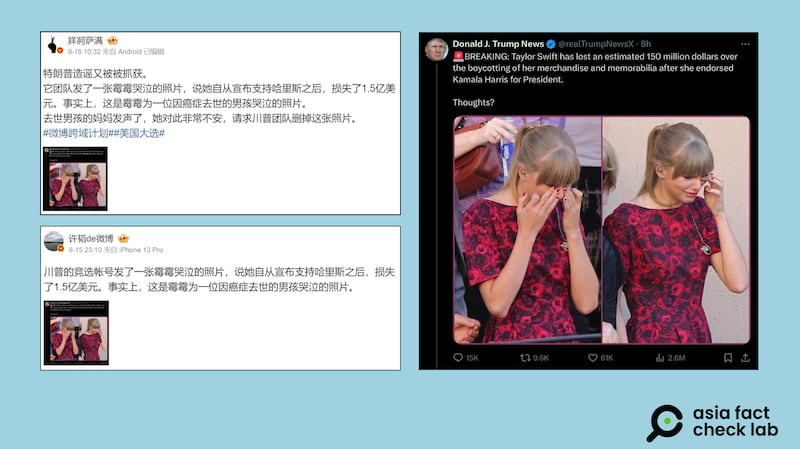

# 事實查覈｜特朗普官方造謠稱泰勒·斯威夫特損失巨資？

作者：莊敬

2024.09.20 14:21 EDT

## 查覈結果：錯誤

## 一分鐘完讀：

近日有微博“大V”用戶轉發一則社媒截圖，稱美國共和黨總統候選人特朗普造謠歌手“黴黴”（泰勒·斯威夫特）因支持民主黨候選人而損失上億美元。經查，發出這則假信息的帳號的肖像照片與特朗普官方號一樣，帳號用戶名也與官方帳號部分相似，但並不是特朗普的官方帳號。

因此，這則針對泰勒·斯威夫特的謠言攻擊，並不來自特朗普官網，而是來自其支持者。

## 深度分析：

美國民主黨總統候選人哈里斯(Kamala Harris,又譯賀錦麗)與共和黨總統候選人特朗普(Donald Trump,又譯川普)於美東時間9月10日舉行首場電視辯論後,流行歌手泰勒·斯威夫特(Taylor Swift,中國互聯網用戶多用暱稱"黴黴"稱呼她) [在社媒發文](https://www.instagram.com/p/C_wtAOKOW1z/?utm_source=ig_web_copy_link),宣告支持哈里斯。特朗普15日則 [在自家社交平臺發文,](https://truthsocial.com/@realDonaldTrump/posts/113142103182027626)以全大寫英文字母寫道"我恨泰勒·斯威夫特(I HATE TAYLOR SWIFT!)"。

正當網路熱議特朗普與“黴黴”的話題時，有多箇中、英文社媒帳號，轉發這則帖子：“突發事件：在泰勒·斯威夫特支持哈里斯選總統後，因她的商品和紀念品遭到抵制，估計損失了1.5億美元。（Breaking: Taylor Swift has lost an estimated 150 million dollars over the boycotting of her merchandise and memorabilia after she endorsed Kamala Harris for President.）”

這則貼文搭配了泰勒·斯威夫特低頭哭泣的照片,發文者爲X"藍勾勾"用戶"Donald J. Trump News",用戶頭像爲特朗普的照片。不過帖子的 [原文](https://twitter.com/realTrumpNewsX/status/1835061344032244195)已被刪除。

一些轉發帖子的中國微博“大V”用戶聲稱“特朗普造謠又被抓獲”、“它團隊發了一張黴黴哭泣的照片，說她自從宣佈支持哈里斯之後，損失了1.5億美元。事實上，這是黴黴爲一位因癌症去世的男孩哭泣的照片。”

近日有微博"大V"用戶轉發一則社媒截圖，稱美國共和黨總統候選人特朗普造謠歌手泰勒·斯威夫特（中文暱稱"黴黴"）因支持民主黨候選人而損失上億美元。（微博截圖）

亞洲事實查覈實驗室(Asia Fact Check Lab)以圖反搜發現,泰勒·斯威夫特哭泣的照片爲 [過去事件](https://www.dailymail.co.uk/tvshowbiz/article-2200468/Taylor-Swift-breaks-debuts-song-Ronan-young-cancer-victim-charity-event.html),與支持哈里斯無關。至於泰勒因支持哈里斯而損失鉅額的傳言,查覈網站《Snopes》已 [發佈查覈報告](https://www.snopes.com/fact-check/taylor-swift-lost-125m-brand-deals/),指傳言並非事實情況,而是來自一篇諷刺文章。

然而,上述中文帳號轉傳的帖子確實存在錯誤信息,但並非大V博主所指控的"特朗普造謠",其轉傳截圖顯示,該信息是由" [Donald J. Trump News(@realTrumpNewsX)](https://x.com/realtrumpnewsx)"所發佈,這個帳號的自介表明與特朗普的官方帳號" [Donald J. Trump(@realDonaldTrump)](https://x.com/realdonaldtrump)"無隸屬關係(no affiliations )。

兩個帳號的頭像雖然一樣，但兩者的加入時間、追隨者人數、發文數都有明顯差距。無證據顯示“Donald J. Trump News”與特朗普或其競選團隊有任何直接關聯，憑該社媒帳號發文截圖指控“特朗普造謠”，傳播錯誤信息。

*亞洲事實查覈實驗室(Asia Fact Check Lab)針對當今複雜媒體環境以及新興傳播生態而成立。我們本於新聞專業主義,提供專業查覈報告及與信息環境相關的傳播觀察、深度報道,幫助讀者對公共議題獲得多元而全面的認識。讀者若對任何媒體及社交軟件傳播的信息有疑問,歡迎以電郵*  [*afcl@rfa.org*](mailto:afcl@rfa.org)  *寄給亞洲事實查覈實驗室,由我們爲您查證覈實。* *亞洲事實查覈實驗室在X、臉書、IG開張了,歡迎讀者追蹤、分享、轉發。X這邊請進:中文*  [*@asiafactcheckcn*](https://twitter.com/asiafactcheckcn)  *;英文:*  [*@AFCL\_eng*](https://twitter.com/AFCL_eng)  *、*  [*FB在這裏*](https://www.facebook.com/asiafactchecklabcn)  *、*  [*IG也別忘了*](https://www.instagram.com/asiafactchecklab/)  *。*

[Original Source](https://www.rfa.org/mandarin/shishi-hecha/hc-trump-spreads-rumors-of-taylor-swift-financial-loss-fact-check-09202024141555.html)