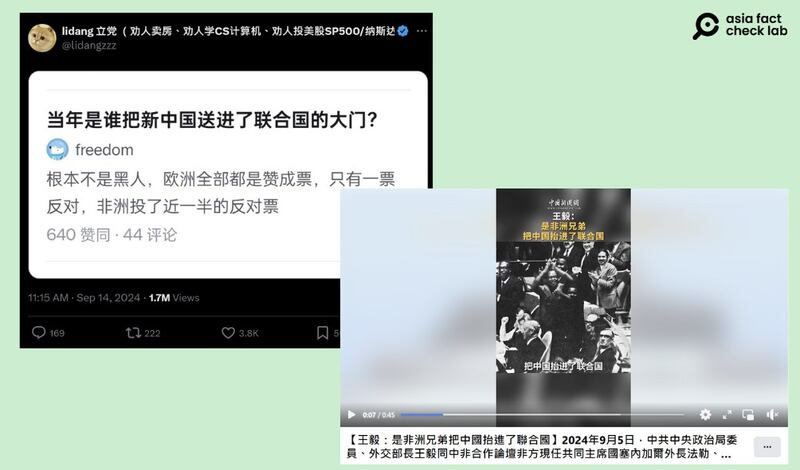
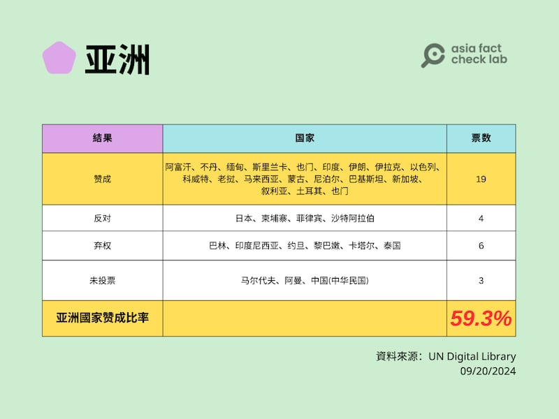

# 事實釐清｜非洲兄弟"把中國抬進了聯合國"？

作者：艾倫

2024.09.20 14:10 EDT

## 一分鐘完讀：

九月初，中國外交部長王毅在中非合作論壇峯會致詞中說“是非洲兄弟把中國抬進了聯合國”，以此表達和非洲國家長遠的友好關係。但中文社交媒體也有網民挑戰他的說法，認爲歐洲國家纔是送中國進聯合國的關鍵角色。

亞洲事實查覈實驗室檢視1971年聯合國大會的表決結果，支持中華人民共和國取得聯合國席位的國家，如果以票數計，非洲略高於歐洲；但如果以贊成比例計，歐洲國家遠高於非洲國家。

## 深度分析：

2024年“中非合作論壇”峯會於9月4日至6日在北京舉行，中國外長王毅5日在論壇發表講話中提到：“我們沒有忘記，是非洲兄弟把中國抬進了聯合國” ，感謝非洲國家在1971年聯合國決定中華人民共和國的合法代表權時投下了贊成票。

儘管王毅在講話中沒有提到具體票數,但有中國網民並不同意中國加入聯合國歸功於非洲國家的說法。 9月14日,一個在X上獲藍勾認證的中文帳號"lidang立黨" [轉發一張截圖](https://x.com/lidangzzz/status/1834793027358875913),標題爲"當年是誰把新中國送進了聯合國的大門",內文稱,中華人民共和國加入聯合國時,歐洲成員國僅一票反對,非洲則有將近一半的成員國反對。

這則推文轉發五天，觀看數已達170萬，將近4千人按贊及超過兩百則轉發。

有X中文帳號（左）質疑中國官媒（右）稱"非洲兄弟"助推中國入聯的說法（X、臉書截圖）

1971年中華人民共和國取代了中華民國的聯合國席位，究竟有沒有哪個地區支持票數顯著多於其它地區？亞洲事實查覈實驗室（Asia Fact Check Lab，下稱AFCL）根據聯合國數位圖書館（UN Digital Library）的記錄，統計五大洲國家針對是否同意中華人民共和國加入聯合國的投票紀錄，包含贊成、反對、棄權及未投票。

## 亞洲國家：19票贊成，59.3%支持率

## 歐洲國家：23票贊成，82.1%支持率

## 

## 非洲國家：26票贊成，61.9%支持率

## 

## 美洲國家：8票贊成，30.7%支持率

## 

## 大洋洲國家：0票贊成

## 

注：以上圖表分類將土耳其歸入亞洲，埃及歸入非洲。當年的部分國家現已改名或不存在。

亞洲事實查覈實驗室認爲，無論是王毅稱“非洲兄弟把中國抬進了聯合國”，還是網友稱非洲國家“半數反對”，都不是準確的描述。

統計結果顯示，投票支持中華人民共和國在聯合國取代中華民國席位的國家，的確以歐洲、非洲爲主力。同時，歐洲國家確實只有一個國家投下反對票，網友貼文中這部分屬實。但非洲投下反對票的成員國約爲三分之一，不是如傳言所說的半數反對。

如果以票數計，非洲26票略高於歐洲的23票；但如果以贊成比例計，歐洲國家贊成比率達到82.1%，遠高於非洲國家的61.9%。

*亞洲事實查覈實驗室(Asia Fact Check Lab)針對當今複雜媒體環境以及新興傳播生態而成立。我們本於新聞專業主義,提供專業查覈報告及與信息環境相關的傳播觀察、深度報道,幫助讀者對公共議題獲得多元而全面的認識。讀者若對任何媒體及社交軟件傳播的信息有疑問,歡迎以電郵*  [*afcl@rfa.org*](mailto:afcl@rfa.org)  *寄給亞洲事實查覈實驗室,由我們爲您查證覈實。* *亞洲事實查覈實驗室在X、臉書、IG開張了,歡迎讀者追蹤、分享、轉發。X這邊請進:中文*  [*@asiafactcheckcn*](https://twitter.com/asiafactcheckcn)  *;英文:*  [*@AFCL\_eng*](https://twitter.com/AFCL_eng)  *、*  [*FB在這裏*](https://www.facebook.com/asiafactchecklabcn)  *、*  [*IG也別忘了*](https://www.instagram.com/asiafactchecklab/)  *。*

[Original Source](https://www.rfa.org/mandarin/shishi-hecha/hc-african-nations-lift-china-to-united-nations-fact-check-09202024135757.html)