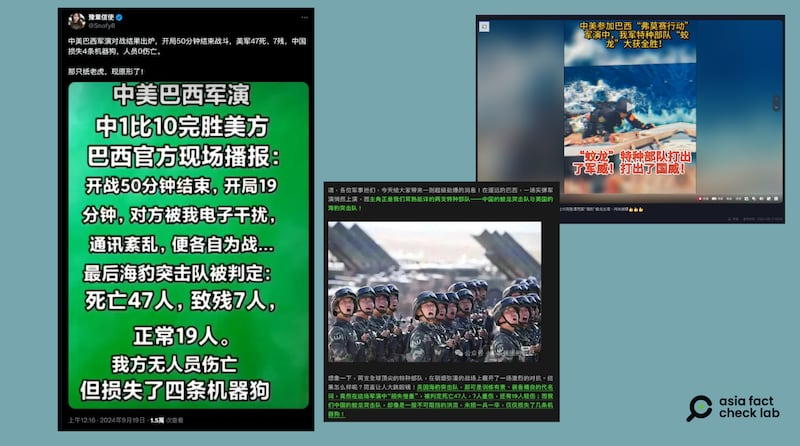

# 事實查覈｜中國人民解放軍大勝美軍海豹突擊隊？

作者：董喆

2024.09.23 15:46 EDT

## 查覈結果：錯誤

## 一分鐘完讀：

近期，中文社媒上廣傳中國人民解放軍在巴西軍演中“大勝美軍”的短視頻，稱美軍在模擬對戰中折損47人，解放軍則是0傷亡。經查，美國國防部在軍演前就表明，中美兩國軍隊將不會在軍演中碰頭。美國海軍陸戰隊南方司令部也告訴亞洲事實查覈實驗室，此次參加軍演的並非海豹突擊隊，且軍演過程未與解放軍互動，演習內容也不涉及模擬部隊對抗。抖音上的短視頻傳播的是錯誤資訊。

## 深度分析：

巴西於當地時間9月11日起展開爲期三天的“福爾摩沙行動（Operation Formosa）”軍事演習，中國海軍陸戰隊與美軍皆參與其中。軍演結束後，中文社交媒體平臺上出現了一系列短視頻和文圖消息（視頻1，視頻2，貼文1，貼文2），稱中國蛟龍突擊隊在軍演中大勝美國海豹突擊隊。

中文社交媒體上傳播的“解放軍大勝美軍”信息 圖截取自X、TikTok、微信公衆號

發佈者稱：“美國海豹突擊隊，那可是訓練有素、裝備精良的代名詞，竟然在這場軍演中損失慘重，被判定死亡47人，7人重傷，還有19人輕傷；而我們中國的蛟龍突擊隊，卻像是一股不可阻擋的洪流，未損一兵一卒，僅僅損失了幾條機器狗！”

不過，亞洲事實查覈實驗室發現，中國官媒並未對此有進一步報道，包括中國國防部以及人民網、新華社等對於這次軍演消息的發佈皆只停留在9月5日前後，除了宣佈參與福爾摩沙行動外，並未通報有關軍演的細節以及結果。

路透社在軍演前引用了美國國防部發言人彼得·阮(Peter Nguyen)的說法，“美國和中國軍隊不會在巴西的福爾摩沙行動演習中一起訓練。”

亞洲事實查覈實驗室進一步詢問負責此次演習的美國海軍陸戰隊南方司令部，新聞聯絡人威策爾士官長（Gunnery Sergeant Daniel Wetzel）回覆稱，此次參與演習的美軍爲一支分遣隊，來自陸戰第4師24團第1營，以及第3海空火力協調連(3rd Air Naval Gunfire Liaison Company)，共約60名官兵參演，但“美國海軍陸戰隊海豹突擊隊沒有參與”。

另外，他解釋稱：“美軍與解放軍在任何時候都沒有進行直接的訓練互動”，美軍進行的訓練僅是與巴西海軍陸戰隊的雙邊訓練，主要是小型武器實彈射擊範圍內的演練，沒有任何實際或模擬部隊對抗的演習。基於此，針對中文社媒平臺上傳播的美軍“傷亡數量”，威策爾表示“該說法不準確且毫無根據”，他還告訴亞洲事實查覈實驗室，這次軍演並沒有傷亡判定。

亞洲事實查覈實驗室（Asia Fact Check Lab）針對當今複雜媒體環境以及新興傳播生態而成立。我們本於新聞專業主義，提供專業查覈報告及與信息環境相關的傳播觀察、深度報道，幫助讀者對公共議題獲得多元而全面的認識。讀者若對任何媒體及社交軟件傳播的信息有疑問，歡迎以電郵afcl@rfa.org寄給亞洲事實查覈實驗室，由我們爲您查證覈實。

亞洲事實查覈實驗室在X、臉書、IG開張了，歡迎讀者追蹤、分享、轉發。X這邊請進：中文@asiafactcheckcn；英文：@AFCL\_eng、FB在這裏、IG也別忘了。

[Original Source](https://www.rfa.org/mandarin/shishi-hecha/hc-pla-vs-american-army-09232024154630.html)