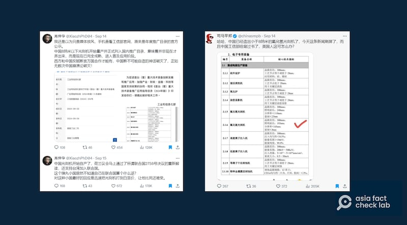
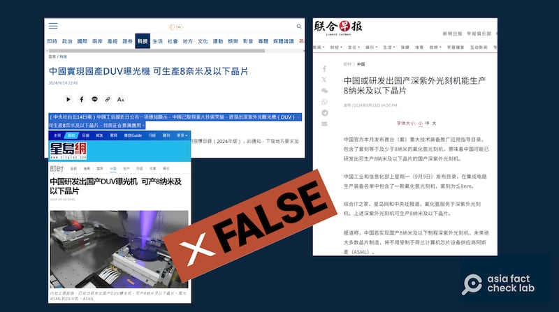

# 事實查覈 | 中國自制光刻機大突破，可量產8納米芯片？

作者：鄭崇生

2024.09.24 18:24 EDT

## 查覈結果：錯誤

## 一分鐘完讀：

中國工信部9月2日公佈的一份產業文件顯示，中國廠商已經成功生產出一型“套刻精度”小於8納米（nm，又譯奈米）的光刻機（臺灣稱曝光機）。之後有媒體根據這份文件報道稱中國這款光刻機“可製作8納米芯片”（臺灣稱晶片）。

亞洲事實查覈實驗室（AFCL）查證後發現，光刻機的“套刻精度小於8納米”並不等於能夠”製造8納米芯片”，前述報道的解讀並不正確。事實上，根據專家評估，這部機器能夠生產的芯片應該在28納米左右。

## 深度分析：

中國工信部發布的產業文件稱作《 [首臺(套)重大技術裝備推廣應用指導目錄(2024年版)](https://www.miit.gov.cn/zwgk/zcwj/wjfb/tz/art/2024/art_2fd2b3eff1f64c9fa27d635932a464ee.html)》的通知,其中指出中國有廠商已能做出兩種光刻機,其中一種爲氟化氬光刻機,它的規格爲:

照明波長：193納米

分辨率（光刻精度）：小於等於65納米

套刻精度：小於等於8納米

"套刻精度小於等於8納米"的規格,被一些網絡意見領袖解讀爲中國已經突破生產"8納米"的技術。例如 [肖仲華](https://archive.ph/a5N3F)和 [司馬平邦](https://archive.ph/QcOmH)都擷取工信部的公告在X平臺上發文稱,中國已經造出8納米以下的光刻機了。肖仲華更 [聲稱](https://archive.ph/l4lm7),中國8納米光刻機自產後,可以迅速讓光刻機打成"白菜價","讓臺灣這小國比死還難受"。

肖仲華和司馬平邦發佈中國已具備生產"8納米"芯片技術（X截圖）

除了網路大V錯誤解讀,中文媒體如臺灣 [中央社](https://archive.ph/DW5gh)、香港 [星島網](https://archive.ph/7ViY8)、新加坡 [聯合早報網路版](https://archive.ph/jRyrQ)也都報道了"中國光刻機可生產8納米及以下晶片"。網紅和媒體的報道掀起中國國內慶祝半導體產業全面科技自主、彎道超車成功的聲浪。

中央社等中文媒體跟進報道了中國國產曝光機的"技術突破"（中央社、星島網及《聯合早報》官網截圖）

## 光刻精度、製程節點和套刻精度的區別

臺灣龍華科技大學半導體工程系助理教授張勤煜告訴亞洲事實查覈實驗室（AFCL），半導體是個極爲複雜的產業，生產芯片用的光刻機技術水平的高低，關係着能產製芯片的製程先進程度，但上述社媒賬號和媒體對該新聞的解讀，混淆了關鍵概念。

張勤煜說,光刻機的分辨率、或者稱"光刻精度",意思是指在單一平面上,光刻機進行曝光(光刻)的精準程度。他特別向記者強調,分辨率(光刻精度)的規格纔跟芯片"製程節點(Process Node)達幾納米"有關聯,也就是一般所謂的"幾納米制程芯片"。例如大衆在新聞報道中會看到" [蘋果手機iPhone 17將採用臺積電2納米制程的芯片](https://9to5mac.com/2024/09/16/report-reiterates-2nm-chips-for-iphone-17-but-highlights-the-challenges/)"。

[1納米(nm)的大小](https://www.nano.gov/nanotech-101/what/nano-size#:~:text=There%20are%2025%2C400%2C000%20nanometers%20in,approximately%2080%2C000%2D%20100%2C000%20nanometers%20wide)約爲人類一根頭髮的8萬到10萬分之一的細度。

根據中國工信部發布的公告，張勤煜以光刻精度小於或等於65nm推算，認爲以這樣的技術條件，在最好的情況能達到28納米左右的製程。他說，當然中國也可以用國外的光刻機做出先進製程的芯片，但良率並不高。

至於“套刻精度”，張勤煜解釋，光刻時，多層堆疊的芯片一層層之間也需要精準對位，套刻精度就指的是指其所能達到的精準程度。但這和“分辨率”或“光刻精度”是不同的概念。

張勤煜說，芯片良率的高低跟製程有很大關係，中國做出可生產28納米制程芯片的光刻機，這算得上是可量產的商業機種，可以視爲中國表現出自己逐步努力，能自制光刻機，以作爲推廣、展示的效果。但在16或14納米以下的製程，中國還是被卡脖子。

根據 [國際半導體產業協會(SEMI)](https://www.semi.org/zh/technology-trends/what-is-a-semiconductor#device)介紹,要劃分芯片製程的工藝程度,外界一般標準已經從過去將10納米以下視爲先進製程,10納米以上稱爲成熟製程,進步到 [以7納米爲劃分標準](https://www.semi.org/zh/technology-trends/advanced-semiconductor-process-technologies)。

綜合查證和專家解釋，可以發現網路大V或部分媒體用8納米的“套刻精度”，推論中國能夠國產8納米芯片，這是誤導信息。

## 荷蘭十八年前已有相同機型

至於中國工信部公佈這一批自制光刻機的技術水平究竟如何？

中國半導體行業自媒體" [芯智訊](https://archive.ph/btVqL)"解讀官方文件時則指出,從氟化氬光刻機的照明波長來判斷,中國首套自主生產的光刻機是較舊的乾式DUV光刻機,而非更先進的浸沒式DUV光刻機。

這可以和荷蘭阿斯麥(ASML,臺譯艾思摩爾)相比對, [ASML在2006年](https://www.asml.com/en/news/press-releases/2006/asml-extends-arf-leadership)就發表了型號TWINSCAN XT:1450的DUV乾式光刻機,分辨率達57納米、套刻精度達7納米,與這次中國工信部公佈的光刻機指標類似。

臺灣國立清華大學與成功大學共同製作的 [科普影片](https://www.youtube.com/watch?v=AHe_yVZW6no),詳細解釋了芯片製作的過程以及相關參數的含義。

*亞洲事實查覈實驗室(Asia Fact Check Lab)針對當今複雜媒體環境以及新興傳播生態而成立。我們本於新聞專業主義,提供專業查覈報告及與信息環境相關的傳播觀察、深度報道,幫助讀者對公共議題獲得多元而全面的認識。讀者若對任何媒體及社交軟件傳播的信息有疑問,歡迎以電郵* *afcl@rfa.org* *寄給亞洲事實查覈實驗室,由我們爲您查證覈實。*  *亞洲事實查覈實驗室在X、臉書、IG開張了,歡迎讀者追蹤、分享、轉發。X這邊請進:中文*  [*@asiafactcheckcn*](https://twitter.com/asiafactcheckcn)  *;英文:*  [*@AFCL\_eng*](https://twitter.com/AFCL_eng)  *、*  [*FB在這裏*](https://www.facebook.com/asiafactchecklabcn)  *、*  [*IG也別忘了*](https://www.instagram.com/asiafactchecklab/)  *。*

[Original Source](https://www.rfa.org/mandarin/shishi-hecha/hc-china-makes-8nm-chips-fact-check-09242024181851.html)