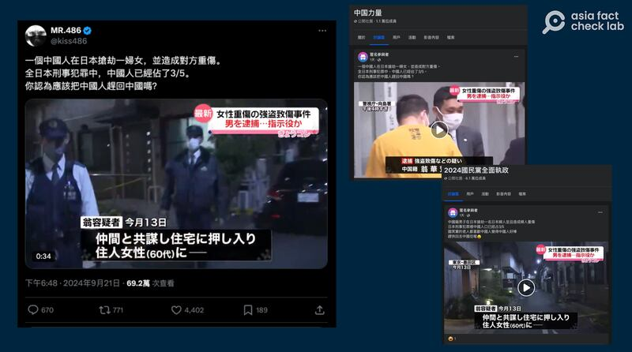
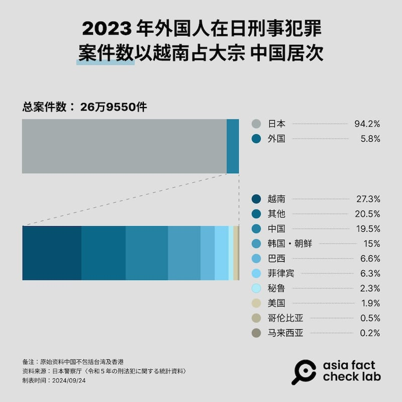
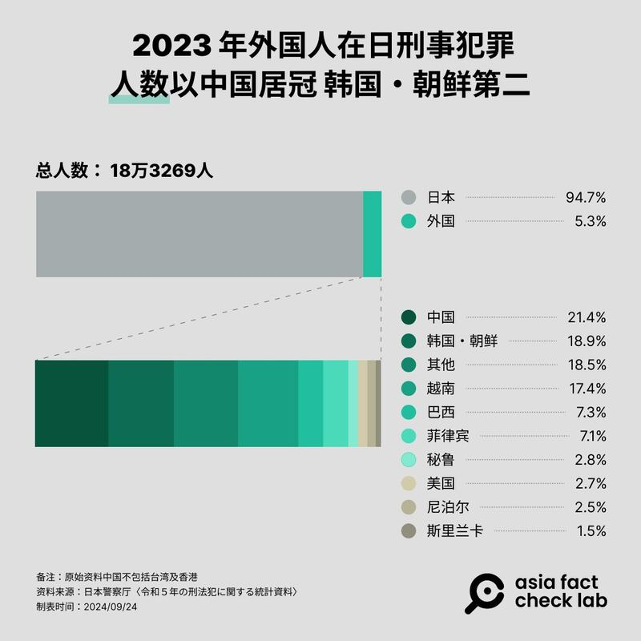
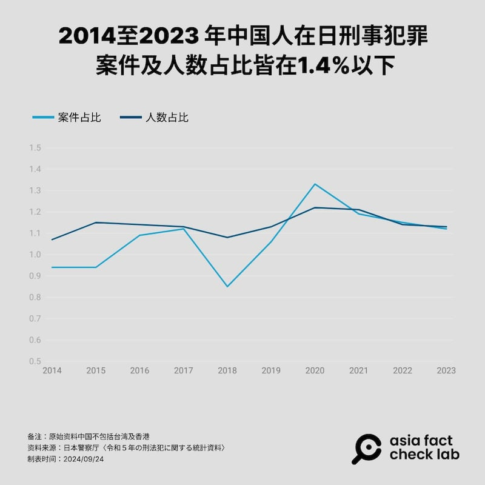

# 事實查覈｜全日本刑案六成是中國人乾的？

作者：董喆

2024.09.25 18:24 EDT

## 查覈結果：錯誤

## 一分鐘完讀：

臺灣電商名人兼網紅“486先生”近期在其旗下多個社羣平臺發文稱“全日本刑事犯罪中，中國人佔3/5”，並詢問網友是否應該把中國人趕回中國。

亞洲事實查覈實驗室覈對日本警察廳統計，2023年中國人在日本犯刑案數僅佔總數的1.12％，涉案人數佔1.14%；近十年數據則顯示，無論案件或涉案人數，中國人的佔比都未超過1.4% 。因此“486先生”所稱中國籍嫌犯佔日本刑事案件3/5的說法並不正確。

## 深度分析：

日前，中國深圳發生一起日籍男童遭中國籍男子刺殺身亡的案件，事件震驚國際社會，也引發中日兩國輿論沸騰，社羣平臺上網友對此事件各有立場，併發文激辯，也有不少錯誤資訊傳播開來。

臺灣電商名人、網紅"486先生"(本名陳延昶)21日於X(原推特)發佈一則影片,爲東京2023年一起中國人入室搶劫案的新聞畫面。"486先生" [在帖文中表示](https://archive.ph/bKFS9):"一箇中國人在日本搶劫一婦女,並造成對方重傷。全日本刑事犯罪中,中國人已經佔了3/5。你認爲應該把中國人趕回中國嗎?"

截至24日,此文在X獲得超過77萬次查看,近5千點贊數。 "486先生"除了在 [個人臉書](https://archive.ph/loNBu)、 [Threads](https://www.threads.net/@486shop/post/DALSb6YvOzN/?xmt=AQGzoy9WKg5hJ70T68jri8kaJGE9EtQeu1B2CZZj-VQJSg)上發表同樣內容,這則文章也被網友轉貼到部分臉書社團。

中文社交媒體流傳中國人佔日本刑事犯罪3/5的帖子（X截圖）

亞洲事實查覈實驗室以 [日本警察廳統計](https://www.npa.go.jp/publications/statistics/safetylife/jousei.html)進行覈對,發現真實數據與"486先生"所稱的比例有極大差距。

日本警察廳今年6月公佈" [2023年刑法犯罪相關統計資料](https://www.npa.go.jp/toukei/seianki/R05/r05keihouhantoukeisiryou.pdf)"(令和5年の刑法犯に關する統計資料),根據該文件資料定義,"檢舉件數"爲刑法案件中,警方送檢的數量;"檢舉人員"則是警方送檢案件中,作爲嫌疑人的人數。

統計文件第2頁提到2023年刑事案件“檢舉件數”有26萬9550件，“檢舉人員”有18萬3269人。

文件第67頁則呈現了外國人觸犯刑事案件的概況。中國人（不包含臺灣與香港），2023年時共涉3028起案件，涉案人數有2080人。

因此以全日本刑事案件來看，中國案件佔比爲1.123%，中國涉案人數佔比爲1.135%，皆不符合“486先生”所稱的六成之多。

若單看外國人在日本犯下刑事案件數量比例，中國案件佔比爲19.5%，中國涉案人數佔比爲21.4%，分居第二與第一。

日本警察廳統計的2023年各國人員在日犯罪案件數和人數的比例 （AFCL製圖）

另外，這一記錄最早可追溯到2014年，從那時起，中國人在全日本案件與涉案人數佔比，皆未曾超過1.4%，亦沒有其它統計數據符合或接近“486先生”所說的中國人在日犯罪的比例。

日本警察廳統計的近十年中國人在日刑事犯罪案件和人數佔比曲線（AFCL製圖）

雖然“486先生”原帖文沒有指明統計時間段，但以近十年，也就是2014至2023年的數據進行比對，他所傳播的“全日本刑事犯罪中，中國人佔3/5”爲錯誤資訊。

亞洲事實查覈實驗24日聯繫“486先生”的Instagram賬號以及其公司，詢問是否爲本人發文、發文依據統計資料爲何等問題，至發稿時尚未收到回覆。

*亞洲事實查覈實驗室(Asia Fact Check Lab)針對當今複雜媒體環境以及新興傳播生態而成立。我們本於新聞專業主義,提供專業查覈報告及與信息環境相關的傳播觀察、深度報道,幫助讀者對公共議題獲得多元而全面的認識。讀者若對任何媒體及社交軟件傳播的信息有疑問,歡迎以電郵* *afcl@rfa.org* *寄給亞洲事實查覈實驗室,由我們爲您查證覈實。*  *亞洲事實查覈實驗室在X、臉書、IG開張了,歡迎讀者追蹤、分享、轉發。X這邊請進:中文*  [*@asiafactcheckcn*](https://twitter.com/asiafactcheckcn)  *;英文:*  [*@AFCL\_eng*](https://twitter.com/AFCL_eng)  *、*  [*FB在這裏*](https://www.facebook.com/asiafactchecklabcn)  *、*  [*IG也別忘了*](https://www.instagram.com/asiafactchecklab/)  *。*

[Original Source](https://www.rfa.org/mandarin/shishi-hecha/hc-chinese-commit-sixty-percent-criminal-cases-in-japan-fact-check-09252024181640.html)