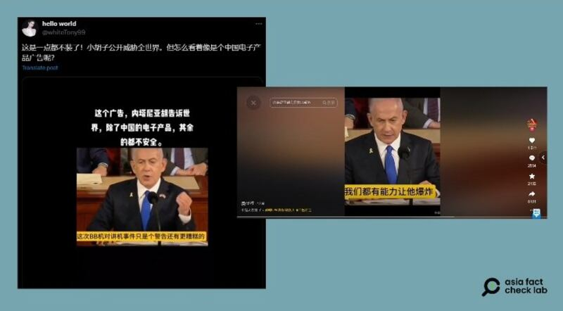

# 事實查覈｜內塔尼亞胡警告：以色列有能力引爆所有美製電子設備？

作者：莊敬

2024.09.26 15:26 EDT

## 查覈結果：錯誤

## 一分鐘完讀：

近日在抖音、X等平臺上流傳一則短視頻，畫面中，以色列總理內塔尼亞胡在用英文演說，簡體中文字幕“翻譯”他說的一段話是：“只要是美國和盟友生產的所有電子產品和設備，我們都有能力讓他爆炸，這次BB機對講機事件只是個警告”。

經查，該視頻出自內塔尼亞胡今年7月在美國國會的演說，主題是關於中東情勢與伊朗威脅，內容並不涉及9月發生的黎巴嫩通訊設備爆炸案。部分網民將其演說片段搭配虛構的中文字幕，傳播了錯誤信息。

深度分析：

黎巴嫩軍事組織真主黨9月17日遭遇傳呼機爆炸攻擊，後續又發生大規模對講機爆炸事件，死傷慘重。真主黨指控以色列爲幕後黑手，以色列否認牽涉其中，然而雙方衝突升級，以軍對真主黨發動大規模空襲，真主黨則以大量火箭彈攻擊。爆炸案尚未明朗之際，社媒平臺已開始流傳大量有關信息。

亞洲事實查覈實驗室（Asia Fact Check Lab）注意到，近日在抖音、X等平臺上流傳一段30秒的短視頻，畫面是以色列總理內塔尼亞胡（Benjamin Netanyahu）站在講臺前發表英文演說，搭配的簡體中文字幕寫道：

“我警告你們，請告訴你們的人民，不要跟以色列作對，否則你們會死的很慘，告訴你們只要是美國和盟友生產的所有電子產品和設備，我們都有能力讓他爆炸，這次BB機對講機事件只是個警告，還有更糟糕的，你們好自爲之。”

有傳播者在視頻上寫道，“這個廣告，內塔尼亞胡告訴世界，除了中國的電子產品，其餘的都不安全”。

中文社媒賬號傳播一則以色列總理內塔尼亞胡發言的短視頻，搭配虛構的簡體中文字幕。圖取自X、抖音

但網傳視頻上的中文字幕，並沒有如實翻譯內塔尼亞胡當時的發言。經查，網傳畫面是內塔尼亞胡今年7月在美國國會兩院聯席會議上發表的演說，在這則30秒視頻中，內塔尼亞胡其實在說一個更廣泛的中東願景，他認爲美以應建立安全聯盟，以應對伊朗威脅，並應邀請所有願與以色列和平相處的國家加入聯盟。（...for the broader Middle East. It’s also shaped in part by what we saw in the aftermath of World War II…Likewise, America and Israel today can forge a security alliance in the Middle East to counter the growing Iranian threat. All countries that are in peace with Israel and all those countries who will make peace with Israel should be invited to join this alliance.）

部分網民挪用了與今年9月黎巴嫩通信設備爆炸案無關的演說畫面，並後製配上虛構的中文字幕，傳播錯誤信息。

*亞洲事實查覈實驗室（Asia Fact Check Lab）針對當今複雜媒體環境以及新興傳播生態而成立。我們本於新聞專業主義，提供專業查覈報告及與信息環境相關的傳播觀察、深度報道，幫助讀者對公共議題獲得多元而全面的認識。讀者若對任何媒體及社交軟件傳播的信息有疑問，歡迎以電郵afcl@rfa.org寄給亞洲事實查覈實驗室，由我們爲您查證覈實。*

*亞洲事實查覈實驗室在X、臉書、IG開張了，歡迎讀者追蹤、分享、轉發。X這邊請進：中文@asiafactcheckcn；英文：@AFCL\_eng、FB在這裏、IG也別忘了。*

[Original Source](https://www.rfa.org/mandarin/shishi-hecha/hc-warning-against-israel-09262024152610.html)