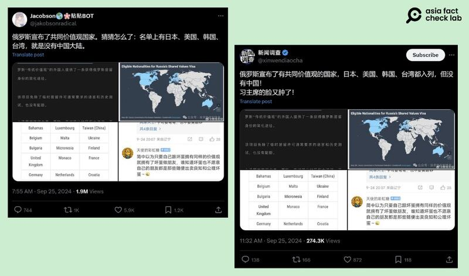

# 事實查覈｜俄羅斯將臺灣列爲"共同價值觀國家"，卻沒有中國？

作者：艾倫

2024.09.27 17:09 EDT

## 查覈結果：錯誤

## 一分鐘完讀：

九月底，部分中文社媒帳號引述一則英文報道，宣稱俄羅斯將臺灣列爲“共同價值觀國家”，並嘲諷中國和俄羅斯建立關係是白費力氣。

經查，俄羅斯公告的是“共同價值觀簽證”，其目的爲吸引“住在敵對價值國家但認同俄羅斯精神的人”到俄國短暫居留，所以臺灣並非因受俄羅斯認可有“共同價值觀”而出現在名單內。

## 深度分析：

9月25日,社媒X( [1](https://archive.ph/iwMkL), [2](https://archive.ph/DXxQ9))和 [Reddit](https://archive.ph/tiggP)中文帳號廣傳一則消息,稱俄羅斯公佈"共同價值觀國家"名單,其中包含臺灣、日韓及歐美等國,並嘲諷中國不在名單上, "習主席的臉又腫了"。文章並附上4張截圖。

相關消息僅傳播一天，X上的觀看總和已超過兩百萬、六千個贊及一千次轉發。

中文社媒用戶轉發俄羅斯發佈"共同價值觀國家名單"的說法（X截圖）

亞洲事實查覈實驗室(Asia Fact Check Lab,下稱AFCL)以傳言第四張圖中出現的"IMI"進行關鍵字搜尋,找到今年8月19日俄羅斯發佈的 [總統令](https://web.archive.org/web/20240927093404/http://publication.pravo.gov.ru/document/0001202408190001)。通過google及DeepL兩種翻譯方式,確認這份文件名爲:"關於向擁有俄羅斯傳統精神和道德價值的人提供人道主義支持"。

這份命令提到，對於住在“具毀滅性的新自由主義國家”（destructive neoliberal countries）但認同俄羅斯“傳統價值”的人民，俄羅斯將提供短期居留權。申請通過者既不受人數配額限制，也無須證明俄語能力及具備俄羅斯的法律和歷史知識，就能拿到這張“共同價值簽證”（shared value visa）。

此外,原消息發佈者"投資移民內幕"(Investment Migration Insider)新聞網站 [指出](https://www.imidaily.com/europe/russia-unveils-eligible-nations-for-shared-values-visa/#:~:text=The%20government%20announced%20the%20SVV,fall%20under%20the%20quota%20system),9月17日俄羅斯總理米哈伊爾·米舒斯京(Mikhail Mishustin)確定符合"共享價值簽證"條件的國家名單,其中主要包含西方民主同盟如歐美國家及亞洲的日本、韓國等,臺灣也榜上有名。

因此，所謂“共享價值簽證”，發放的對象是認同俄羅斯，但卻住在價值觀和俄羅斯背道而馳國家的人民。因此適用的國家，是俄羅斯政府認定的不同價值觀國家，而不是相同理念國家。前述網傳的說法有誤。

臺灣中央社也發佈 [新聞](https://www.cna.com.tw/news/aipl/202409210199.aspx),指出這份名單是與俄羅斯"價值觀敵對國家地區名單",旨在弘揚俄羅斯的傳統價值觀如愛國心、爲祖國服務的精神、集體主義、及民族團結等。而俄羅斯也早在2023年3月就已將臺灣列入包含美國在內的"不友善國家地區"名單。

*亞洲事實查覈實驗室(Asia Fact Check Lab)針對當今複雜媒體環境以及新興傳播生態而成立。我們本於新聞專業主義,提供專業查覈報告及與信息環境相關的傳播觀察、深度報道,幫助讀者對公共議題獲得多元而全面的認識。讀者若對任何媒體及社交軟件傳播的信息有疑問,歡迎以電郵*  [*afcl@rfa.org*](mailto:afcl@rfa.org)  *寄給亞洲事實查覈實驗室,由我們爲您查證覈實。* *亞洲事實查覈實驗室在X、臉書、IG開張了,歡迎讀者追蹤、分享、轉發。X這邊請進:中文*  [*@asiafactcheckcn*](https://twitter.com/asiafactcheckcn)  *;英文:*  [*@AFCL\_eng*](https://twitter.com/AFCL_eng)  *、*  [*FB在這裏*](https://www.facebook.com/asiafactchecklabcn)  *、*  [*IG也別忘了*](https://www.instagram.com/asiafactchecklab/)  *。*

[Original Source](https://www.rfa.org/mandarin/shishi-hecha/hc-russian-list-includes-taiwan-as-country-with-shared-values-butnot-china-fact-check-09272024170605.html)