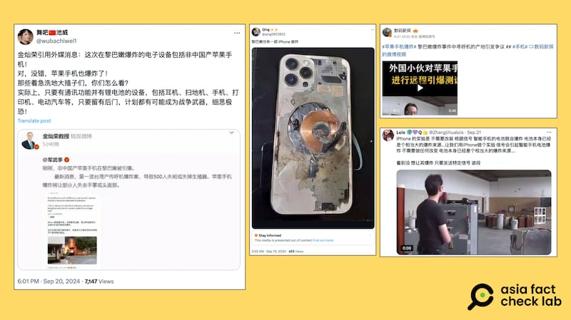
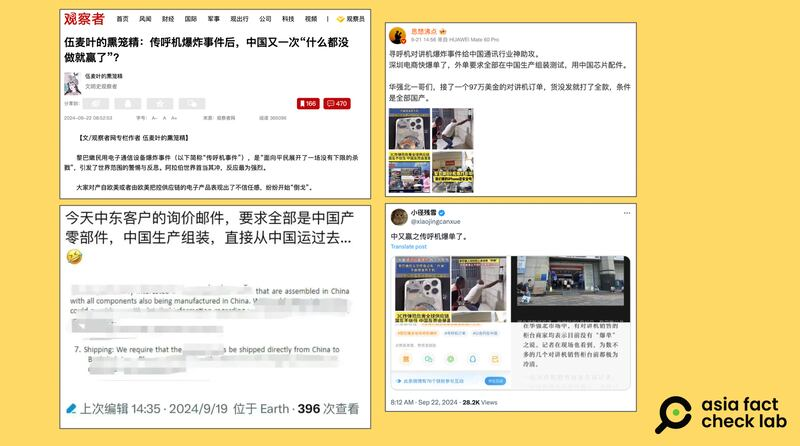
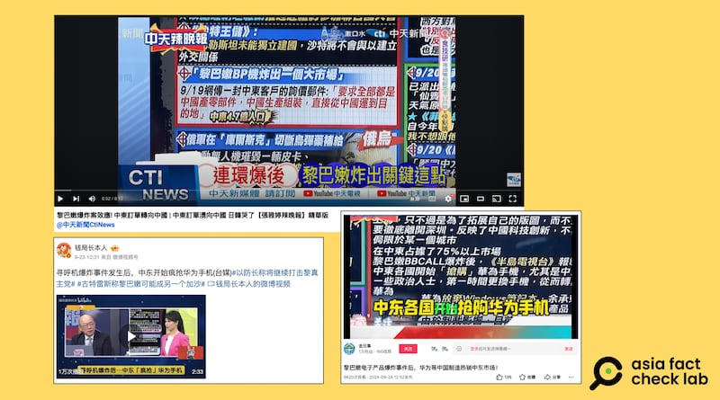

# 傳播觀察｜黎巴嫩傳呼機爆炸案後，輿論追捧 “中國製造最安全”？

作者：莊敬

2024.09.30 15:12 EDT

"呼叫機爆炸後,中東國家瘋搶華爲,不要iPhone"、"傳呼機爆炸事件後,中國又一次什麼都沒做就贏了?"這些是黎巴嫩傳呼機爆炸事件後,出現在中文 [政論節目](https://www.youtube.com/watch?v=JiHTp3AV70c)、 [資訊平臺](https://www.guancha.cn/wumaiye/2024_09_22_749331.shtml)的標題。

一場傳呼機、對講機引爆的中東衝突，傳到中文輿論場上，如何演變成“棄蘋(果)論”及“中國躺贏論”？要從“蘋果手機爆炸”的假信息講起。

## 蘋果手機爆炸？

9月17日、18日，黎巴嫩軍事組織真主黨（Hezbollah）成員使用的傳呼機、對講機，連續遭大規模引爆，真主黨指控以色列爲幕後黑手，以色列則否認與爆炸事件有關，此後雙方衝突升級，多次空中交火。爆炸案情尚未水落石出，網上已流傳許多未經證實的錯誤信息。

例如,在傳呼機爆炸事件後不久,社媒上瘋傳一則蘋果手機被遠程引爆的視頻,引起廣大討論,甚至驚動中國官媒闢謠。根據《環球時報》 [耿直哥視頻](https://new.qq.com/rain/a/20240920A08DGZ00)欄目報道,網上流傳的蘋果手機被引爆的視頻,是被自媒體帳號斷章取義地裁剪。

幾乎同一時間，社媒上又有黎巴嫩發生蘋果手機爆炸的傳言，傳播者包括擁有“國際關係教授”頭銜的金燦榮。他在微博轉發大V用戶“軍武季”的帖子，聲稱“非中國產蘋果手機在黎巴嫩被引爆”、“蘋果手機爆炸將讓部分人失去手掌或頭面部”。

對於金燦榮的帖子，有人信以爲真，亦有人指控金燦榮造謠，因當時並無國際主流媒體報道黎巴嫩發生蘋果手機爆炸。雖然金燦榮刪帖，但已被網民截圖並大量轉發，在各平臺迅速傳開。

黎巴嫩發生傳呼機、對講機爆炸事件後，網上盛傳蘋果手機爆炸的消息與影像。（圖取自X、微博）

亞洲/事實查覈實驗室(Asia Fact Check Lab,下簡稱AFCL)注意到,還有其他 [中文社媒用戶](https://x.com/qing2022022/status/1836479200628551736)傳播"在黎巴嫩也有一部iPhone被炸"的消息,並且搭配一張蘋果手機爆炸的照片。 《德國之聲》等媒體機構已針對這則消息發佈 [查覈報告](https://www.dw.com/en/fact-check-no-iphones-solar-panels-laptops-exploded-in-lebanon/a-70281061),網傳照片實爲2021年民衆手機充電爆炸意外事件,與黎巴嫩爆炸案無關。

然而,在消息經查覈後,仍有中文帳號( [1](https://m.weibo.cn/detail/5081056649150473), [2](https://twitter.com/xiaojingcanxue/status/1837646218316722304))轉傳這張照片,用於搭配他們所謂的"爆炸事件給中國通訊行業神助攻、"中國傳呼機爆單了"等說法。

## “棄蘋論”與“中國躺贏論”可疑的消息來源與傳播途徑

雖然上述有關蘋果手機爆炸的傳言迅速被闢謠，但“蘋果手機爆炸”的話題熱度不減，在微博上仍能看到許多用戶發文標註“#蘋果手機爆炸#”，表達他們對於西方電子設備安全性的疑慮，稱“寧可信其有，不可信其無”。

與此同時，又有網民分享中東客戶的詢價郵件，要求全部是中國產零部件，中國生產組裝，直接從中國運過去。

就這樣，網傳一份難以確認真僞的詢價郵件，加上一則無中生有的黎巴嫩蘋果手機爆炸消息，很快地融合、形成新的敘事：“中東國家瘋搶華爲，不要iPhone”、“黎巴嫩爆炸案效應！中東訂單轉向中國”。

黎巴嫩傳呼機爆炸案後，中文社媒用戶開始傳播中東訂單轉向中國等言論。（圖取自觀察者網、騰訊網、微博、X）

上述敘事傳遍各大平臺，但是許多傳播者提供的配圖、消息來源，都存在問題。例如，X用戶“豫章信使”在9月24日發文，稱“以色列把美歐電子產品都炸沒了，東方大國在中東簽單簽得手軟”，搭配了一張2023年阿聯酋航空攜手華爲的新聞照片，無涉黎巴嫩爆炸事件或其後續效應。

另一個案例則是臺灣中天新聞於9月22日播出的“張雅婷辣晚報”節目，不僅引用網傳的詢價郵件，稱黎巴嫩事件“炸出一個大市場”，主持人還引述一段話：“黎巴嫩BB call爆炸後，《半島電視臺》報導：中東各國開始“搶購”華爲手機，尤其是中東一些政治人士，第一時間更換手機，從而轉向華爲。 ”

節目來賓應和表示，“這些BB call（傳呼機）、手機、通訊設備要向中國大陸買啦，因爲比較牢靠，比較安全”、“中國大陸等於是什麼也沒做，福利天上來。對中東的人來講就是看美國製裁哪些公司制裁最兇，那大概就是相對最安全，因爲它的供應鏈一定都在中國境內”。

臺灣的中天新聞節目引用網傳消息，談論黎巴嫩爆炸事件後中東國家瘋想華爲手機，被網民搬運到微博等中國平臺。（圖取自YouTube、微博、西瓜視頻）

AFCL在《半島電視臺》(Al Jazeera )網站上查詢"huawei"(華爲),最新一則相關報道是9月19日刊出的《 [黎巴嫩爆炸事件引發全球對供應鏈及技術安全的擔憂](https://www.aljazeera.com/economy/2024/9/19/lebanon-blasts-raise-alarm-about-supply-chain-security-tech-safety)》,其中寫道"分析人士表示,蘋果、三星、華爲、小米和LG等智能手機巨頭普遍被認爲比小公司更不容易受到攻擊⋯⋯",但文章並沒有出現中天節目所說的"中東各國開始搶購華爲手機"。

進一步查詢這個說法,在香港《 [風火時報](https://archive.ph/OmSl6)》網站上看到這段話:"根據中東權威媒體《半島電視臺》的報道,目前華爲手機在中東地區的銷量幾乎是暴漲的行情,尤其是中東一些政治人士,更是第一時間更換了自身的手機,從而轉向華爲。"而同樣的話更早出現在一篇刊登於 [網易](https://m.163.com/dy/article/JCJUONJ505561JUG.html)的文章中,但網頁已失效。 AFCL致信詢問《半島電視臺》,至截稿前尚未獲回覆。

再以“中東”、“華爲”、“搶購”等中、英文關鍵字搜尋，並沒有找到其他國際主流媒體報道相關消息。但在搜尋結果中，看到數則內容相似的視頻，多是中天新聞節目的主持人與來賓談論中東搶購華爲，被剪輯、搬運到微博、西瓜視頻、B站等平臺，還有發文者特別標註來源爲“臺媒”。

## “搶購中國貨”一說欠缺實證

無論是網傳的詢價郵件,或是引述外媒報道卻未能提供原文的帖子,都難以作爲"黎巴嫩爆炸事件後,中東國家瘋搶華爲,不要iPhone"的證據支持。至於黎巴嫩爆炸事件後,是否引發中東國家"不要iPhone",至少從阿聯酋《 [海灣時報](https://www.khaleejtimes.com/business/tech/live-iphone-16-hits-uae-stores-today-tight-security-in-place-at-malls-ahead-of-launch)》(Khaleej Times) 報道最近蘋果開賣新手機的狀況,看不出"棄蘋"跡象。

*亞洲事實查覈實驗室(Asia Fact Check Lab)針對當今複雜媒體環境以及新興傳播生態而成立。我們本於新聞專業主義,提供專業查覈報告及與信息環境相關的傳播觀察、深度報道,幫助讀者對公共議題獲得多元而全面的認識。讀者若對任何媒體及社交軟件傳播的信息有疑問,歡迎以電郵*  [*afcl@rfa.org*](mailto:afcl@rfa.org)  *寄給亞洲事實查覈實驗室,由我們爲您查證覈實。* *亞洲事實查覈實驗室在X、臉書、IG開張了,歡迎讀者追蹤、分享、轉發。X這邊請進:中文*  [*@asiafactcheckcn*](https://twitter.com/asiafactcheckcn)  *;英文:*  [*@AFCL\_eng*](https://twitter.com/AFCL_eng)  *、*  [*FB在這裏*](https://www.facebook.com/asiafactchecklabcn)  *、*  [*IG也別忘了*](https://www.instagram.com/asiafactchecklab/)  *。*

[Original Source](https://www.rfa.org/mandarin/shishi-hecha/hc-lebanon-explosion-safety-issue-09302024151216.html)