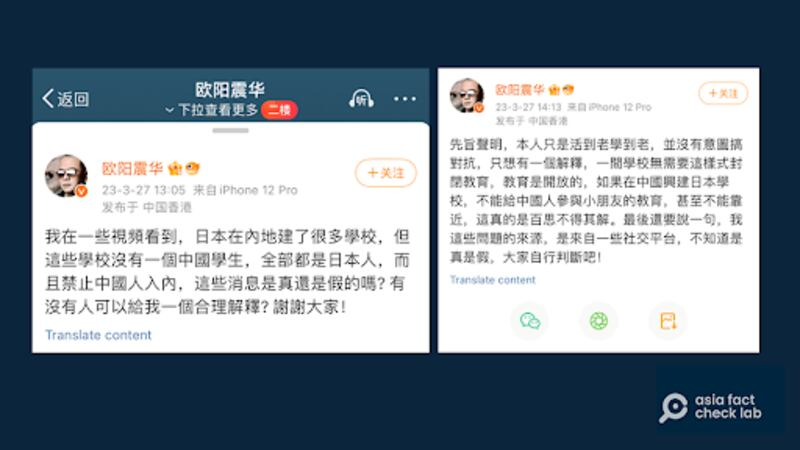
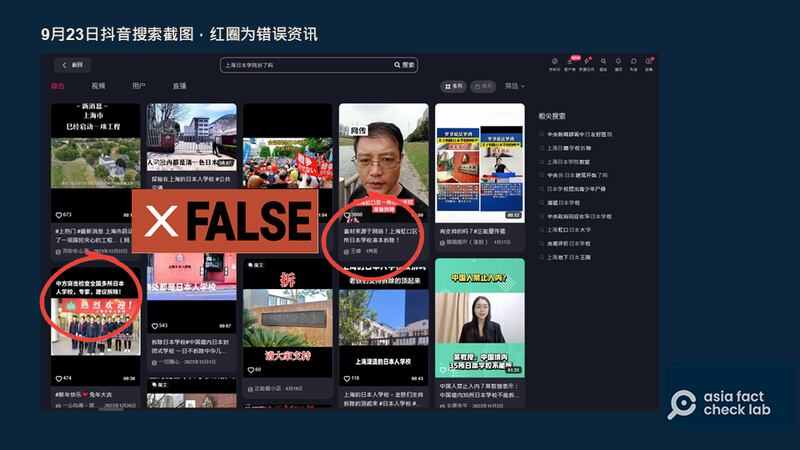
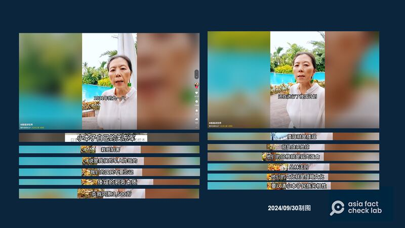
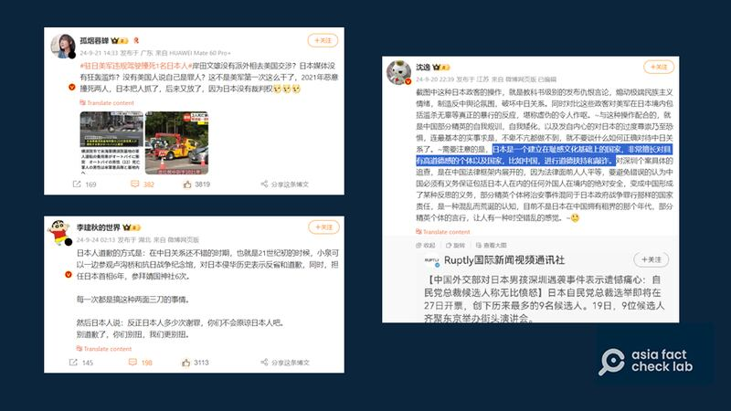

# 傳播觀察｜日本人學校如何成爲中國反日情緒的目標？

作者：鄭崇生

2024.10.01 19:57 EDT

"蛇口港船來船往,匯聚光芒中的追夢人,我攢着內心的澎湃,航向廣闊世界。"——沈航平再也無法和同學們齊唱這首 [深圳日本人學校校歌](http://www.jsszcn.com/school_info/school_song?dt_dapp=1)了。918事件滿93週年的當天上午, [深圳警方通報](https://mp.weixin.qq.com/s/fqgpIOmVcHE3_HDhZHBr7Q)他遭人持刀刺傷, 10年的短暫人生止於隔天的9月19日。

在中國生活的日本孩童於上、下學途中遭刺殺，在今年已經不是第一次。6月24日下午，一輛蘇州日本人學校校車抵達車站後，一名中國籍男子突然上前砍人，造成一對日本母子受傷，中國籍校巴職員胡友平爲救學生，最終不幸喪命。犯案者的行兇動機同樣至今未明。

有許多中國民衆在事件發生後到學校門前獻花,有獻花者在接受記者採訪時 [反思中國的仇恨教育](https://youtu.be/xk4aA0qXZJ0?si=v4NUP_mHZgehlYwD)。但中國外交部發言人林劍在 [23日的例行記者會上強調稱](https://www.mfa.gov.cn/web/fyrbt_673021/202409/t20240923_11495083.shtml):中國沒有所謂"仇日教育"。

## 攻擊日本人學校成爲網絡流量密碼

中國沒有"仇日教育"嗎?亞洲事實查覈實驗室(AFCL)發現,早在2022年,"拆除日本人學校"在中國社交媒體平臺上成爲流量密碼。但關於中國究竟有多少日本人學校,不同賬戶說法不一, [35](https://v.douyin.com/iB8hVxEB/)、 [102](https://v.douyin.com/iB8h4oVN/)、 [108](https://v.douyin.com/iB8hjoJk/)的說法都有,截至發稿前,這些視頻在抖音平臺上還看得到。

短視頻平臺上呼籲"拆除日本人學校"的視頻（抖音截圖）

根據日本文部科學省的 [最新數據](https://www.mext.go.jp/content/20240515-mxt_kyokoku-000026120.pdf):不包括臺灣的3所學校,中國共有日本學校12所,其中2所在香港。

上述三個抖音賬號中，粉絲數最高的是“紅玉在努力”，約有16萬人，她平時也在自己經營的實體服裝店裏錄製短視頻談時政。

2023年3月,香港藝人歐陽震華曾 [公開發文](https://archive.ph/YWdA1)對日本人學校提出質疑,該事件一度衝上微博熱搜,他質問:"爲什麼日本在內地建的學校是封閉式教育?沒有一箇中國學生"。

儘管歐陽震華強調自己發文不是要搞對抗，但他的這兩則發文，確實讓“日本人學校”再度成爲中國社交媒體平臺上的流量密碼，掀起中國網民實地走訪日本人學校、錄製視頻的另一波高峯。

歐陽震華曾發文對在華日本人學校提出質疑（新浪微博截圖）

至於這些日本人學校不招收中國人的原因,在中國教育部官網上就有公開的說明。 [《關於開辦外籍人員子女學校的暫行管理辦法》](http://www.moe.gov.cn/srcsite/A02/s5911/moe_621/199504/t19950405_81906.html)第17條明確規定,日本人學校不得招收境內中國公民子女,如有違反,中國官方最重可責令學校停辦。

中文社媒平臺去年中出現一波探訪日本人學校並以愛國或反日爲主題的視頻，上述視頻已下架。（抖音、新浪微博截圖）

標記爲前網易新聞日文總編輯得"東京溫哥"在 [X賬號視頻中](https://x.com/wenqiangjp/status/1837482191049445551)說,中國國內這類針對日本人的"偶發事件頻繁發生",在他看來,從平臺默許網上針對日本人的謠言,到這些博主散播仇日情緒,就是"在犯罪邊緣不斷試探",他認爲"仇恨日本是門好生意",流量的利益更是驅動這些人"反日"。

歐陽震華髮文後,教育學者熊丙奇當時就以上述中國官方規定 [釋疑](https://www.toutiao.com/w/1761689727376384/?log_from=a60ebe368745_1727739462265),但在文章留言區裏,熊丙奇卻遭網民圍剿,質疑他是幫日本人說話。

在歐陽震華髮帖之前的2023年3月,香港浸會大學針對上海日本人學校小學生宣誓"中國很快會是我們的"虛假視頻發佈過 [查覈文章](https://factcheck.hkbu.edu.hk/home/2023/03/28/23031001/),當時原視頻拍攝者就是"東京溫哥"。他非常氣憤自己的視頻遭盜用,原視頻是他女兒在日本就讀的學校舉辦運動會,賽前學生喊口號激勵士氣的片段,卻被人亂翻譯變造成了煽動仇日的素材。

## 官方否認仇恨教育

微信公衆號"念個咒語會下雨"20日發佈 [文章](https://chinadigitaltimes.net/chinese/711615.html),統計出在深圳男童遇害後,短視頻平臺"快手"上有至少278個呼籲"拆除日本人學校"的視頻。他將這些視頻整理、區分爲四大類:

1. 實地走訪在華日本人學校,以第一人稱展示學校外觀的博主。
2. 宣稱"國家層面"決定將很快將拆除日本人學校的"僞新聞播報"。
3. 造謠日本人學校培養間諜的"懟臉解說"。
4. 宣揚民族仇恨呼籲拆除日本人學校的情緒聲討。

他統計，在這278條視頻中，累計點贊量超過231萬。其中，點贊量最高的達32.7萬，有39個視頻點贊量超過1萬、5個視頻點贊量超過10萬。

但這篇分析文章在發佈後僅4個小時就被刪除。他後來另外 [發文](https://archive.ph/V7aTO)表示,網管稱刪帖的原因是"違反規定",但快手隨後也將被他點名的這278個視頻下架,"念個咒語會下雨"說,虛假視頻跟着他的文章一起"陪葬",自己也算是達到目的。

亞洲事實查覈實驗室觀察發現，在抖音平臺還有大量涉及仇日的消息包括不實消息被算法推送。直到美東時間9月23日，在該平臺搜索“日本人學校”，還會看到平臺推送的“上海虹口區一所日本學校準備拆除”等假信息。上海的兩所日本人學校，一所在閔行區，一所在浦東，虹口並沒有日本人學校。

9月23日，抖音上仍可搜出大量涉及日本人學校的不實信息（抖音截圖）

9月30日,亞洲事實查覈實驗室再次於抖音上搜索"日本人學校",仍可看到網頁右方自動跳出"上海日本學院拆了嗎?"亞洲事實查覈實驗室統計,在列出的81個視頻中可,仍有49個視頻是涉及在華日本人學校的視頻,內容有虛假或誤導訊息,包括 [稱殺害兒童事件"是日本人自導自演"的陰謀論](https://v.douyin.com/iB86tJKh/)。

9月30日，抖音上流傳的質疑深圳男童遇刺事件"可能是日本人自導自演"的視頻（抖音截圖）

## “受害者有罪論”的輿論導向

深圳事件案發後,一些中國學者發佈反思愛國主義如何演變成仇恨暴力的 [文章](https://archive.ph/avpke),在微信幾度"轉世"仍遭刪除。但替日本人反省的網帖卻大量存在。孤煙暮蟬等網絡大V對那些反思仇恨教育的網民開展了 [人肉搜索和批鬥](https://archive.ph/lGEtd),她還把深圳日本男童遇害事件兇手遭逮捕,與日本設立靖國神社相比較,談中日之間文明與野蠻的區別,她的觀點成爲評論區民衆熱議事件的 [主流觀點](https://archive.ph/LqHc6)之一。

多個網絡大V以檢討日本人的角度來引導話題（微博截圖）

上海復旦大學政治系教授沈逸 [發文](https://archive.ph/2PrRr)稱,中國內部有自我檢討的聲音是"自我矮化",而日本非常擅長對具高道德感的國家,如中國,"進行道德挾持和敲詐"。

關於日本孩童遇刺後網絡流傳的假消息,亞洲事實實驗室已經發布了相關查覈報告,可點選 [鏈接](2024-09-27_事實釐清 ｜ 日本關心男童深圳遇刺，駐日美軍犯法卻沒法管？.md)回顧。

*亞洲事實查覈實驗室(Asia Fact Check Lab)針對當今複雜媒體環境以及新興傳播生態而成立。我們本於新聞專業主義,提供專業查覈報告及與信息環境相關的傳播觀察、深度報道,幫助讀者對公共議題獲得多元而全面的認識。讀者若對任何媒體及社交軟件傳播的信息有疑問,歡迎以電郵*  [*afcl@rfa.org*](mailto:afcl@rfa.org)  *寄給亞洲事實查覈實驗室,由我們爲您查證覈實。* *亞洲事實查覈實驗室在X、臉書、IG開張了,歡迎讀者追蹤、分享、轉發。X這邊請進:中文*  [*@asiafactcheckcn*](https://twitter.com/asiafactcheckcn)  *;英文:*  [*@AFCL\_eng*](https://twitter.com/AFCL_eng)  *、*  [*FB在這裏*](https://www.facebook.com/asiafactchecklabcn)  *、*  [*IG也別忘了*](https://www.instagram.com/asiafactchecklab/)  *。*

[Original Source](https://www.rfa.org/mandarin/shishi-hecha/hc-how-japanese-school-becomes-target-of-china-anti-japan-sentiment-10012024194705.html)