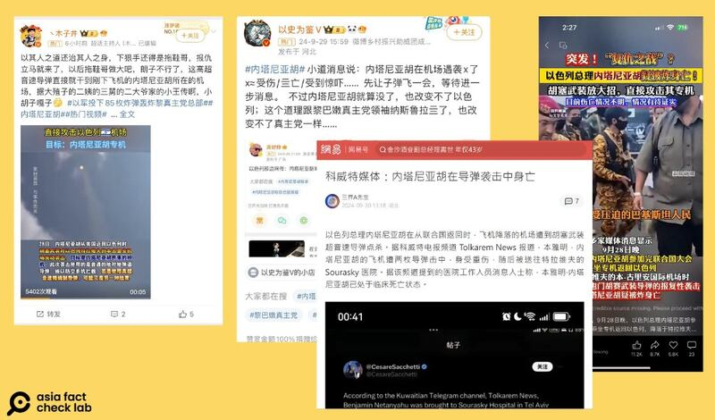
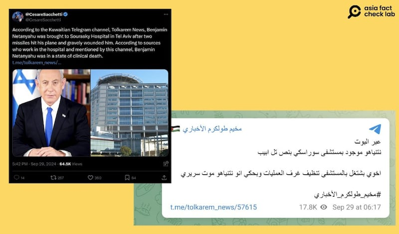

# 事實查覈｜以色列總理內塔尼亞胡重傷身亡？

作者：艾倫

2024.10.02 11:16 EDT

## 查覈結果：錯誤

## 一分鐘完讀：

九月底，中文社媒平臺上大量轉發一則消息：以色列總理本雅明·內塔尼亞胡（Benjamin Netanyahu）在28日從紐約飛回以色列特拉維夫（Tel Aviv）的班機降落時，於機場遭遇胡塞武裝的導彈襲擊，身受重傷，生死不明。

亞洲事實查覈實驗室查覈後發現，內塔尼亞胡在這則消息傳出後已有多次公開露面談話的記錄，他的社媒帳號也持續發文。因此網傳他重傷或死亡的說法爲錯誤信息。

## 深度分析：

9月29、30日,微博( [1](https://web.archive.org/web/20241002145905/https://weibo.com/5410945006/OzheIn6Iy), [2](https://web.archive.org/web/20241002150006/https://weibo.com/2178514797/OzlSeELBC))和 [網易](https://web.archive.org/web/20241002150515/https://m.163.com/dy/article_cambrian/JDBA6Q5U05568TSV.html)廣傳一則消息,稱以色列總理內塔尼亞胡28日從美國返回以色列時,在特拉維夫的本古裏安(Ben Gurion)機場遭胡塞武裝襲擊,身受重傷,"生死未卜",有傳言甚至稱內塔尼亞胡已經身亡。

九月底，中文社媒盛傳以色列總理內塔尼亞胡遇襲重傷的消息。（微博、網易截圖）

## 內塔尼亞胡確實遇襲嗎？

被上述多箇中文博主引用的X英文帳號@CesareSacchetti [發文指出](https://x.com/CesareSacchetti/status/1840326269189202226),根據科威特的Telegram頻道Tolkarem News [報道](https://t.me/tolkarem_news/57615),內塔尼亞胡的飛機被"兩枚導彈擊中",他本人"重傷",被送往特拉維夫的蘇拉斯基醫院(Sourasky Hospital),處於"臨牀上死亡"(clinical death)狀態,意即沒了呼吸心跳。

內塔尼亞胡遇襲的消息最早傳自Telegram頻道Tolkarem News，後再經英文X帳號流傳。（X、Telegram截圖）

以關鍵字搜尋新聞發現,國際媒體如《 [印度斯坦時報](https://www.hindustantimes.com/videos/world-news/houthis-try-to-kill-netanyahu-fire-missile-at-airport-when-israel-pms-plane-arrived-nasrallah-101727603738124.html)》及《 [以色列時報](https://www.timesofisrael.com/liveblog_entry/after-claiming-rocket-launch-on-tel-aviv-houthi-rebel-leader-vows-nasrallahs-death-will-not-be-in-vain/)》皆有報道此次胡塞武裝的報復行動。 《以色列時報》提及,胡塞武裝表示,28日晚曾向特拉維夫發射導彈,目標是以色列總理內塔尼亞胡。

報道引述以色列國防軍的說法，稱該導彈是在內塔尼亞胡的飛機降落在古裏安機場至少“半小時後”才發射，並已被空防系統“在國境之外”攔截。

胡塞武裝方面則 [發表聲明](https://www.saba.ye/en/news3377537.htm),稱也門武裝部隊在28日下午對本古裏安機場發射兩枚巴勒斯坦二型彈道飛彈,並稱這是針對"罪犯本雅明·內塔尼亞胡"(criminal Benjamin Netanyahu)的飛機降落時所發射,但並未提及導彈任務是否成功。

## 內塔尼亞胡"遇襲"之後，又多次公開發言

查詢以色列總理辦公室的新聞發佈,會發現截至10月2日,內塔尼亞胡已數次公開發言。例如伊朗於10月1日以近200枚導彈攻擊以色列,內塔尼亞胡即在當日的安全內閣會議上 [出面聲稱](https://www.youtube.com/watch?v=0CeOdoHV1ZE)伊朗要爲此付出代價。

[會議](https://www.gov.il/en/pages/event-cabinet011024)上,內塔尼亞胡譴責發生在以色列雅法市的恐怖攻擊,他強調該恐攻和以色列遭轟炸的幕後黑手皆來自伊朗,並再次讚揚以色列軍隊應對伊朗導彈攻擊的表現。

稍早,內塔尼亞胡在9月30日的 [會議](https://www.gov.il/en/pages/spoke-start300924)中,除了讚揚以色列國防軍(IDF)的表現,也歡迎他的昔日對手基甸薩爾(Gideon Saar)加入執政團隊,該消息也經《美聯社》 [報道](https://apnews.com/article/netanyahu-saar-israel-politics-cabinet-ee441a9a75780e5c2740ccaeacc461e9)。

此外,所謂的遇襲日(9月28日)之後,內塔尼亞胡的官方X帳號仍持續更新內容,其中數支視頻包含向伊朗人民 [喊話](https://x.com/netanyahu/status/1840740049299583355),以及前述的兩個政府會議( [1](https://x.com/netanyahu/status/1840759955948765606), [2](https://x.com/netanyahu/status/1841214635292119507))。

消息傳出數日，以色列總理官網及內塔尼亞胡的社媒並未對此事做出說明，國際主流媒體也沒有對此事件多做報道。亞洲事實查覈實驗室去信以色列總理辦公室及以色列駐美大使館，至截稿前未獲回應。

由此可知，內塔尼亞胡從重傷及死亡的消息傳出後，仍有多次公開露面的記錄，因此網傳說法爲錯誤信息。

*亞洲事實查覈實驗室(Asia Fact Check Lab)針對當今複雜媒體環境以及新興傳播生態而成立。我們本於新聞專業主義,提供專業查覈報告及與信息環境相關的傳播觀察、深度報道,幫助讀者對公共議題獲得多元而全面的認識。讀者若對任何媒體及社交軟件傳播的信息有疑問,歡迎以電郵*  [*afcl@rfa.org*](mailto:afcl@rfa.org)  *寄給亞洲事實查覈實驗室,由我們爲您查證覈實。* *亞洲事實查覈實驗室在X、臉書、IG開張了,歡迎讀者追蹤、分享、轉發。X這邊請進:中文*  [*@asiafactcheckcn*](https://twitter.com/asiafactcheckcn)  *;英文:*  [*@AFCL\_eng*](https://twitter.com/AFCL_eng)  *、*  [*FB在這裏*](https://www.facebook.com/asiafactchecklabcn)  *、*  [*IG也別忘了*](https://www.instagram.com/asiafactchecklab/)  *。*

[Original Source](https://www.rfa.org/mandarin/shishi-hecha/hc-netanyahu-injured-from-missile-attack-fact-check-10022024111146.html)