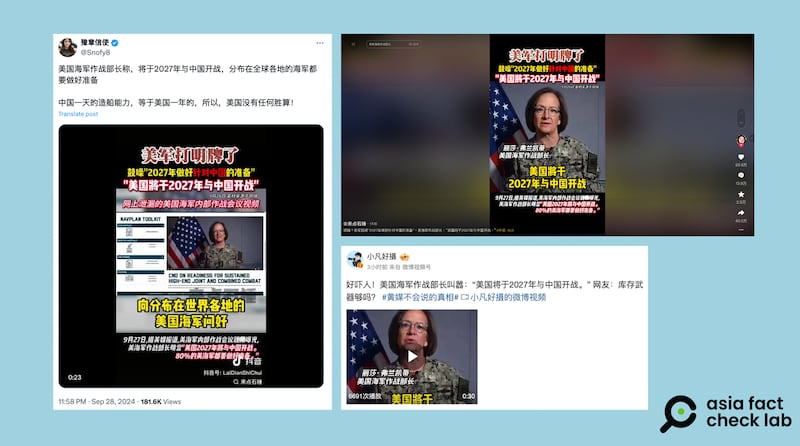

# 事實查覈｜美國海軍作戰部長稱"美國將於2027年與中國開戰"？

作者：莊敬

2024.10.03 18:56 EDT

## 查覈結果：誤導

## 一分鐘完讀：

近日在抖音、X、微博等平臺流傳一則30秒的短視頻，畫面是美國海軍作戰部長弗蘭凱蒂（Lisa Franchetti）的談話片段，視頻上的簡體中文字幕寫着“美軍打明牌了，美國將於2027年與中國開戰”和“網上泄漏的美國海軍內部作戰會議視頻”等內容。

經查，弗蘭凱蒂公開發表的這一談話指出，要確保美方在2027年前做好萬全準備，以應對與中國發生衝突的可能性。而2027年這個時間節點，是基於中國國家主席習近平提出的建軍備戰目標。但網傳短視頻剪掉了弗蘭凱蒂提到習近平設下的2027年目標，並配上“美國將於2027年與中國開戰”字幕，扭曲了她的原意。

## 深度分析：

在抖音上擁有兩百多萬粉絲的賬號 ["來點石錘"](https://v.douyin.com/iBe4TkMD/)在9月底發佈了一則30秒的短視頻,畫面是美國海軍作戰部長弗蘭凱蒂的錄影談話,視頻上的簡體中文標題與字幕寫着"美軍打明牌了,美國將於2027年與中國開戰""網上泄漏的美國海軍內部作戰會議視頻"等字句。

亞洲事實查覈實驗室(Asia Fact Check Lab)在9月30日注意到"來點石錘"的視頻,當時這則視頻的轉發次數已超過40萬,但10月1日上午點擊原鏈接時,導向的網頁顯示"視頻不存在"。不過,這則視頻已迅速傳進其它平臺,包括X上的"藍勾勾"用戶 ["豫章信使"](https://twitter.com/Snofy8/status/1840058444017217667)、微博大V ["小凡好攝"](https://m.weibo.cn/detail/5084223423120159)等賬號都有轉發。

抖音、X、微博流傳一則短視頻，畫面是美國海軍作戰部長弗蘭凱蒂的錄影談話片段，視頻上簡體中文字寫着"美國將於2027年與中國開戰"、"網上泄漏的美國海軍內部作戰會議視頻"。（X、抖音、微博截圖）

但視頻中搭配的部分簡體字幕,以及網民轉發短視頻的配文,都存在誤導信息。首先,這個視頻並非"網上泄漏的美國海軍內部作戰會議視頻",而是公開發布在 [美國海軍網站](https://www.navy.mil/Leadership/Chief-of-Naval-Operations/CNO-NAVPLAN-2024/)上的弗蘭凱蒂錄影談話。

弗蘭凱蒂在3分多鐘的錄影談話中提到,新發布的 [《美國作戰海軍領航計劃》](https://www.navy.mil/Portals/1/CNO/NAVPLAN2024/Files/CNO_NAVPLAN_2024_50Sat.pdf?ver=wcI10aP6LiEoojJZz-2qXA%3d%3d)(Chief of Naval Operations Navigation Plan for America's Warfighting Navy 2024)作爲海軍的戰略指導方針,是爲了確保美方做好萬全準備,以應對到2027年可能與中國發生的衝突。她並說明,以2027年爲限,因爲這是中國國家主席習近平要求軍隊完成備戰目標的時間。(...to ensure that we are more ready for potential conflict with the People's Republic of China by 2027…NAV plan 2024 lays out seven key areas of acceleration, areas where I intend to invest my time and resources to raise our fleets baseline level of readiness by 2027, the year the PRC chairman told his forces to be ready for war.)

《美國作戰海軍領航計劃》說明了當前的安全情勢，包括俄羅斯入侵烏克蘭、以哈衝突、中國對美國海軍構成的挑戰等，其中寫道“中國國家主席已告訴軍隊在2027年做好戰爭準備，我們將更充足準備。”（The Chairman of the People’s Republic of China (PRC) has told his forces to be ready for war by 2027—we will be more ready. ）

根據在2020年10月召開的中國共產黨第19屆中央委員會第五次全體會議 [公報](https://www.12371.cn/2020/10/29/ARTI1603964233795881.shtml),全會提出,加快國防和軍隊現代化,實現富國和強軍相統一,貫徹習近平強軍思想,全面加強練兵備戰,"確保2027年實現建軍百年奮鬥目標",此後 [中國官方](http://www.xinhuanet.com/politics/2020-11/26/c_1126791220.htm)與 [官媒](http://www.mod.gov.cn/gfbw/jmsd/16207985.html)經常提及此目標。

但根據媒體 [報道](https://www.cna.com.tw/news/acn/202311160049.aspx),去年11月16日,習近平與美國總統拜登會面時,又曾在拜登面前否認了2027或2035有攻臺計劃。在此同時,美軍將領則 [警告稱](https://www.cna.com.tw/news/aipl/202404240402.aspx),中國的目標是在2027年之前具備侵略臺灣的能力。

*亞洲事實查覈實驗室(Asia Fact Check Lab)針對當今複雜媒體環境以及新興傳播生態而成立。我們本於新聞專業主義,提供專業查覈報告及與信息環境相關的傳播觀察、深度報道,幫助讀者對公共議題獲得多元而全面的認識。讀者若對任何媒體及社交軟件傳播的信息有疑問,歡迎以電郵*  [*afcl@rfa.org*](mailto:afcl@rfa.org)  *寄給亞洲事實查覈實驗室,由我們爲您查證覈實。* *亞洲事實查覈實驗室在X、臉書、IG開張了,歡迎讀者追蹤、分享、轉發。X這邊請進:中文*  [*@asiafactcheckcn*](https://twitter.com/asiafactcheckcn)  *;英文:*  [*@AFCL\_eng*](https://twitter.com/AFCL_eng)  *、*  [*FB在這裏*](https://www.facebook.com/asiafactchecklabcn)  *、*  [*IG也別忘了*](https://www.instagram.com/asiafactchecklab/)  *。*

[Original Source](https://www.rfa.org/mandarin/shishi-hecha/hc-us-navy-official-claims-us-to-wage-war-against-china-in-2027-fact-check-10032024185232.html)