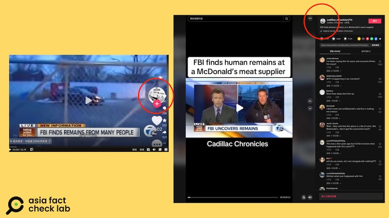

# 事實查覈｜FBI發現麥當勞肉類供應商用人肉？

作者：董喆

2024.10.04 15:52 EDT

## 查覈結果：錯誤

## 一分鐘完讀：

近日，中國社羣平臺抖音熱傳一條視頻，稱“FBI查出麥當勞供應商肉類含有人肉”，並提供一些美國媒體報道截圖、剪輯，。亞洲事實查覈實驗室查覈後發現，抖音視頻剪輯的內容爲美媒報道多年前底特律一家公司非法買賣人類遺骸給醫學教育單位，原報道完全沒有提及與麥當勞有關。“麥當勞用人肉”則是一則多年反覆流傳的假信息，曾多次在美國、中東、日本等不同地區出現過。

深度分析：

"美國食品裏面沒有添加劑,太天真了,不光有添加劑,它還有人肉!"抖音博主" [燈塔破壁人李晨](https://v.douyin.com/iBRB1MLP/)"在其個人賬號中發佈視頻稱,9月28日美國聯邦調查局(FBI)在"M字頭"漢堡的肉類供應商那發現了人類的殘骸,並查獲肢解工具,並在分割畫面中引用了一則疑似美國媒體的新聞畫面。這則短視頻收穫2.8萬贊數,有2.6萬人轉發。

同樣的說法與視頻內容在抖音廣傳( [1](https://v.douyin.com/iBdDMREP/), [2](https://v.douyin.com/iBdAwpMJ/)),皆有有破萬轉載量。

中國多個社媒賬號流傳美國麥當勞“查出人肉”的說法。（抖音截圖）

亞洲事實查覈實驗室(以下簡稱AFCL)根據視頻的浮水印,追查出這些帳號都使用了TikTok帳號"@cadillac\_chronicles714"9月27日上傳的一則 [短視頻](https://www.tiktok.com/@cadillac_chronicles714/video/7419394084994895150?is_from_webapp=1&sender_device=pc&web_id=7205785657578538497),這則視頻的上傳者與受衆以英文爲主,但內容同樣提到"FBI在麥當勞肉類供應商發現人類殘肢",因此中文世界的傳言很有可能是自英文世界搬運。

相關傳播“麥當勞查處人肉”假信息的賬號很可能是轉發英文假信息。（抖音、TikTok截圖）

AFCL以新聞畫面反搜，發現抖音與TikTok上引用的視頻皆出自美國廣播公司（ABC）旗下的底特律地方電視臺“WXYZ-TV Detroit”，這則報道發生在2013年12月14日，在時間點上就已反駁抖音博主所稱是9月28日。

經對比，傳言中的新聞報道爲2018年事件，與麥當勞並不相關。(抖音、WXYZ截圖)

近一步檢視報道,標題爲"FBI finds remains from many people"並未提到麥當勞。 AFCL綜合同一媒體刊載的 [影音](https://www.youtube.com/watch?v=gA75YDVXJqs&ab_channel=WXYZ-TVDetroit%7CChannel7)與 [文字報道](https://web.archive.org/web/20131217081623/http://www.wxyz.com:80/dpp/news/fbi-finds-remains-from-many-people-at-scene-of-detroit-business-under-investigation),內容指出,FBI查獲底特律一家名爲"International Biological, Inc."的醫學教育服務公司非法買賣人類遺骸,官員們在該公司帶走了部分殘骸與切割工具。這些內容與抖音博主所述大致相符,但皆未提到與麥當勞有關。

本案於2018年展開審判,根據《 [底特律新聞](https://www.detroitnews.com/story/news/local/wayne-county/2018/05/22/tainted-body-parts-seller-sentenced-prison/633891002/)》以及 [路透社](https://www.reuters.com/article/us-usa-bodies-sentence-idUSKCN1IN2PA/)報道,公司負責人亞瑟·拉斯伯恩(Arthur Rathburn)自1997年至2013年,向不知情的醫學教育者提供病患遺體,遭判處9年監禁。不過在上述相關報道與 [法庭文件](https://www.scribd.com/document/297134339/Arthur-Rathburn-Indictment)中皆未提到麥當勞。

查覈過程中,AFCL發現"麥當勞漢堡有人肉"已是流傳多年的假訊息,且有多種不同的版本。臺灣查覈組織MyGoPen在2022年針對"以色列摩薩德和美國聯邦調查局發現麥當勞使用人肉"撰寫過 [查覈報告](https://www.mygopen.com/2022/01/mcdonalds-human.html),當中的假訊息也是運用同一則新聞報道。 [路透社](https://www.reuters.com/article/factcheck-mcdonalds-human/fact-check-mcdonalds-human-meat-claims-stem-from-satire-article-idUSL2N2NT1SV/)、 [美聯社](https://apnews.com/article/archive-fact-checking-9233643423)也曾查覈這個錯誤說法。2023年,微博也曾流傳日本麥當勞喫出"美國失蹤兒童的人肉",被中國新聞機構 [查覈](https://chinafactcheck.com/?p=11986)爲假信息。

我們在麥當勞阿曼的官方網站也找到麥當勞曾對"人肉說" [闢謠](https://www.yourrighttoknow.com/om/en/topics/ingredients/are-you-using-humans-meat-food-0),該網站指出,"我們的牛肉來源於阿布達比的BRF公司,雞肉則來自馬來西亞的McFood公司,這些供應商均遵守我們嚴格的質量、安全和清真標準"。

*亞洲事實查覈實驗室(Asia Fact Check Lab)針對當今複雜媒體環境以及新興傳播生態而成立。我們本於新聞專業主義,提供專業查覈報告及與信息環境相關的傳播觀察、深度報道,幫助讀者對公共議題獲得多元而全面的認識。讀者若對任何媒體及社交軟件傳播的信息有疑問,歡迎以電郵*  [*afcl@rfa.org*](mailto:afcl@rfa.org)  *寄給亞洲事實查覈實驗室,由我們爲您查證覈實。* *亞洲事實查覈實驗室在X、臉書、IG開張了,歡迎讀者追蹤、分享、轉發。X這邊請進:中文*  [*@asiafactcheckcn*](https://twitter.com/asiafactcheckcn)  *;英文:*  [*@AFCL\_eng*](https://twitter.com/AFCL_eng)  *、*  [*FB在這裏*](https://www.facebook.com/asiafactchecklabcn)  *、*  [*IG也別忘了*](https://www.instagram.com/asiafactchecklab/)  *。*

[Original Source](https://www.rfa.org/mandarin/shishi-hecha/hc-fake-fbi-investigation-mcdonalds-10042024155140.html)