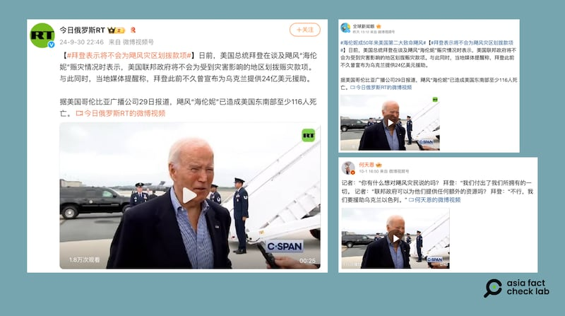

# 事實查覈｜拜登稱“不會爲颶風災區撥款”，因爲“要援助烏克蘭、以色列” ？

作者：莊敬

2024.10.04 15:47 EDT

## 查覈結果：錯誤

## 一分鐘完讀：

《今日俄羅斯》（RT）近日在微博發佈一則短視頻，畫面是美國總統拜登談論海倫颶風的賑災情況，其中貼文寫道，“拜登表示將不會爲颶風災區劃撥款項”。另有“大V”博主發佈視頻，並稱拜登政府不會爲災民提供額外資源，因爲“要援助烏克蘭、以色列”。

亞洲事實查覈實驗室檢視了完整訪問，拜登在回應記者詢問是否爲災民提供額外資源時，表示政府已傾盡所能，提供預先已規劃好的資源。拜登原意是要表達政府爲災區所做的事情，但卻被斷章取義，被部分社媒用戶扭曲成政府“不會撥款援助”，甚至無中生有地與美國對外軍援聯繫起來，傳播錯誤信息。

深度分析：

海倫颶風(Hurricane Helene,又譯海倫妮)9月底在佛羅里達州登陸,重創美國東南部數個州,造成數百人喪命。美國政府採取一系列 [應對措施](https://www.whitehouse.gov/briefing-room/statements-releases/2024/10/02/fact-sheet-update-biden-harris-continues-life-saving-response-efforts-in-response-to-hurricane-helene/),包括下令聯邦提供援助,部署千名現役軍人前往災區,支援運送食物等必需品,總統拜登(Joe Biden)與副總統哈里斯(Kamala Harris,又譯賀錦麗)10月2日起前往災區視察。

亞洲事實查覈實驗室(Asia Fact Check Lab,下簡稱AFCL)注意到,俄羅斯媒體《 [今日俄羅斯](https://weibo.com/6244553417/5084436534401173)》(RT)的微博視頻號在9月30日發佈一則25秒的短視頻,其配文寫道,"日前,美國總統拜登在談及颶風海倫妮賑災情況時表示,美國聯邦政府將不會爲受到災害影響的地區劃撥賑災款項。"

另有微博"大V"用戶" [何天恩](https://m.weibo.cn/detail/5084709348707475)"分享同場景的短視頻,配文陳述記者與拜登的對話,"記者:聯邦政府可以爲他們(指災民)提供額外的資源嗎?拜登:不行,我們要援助烏克蘭以色列"。在X上亦有中文帳號( [1](https://x.com/shell_zipi/status/1840932190344876124), [2](https://x.com/CaoChangqing/status/1840916969463431633), [3](https://x.com/guowengui360/status/1841355400802897956))發佈類似的論述,指"拜登政府拿幾百億給外國打仗,卻對美國大水災漠不關心,聲稱沒錢沒資源救助"。

網傳美國總統拜登表示，不會爲颶風災區劃撥款項。（微博截圖）

## 拜登對颶風災情說了什麼？

AFCL檢視了RT等帳號轉發的視頻來源,是拜登9月29日在多佛空軍基地(Dover Air Force Base)簡短接受記者訪問。根據美國媒體C-SPAN的 [畫面](https://www.c-span.org/video/?538805-1/president-biden-speaks-reporters-dover-air-force-base),以及白宮的 [文字記錄](https://www.whitehouse.gov/briefing-room/speeches-remarks/2024/09/30/remarks-by-president-biden-before-air-force-one-departure-dover-de/),當天拜登向記者表示,政府傾全力幫助災民,提前抵達災區,正努力工作。

一名記者問：“聯邦政府可以提供他們更多資源嗎？”拜登回覆：“不，我們已經給他們－預先規畫的大量資源，儘管他們尚未提出要求。（No. We've given them — we have preplanned a significant amount of it, even though they didn't ask for it yet — had — hadn't asked for it yet.）”

拜登這段發言，並沒有說出“不行，我們要援助烏克蘭以色列”，因此博主“何天恩”配文所寫的爲捏造內容。拜登亦沒有表達《今日俄羅斯》帖子所謂的“政府將不會爲颶風災區劃撥款項”。

事實上,拜登發言當天,白宮發佈了一份 [說明文件](https://www.whitehouse.gov/briefing-room/statements-releases/2024/09/29/fact-sheet-update-biden-harris-administrations-continued-response-efforts-to-hurricane-helene/),列舉政府爲應對颶風災情所採取的行動,包括拜登批准佛羅里達州、北卡羅來納州等地的緊急狀態聲明,讓災民立即獲得資金和資源啓動復原工作,並可以向聯邦緊急事務管理局(FEMA)申請援助,這些援助可能包括前置資金(upfront funds),以幫助購買食品、水等必需品,修復颶風造成的房屋和個人財產損壞,尋找臨時住所等。

10月1日,拜登針對颶風災情 [發表談話](https://www.whitehouse.gov/briefing-room/speeches-remarks/2024/10/01/remarks-by-president-biden-on-his-administrations-continued-response-efforts-to-hurricane-helene/),表示已指示政府團隊儘快向受災社區提供一切可用資源,以進行救援、恢復、開始重建。根據白宮10月2日更新的 [說明文件](https://www.whitehouse.gov/briefing-room/speeches-remarks/2024/10/01/remarks-by-president-biden-on-his-administrations-continued-response-efforts-to-hurricane-helene/),政府迄今已向受海倫影響的災民提供超過1000萬美元的個人援助,預計此數字還會增加。

另根據《 [美國之音](https://www.voacantonese.com/a/us-helene-biden-north-carolina-20241002/7807427.html)》、《 [國會山莊報](https://thehill.com/homenews/campaign/4907140-biden-expects-supplemental-bill-hurricane-relief/)》等媒體報道,拜登可能要求國會議員返回華府,召開特別會議,審議受災地區的額外援助資金。

## 外媒已查覈闢謠

有關拜登不會爲災區提供更多援助的說法,在中、英文社媒瘋傳,且有許多網民將這件事與無關的對外軍援連結。針對這類論述,《 [今日美國報](https://www.usatoday.com/story/news/factcheck/2024/10/03/biden-aid-hurricane-helene-victims-fact-check/75473568007/)》(USA Today)、查覈網站《 [PolitiFact](https://www.politifact.com/factchecks/2024/sep/30/social-media/no-link-between-ukraine-and-helene-aid-and-joe-bid/)》都已發佈查覈報告,《 [美國全國公共廣播電臺](https://www.npr.org/2024/10/03/nx-s1-5134866/rumors-conspiracy-theories-helene-social-media)》(NPR)亦報道了關於海倫颶風的網傳謠言與陰謀論。

然而，在主流媒體與查覈機構闢謠後，《今日俄羅斯》等社媒帳號，仍未刪除或修改他們在中文平臺發佈的錯誤信息。

*亞洲事實查覈實驗室(Asia Fact Check Lab)針對當今複雜媒體環境以及新興傳播生態而成立。我們本於新聞專業主義,提供專業查覈報告及與信息環境相關的傳播觀察、深度報道,幫助讀者對公共議題獲得多元而全面的認識。讀者若對任何媒體及社交軟件傳播的信息有疑問,歡迎以電郵*  [*afcl@rfa.org*](mailto:afcl@rfa.org)  *寄給亞洲事實查覈實驗室,由我們爲您查證覈實。* *亞洲事實查覈實驗室在X、臉書、IG開張了,歡迎讀者追蹤、分享、轉發。X這邊請進:中文*  [*@asiafactcheckcn*](https://twitter.com/asiafactcheckcn)  *;英文:*  [*@AFCL\_eng*](https://twitter.com/AFCL_eng)  *、*  [*FB在這裏*](https://www.facebook.com/asiafactchecklabcn)  *、*  [*IG也別忘了*](https://www.instagram.com/asiafactchecklab/)  *。*

[Original Source](https://www.rfa.org/mandarin/shishi-hecha/hc-what-biden-did-not-say-about-hurricane-10042024154653.html)