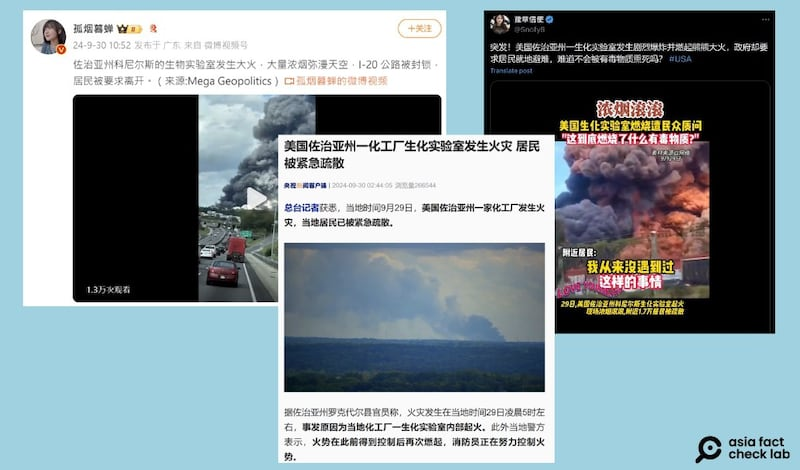

# 事實查覈｜美國佐治亞州"生化實驗室"爆炸導致新病毒泄露？

作者：艾倫

2024.10.07 18:25 EDT

## 查覈結果：錯誤

## 一分鐘完讀：

九月底至十月初，中文媒體及社媒平臺上流傳一則消息，稱美國佐治亞州的一座生化實驗室爆炸起火，並有事故現場的視頻爲證。

經查覈，網傳起火的“BioLab”公司爲一家提供泳池及水療服務的化工企業，和生物、生化實驗並無關係。官媒和大V在傳播該消息時將該公司的英文名（生物實驗室）按字面意義直譯並作爲該公司的類別依據，傳播了錯誤信息。

## 深度分析：

9月30日，微博大V“孤煙暮蟬”發文（原文已刪，見下方截圖）稱，美國佐治亞州一“生物實驗室”發生大火，大量濃煙瀰漫天空，不僅高速公路被封，附近居民也被撤離。原帖並附有一則交通堵塞的公路盡頭升起滾滾濃煙，疑似事故現場遠景的視頻。

兩天後,X上藍勾勾用戶"豫章信使"也轉發相同 [消息](https://archive.ph/1FwBc),說佐治亞州一個"生化實驗室發生劇烈爆炸並燃起熊熊大火",他並質疑政府要求居民就地避難,"難道不會被有毒物質燻死嗎?"

此外,一些中國官媒也將發生事故的工廠定義爲"生化實驗室",如央視的報道 [《美國佐治亞州一化工廠生化實驗室發生火災 居民被緊急疏散》](https://archive.ph/LISmr)。

中文網上出現和佐治亞州化工廠爆炸的相關謠言（微博、X、央視截圖）

有網民評論：“美帝的新病毒又泄露啦”“第二種新冠病毒要來了”。

亞洲事實查覈實驗室以關鍵字搜尋,找到美聯社曾在9月30日 [報道](https://apnews.com/article/biolab-chemical-plant-fire-evacuation-a9c7ddcbec42fcd891831101b9ccd1d4),佐治亞州科尼爾斯市(Conyers)確實有一家名爲"BioLab"的化工廠爆炸,羅克代爾縣警局(Rockdale County Sheriff's Office)也曾在臉書發佈一則事故現場升起濃煙密的 [視頻](https://www.facebook.com/watch/live/?ref=watch_permalink&v=1188375732389228)。

然而，“BioLab”是事故方公司的名字，而不是它的類別，根據該公司官網，它是KIK Consumer Products公司旗下的游泳池和水療水護理部門，生產和銷售與之相關的民用化工品。而網傳消息先是將其名字拆解，將“Bio”（生物詞根）翻譯爲生化，將“Lab”翻譯爲實驗室，以此爲據稱發生事故的是生化實驗室，並進一步引發“新病毒外泄”的輿論。

## 大火是否造成有毒物質擴散？

美國國家環境保護局的 [公開信息](https://www.epa.gov/ga/conyers-ga-biolab-fire?fbclid=IwY2xjawFskFRleHRuA2FlbQIxMQABHVAihX2F31rnZOnoGunV7N-aT54APxHyo58a7SS5ve1Y19n7HPyG25ldWg_aem_ypyIPgmnmK9PhZ_H_tbMeg)指出,化工廠大火燃燒時的曾釋放出有害物質氯氣(chlorine),不過至本文截稿時(10月4日),科尼爾斯市的氯氣含量已大幅降低,已無明顯致災性。

此外,"豫章信使"所說當地政府"要求民衆就地避難"的說法也並非事實全貌。羅克代爾縣政府官方臉書曾 [發文](https://www.facebook.com/photo/?fbid=951999576968487&set=a.237537725081346)公告撤離信息,呼籲疏散區內的民衆立即撤出原住家,也提醒疏散區外的民衆就地避難,待在家裏以防接觸有害物質。而這些指令及建議也在工廠周邊大氣環境逐漸恢復正常後 [取消](https://www.facebook.com/photo?fbid=952991340202644&set=a.237537725081346)。

*亞洲事實查覈實驗室（Asia Fact Check Lab）針對當今複雜媒體環境以及新興傳播生態而成立。我們本於新聞專業主義，提供專業查覈報告及與信息環境相關的傳播觀察、深度報道，幫助讀者對公共議題獲得多元而全面的認識。讀者若對任何媒體及社交軟件傳播的信息有疑問，歡迎以電郵afcl@rfa.org寄給亞洲事實查覈實驗室，由我們爲您查證覈實。*

*亞洲事實查覈實驗室在X、臉書、IG開張了,歡迎讀者追蹤、分享、轉發。X這邊請進:中文*  [*@asiafactcheckcn*](https://twitter.com/asiafactcheckcn)  *;英文:*  [*@AFCL\_eng*](https://twitter.com/AFCL_eng)  *、*  [*FB在這裏*](https://www.facebook.com/asiafactchecklabcn)  *、*  [*IG也別忘了*](https://www.instagram.com/asiafactchecklab/)  *。*

[Original Source](https://www.rfa.org/mandarin/shishi-hecha/hc-us-biochemical-lab-explosion-fact-check-10072024181745.html)