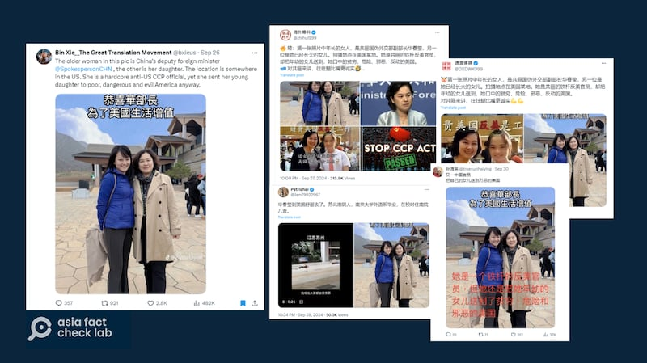
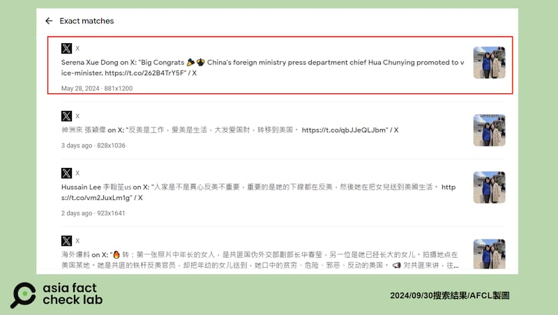
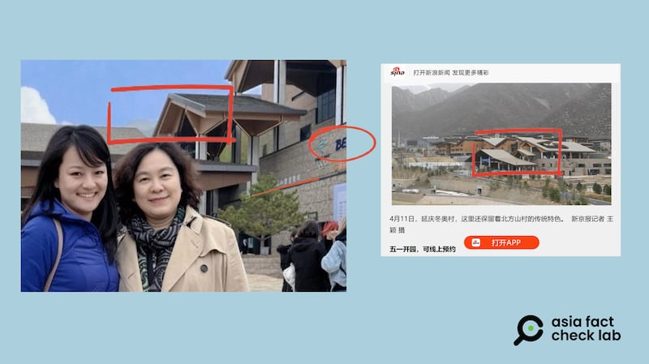

# 事實查覈｜華春瑩與女兒在美國生活的合照流出？

作者：鄭崇生

2024.10.08 19:31 EDT

## 查覈結果：錯誤 / 缺乏證據

## 一分鐘完讀：

一張被宣稱是中國外交部副部長華春瑩和女兒在美國的合照近日在社交媒體上廣傳,並引起華春瑩"人已經在美國生活"的 [中](https://archive.ph/1gjMS)、 [英文](https://archive.ph/1DZkO)消息不脛而走。

亞洲事實查覈實驗室發現，網傳照片其實是取自一名中國記者董雪（Serena Dong）在社交媒體平臺上發佈的自己與華春瑩的合照。並沒有可靠的公開資訊顯示華春瑩和董雪有血緣關係，而且照片拍攝的地點，也在北京而不是美國。

## 深度分析：

今日,在X平臺上,名爲"Bin Xie\_The Great Translation Movement"的賬號最早在美東時間9月26日發佈了"華春瑩與女兒在美國"的 [推文](https://archive.ph/8cIS8),附上華春瑩與一位身穿藍色連帽外套女性的合照。發佈者稱,這是華春瑩與她女兒的合照,"地點就在美國某處",並稱華春瑩是中共的鐵桿反美官員,"然而,她卻把女兒送去窮困、危險和邪惡的美國。"

近日社媒平臺上廣傳"華春瑩和女兒在美國"的合照（X截圖）

該帖很快就在社交媒體上轉譯成中文並傳播開來,中國知名演員 [孫海英](https://archive.ph/Vi4M4)也轉發了這張照片並評論稱"又一中國官員把自己的女兒送到萬惡的美國"。

亞洲事實查覈實驗室以圖反搜發現，這張照片來自中國記者董雪（Serena Dong）今年5月28日在X上的發文。她服務於中國國際電視臺新聞頻道（CGTN）。根據Google Lens的存取記錄顯示，她是在中國政府正式發佈華春瑩升任外交部副部長的後一天，發佈兩人的合照並表達恭賀。但後來董雪又將這張照片與祝賀華春瑩的帖文從X上刪除。

同一照片在X平臺上被多次傳播（X截圖）

網傳照片與董雪最初發出的照片相比較，畫面上多出了“恭喜華部長爲了美國生活增值”的兩行繁體字，而照片右下角增加了TikTok用戶@ziyoufujian的水印。

亞洲事實查覈實驗室進一步確認,X上的"爆料"圖文擷取自TikTok上名爲"自由福建"的賬號, ["自由福建"](https://www.tiktok.com/t/ZP8Rt4MLr/)同樣在5月28日當天使用了董雪公開的這一張照片,並在照片上加上"恭喜華部長爲了美國生活增值"的白色文字,還製作了約22秒的音頻,剪自華春瑩過去反駁外界批評"中國人民受壓迫"的發言。

“自由福建”還多次聲稱華春瑩在美國有房產、女兒在美國，也曾聲稱原外交部發言人汪文斌從發言人的位置上退下來後“潤到美國”，然而汪文斌目前擔任中國駐柬埔寨大使。

## 華春瑩與董雪在哪裏拍的合照？

將該照片放大可發現,華春瑩與董雪背後的建築物上可看到北京冬奧會的標誌(logo和"北京"拼音的前半部分),另外還可見到不清楚的中文文字,而對照網上可查找到的照片可發現,這棟建築物的屋頂造型,和中國 [《新京報》](https://m.bjnews.com.cn/detail/165626596414063.html)報道的北京延慶冬奧村極爲相似。

亞洲事實查覈實驗室查覈後發現，這張照片並非P圖，地點也不是在美國，而是中國的延慶冬奧村。

網傳華春瑩照片與冬奧村新聞圖片對比（新浪新聞截圖）

至於照片中兩人的關係,公開資料顯示,董雪曾就讀於 [重慶外國語大學](https://ent.sina.com.cn/j/2009-10-23/07402741759.shtml),後赴美國普渡大學(Purdue University)就讀於 [大衆傳播系](https://www.linkedin.com/in/serena-xue-dong-9baba24a/?originalSubdomain=cn)。

關於華春瑩家庭狀況, [公開資料](http://politics.people.com.cn/n/2012/1116/c41223-19605416.html)有限,僅知她已婚,育有一女。她先生的身份則衆說紛紜。立場親中的中文媒體《星島日報》曾在2020年 [報道](https://std.stheadline.com/realtime/article/1217197/%E5%8D%B3%E6%99%82-%E4%B8%AD%E5%9C%8B-%E4%B8%AD%E5%9C%8B%E5%BB%BA%E7%AF%89%E5%89%8D%E8%91%A3%E4%BA%8B%E9%95%B7%E7%97%85%E9%80%9D-%E5%82%B3%E7%82%BA%E8%8F%AF%E6%98%A5%E7%91%A9%E4%B8%88%E5%A4%AB%E6%B6%88%E6%81%AF%E6%8C%87%E7%B4%94%E5%B1%AC%E8%AC%A0%E8%A8%80)稱華春瑩的先生也是中國外交官。但中國官方從未證實或否認。經查覈,並沒有任何可信的信息顯示華春瑩和董雪有血緣關係。

至於董雪爲何要刪除祝賀華春瑩的帖文，她是在什麼場合與華春瑩合照，她與華春瑩又是否有血緣關係？截至發稿，董雪沒有回覆亞洲事實查覈實驗室的電子郵件查詢。

關於華春瑩的各種傳言一直不絕於網絡,亞洲事實查覈實驗室在華春瑩升任外交部副部長後,也曾發佈有關她被調查,"家中搜出500萬美元"的 [查覈報告](2024-07-22_事實查覈｜華春瑩被查，家中搜出500萬美金？.md),可點選文中鏈結回顧。

*亞洲事實查覈實驗室(Asia Fact Check Lab)針對當今複雜媒體環境以及新興傳播生態而成立。我們本於新聞專業主義,提供專業查覈報告及與信息環境相關的傳播觀察、深度報道,幫助讀者對公共議題獲得多元而全面的認識。讀者若對任何媒體及社交軟件傳播的信息有疑問,歡迎以電郵*  [*afcl@rfa.org*](mailto:afcl@rfa.org)  *寄給亞洲事實查覈實驗室,由我們爲您查證覈實。* *亞洲事實查覈實驗室在X、臉書、IG開張了,歡迎讀者追蹤、分享、轉發。X這邊請進:中文*  [*@asiafactcheckcn*](https://twitter.com/asiafactcheckcn)  *;英文:*  [*@AFCL\_eng*](https://twitter.com/AFCL_eng)  *、*  [*FB在這裏*](https://www.facebook.com/asiafactchecklabcn)  *、*  [*IG也別忘了*](https://www.instagram.com/asiafactchecklab/)  *。*

[Original Source](https://www.rfa.org/mandarin/shishi-hecha/hc-picture-of-hua-chunying-living-in-us-fact-check-10082024192308.html)