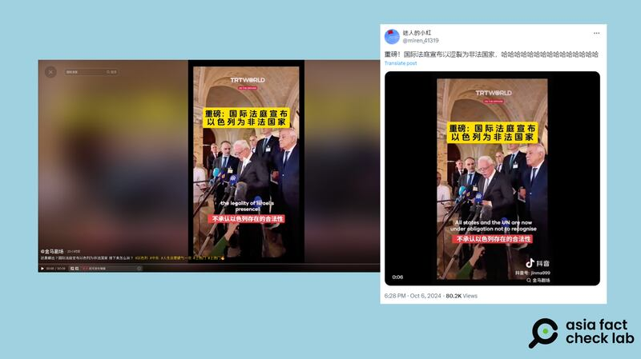

# 事實查覈｜國際法庭宣佈以色列"爲非法國家"？

作者：莊敬

2024.10.09 14:19 EDT

## 查覈結果：錯誤

## 一分鐘完讀：

近日在社媒上流傳一段視頻，畫面爲巴勒斯坦外長馬立基受訪，影像上的簡體中文字幕寫着“重磅：國際法庭宣佈以色列爲非法國家”、“突發新聞：10月6日，國際法庭宣佈以色列爲非法國家”。

經查，畫面來源是今年7月馬立基發言介紹國際法庭的一項諮詢意見，他的原話是“所有國家和聯合國現在有義務不承認以色列所佔領原屬巴勒斯坦領土的合法性”，而非“不承認以色列的合法性”，網傳視頻字幕扭曲原意，傳播了錯誤信息。

## 深度分析：

X上的"藍勾勾"用戶" [迷人的小紅](https://twitter.com/miren_41319/status/1842874650831052860)"10月6日發佈短視頻,簡體中文標題寫着"重磅:國際法庭宣佈以色列爲非法國家",視頻左上方的資訊顯示來源爲抖音號" [金馬劇場](https://v.douyin.com/iB526KR7/)"。這則9秒短視頻的畫面是巴勒斯坦外長馬立基(Riyad al-Maliki)在位於海牙的國際法庭(International Court of Justice)外對記者發言,視頻下方搭配簡中字幕:"所有國家和聯合國現在有義務不承認以色列的合法性"。

社媒上還流傳另一個版本的視頻( [1](https://x.com/whiteTony99/status/1843153170383724861), [2](https://x.com/wangban666/status/1843090253856604488), [3](https://x.com/junyin2001/status/1843041677268930940)),畫面同樣是馬立基在國際法院外發言,只是時間較長,約2分鐘。而長版視頻最後簡中字幕也是"所有國家和聯合國現在有義務不承認以色列的合法性"。

網傳視頻標題稱國際法庭宣佈以色列爲非法國家（X、抖音截圖））

亞洲事實查覈實驗室(Asia Fact Check Lab,下簡稱AFCL)以中文關鍵字搜尋,找到《 [法廣](https://www.rfi.fr/tw/%E4%B8%AD%E6%9D%B1/20240720-%E8%81%AF%E5%90%88%E5%9C%8B%E6%9C%80%E9%AB%98%E6%B3%95%E9%99%A2%E7%A8%B1%E4%BB%A5%E8%89%B2%E5%88%97%E4%BD%94%E9%A0%98%E5%B7%B4%E5%8B%92%E6%96%AF%E5%9D%A6%E9%A0%98%E5%9C%9F%E9%9D%9E%E6%B3%95-%E4%BB%A5%E8%89%B2%E5%88%97%E8%BF%85%E9%80%9F%E9%A7%81%E6%96%A5)》、《 [德國之聲](https://www.dw.com/zh-hant/%E5%9C%8B%E9%9A%9B%E6%B3%95%E9%99%A2%E8%A3%81%E6%B1%BA%E5%BE%8C-%E5%BE%B7%E5%A4%96%E9%95%B7%E6%95%A6%E4%BF%83%E4%BB%A5%E8%89%B2%E5%88%97%E5%9A%B4%E8%82%85%E5%B0%8D%E5%BE%85/a-69735317)》等媒體今年7月的相關新聞報道,內容是國際法庭公告,以色列對原屬巴勒斯坦領土和定居點的佔領是非法的。

AFCL根據報道內容進一步查詢,國際法庭在7月發表 [一項諮詢意見](https://news.un.org/zh/story/2024/07/1130076),認爲以色列在巴勒斯坦被佔領土的繼續存在是非法的,而馬立基在國際法庭外向記者宣讀這項諮詢意見,並接受記者提問。根據路透社的 [完整影像](https://www.youtube.com/watch?v=12KjZdAjsyA),馬立基當時說:

“所有國家和聯合國均有義務不承認以色列在巴勒斯坦被佔領土的合法性，且不採取任何行動來支持以色列的非法佔領。”（All states and the UN are now under obligation not to recognize the legality of Israel's presence in the occupied Palestinian territory and to do nothing to assist Israel in maintaining this illegal situation.）

但前述社媒用戶流傳的版本，僅保留馬立基說的前半段“All states and the UN are now under obligation not to recognize the legality of Israel's presence（所有國家和聯合國均有義務不承認以色列的合法性）” ，剪掉了“in the occupied Palestinian territory（在巴勒斯坦被佔領土）”，是故意通過剪輯扭曲原意。其中某些版本的視頻雖保有原英文字幕，但搭配不完整的中文字幕，以及斷章取義的標題，仍會誤導讀者。

AFCL注意到,《澎湃》的核查平臺"明查"今年9月曾針對這則視頻 [發佈報告](https://m.thepaper.cn/newsDetail_forward_28691379),查覈結果爲"誤導"。然而"金馬劇場"、"迷人的小紅"等社媒用戶,在中文媒體已查覈後,仍散佈含有不實信息的內容。

*亞洲事實查覈實驗室(Asia Fact Check Lab)針對當今複雜媒體環境以及新興傳播生態而成立。我們本於新聞專業主義,提供專業查覈報告及與信息環境相關的傳播觀察、深度報道,幫助讀者對公共議題獲得多元而全面的認識。讀者若對任何媒體及社交軟件傳播的信息有疑問,歡迎以電郵*  [*afcl@rfa.org*](mailto:afcl@rfa.org)  *寄給亞洲事實查覈實驗室,由我們爲您查證覈實。* *亞洲事實查覈實驗室在X、臉書、IG開張了,歡迎讀者追蹤、分享、轉發。X這邊請進:中文*  [*@asiafactcheckcn*](https://twitter.com/asiafactcheckcn)  *;英文:*  [*@AFCL\_eng*](https://twitter.com/AFCL_eng)  *、*  [*FB在這裏*](https://www.facebook.com/asiafactchecklabcn)  *、*  [*IG也別忘了*](https://www.instagram.com/asiafactchecklab/)  *。*

[Original Source](https://www.rfa.org/mandarin/shishi-hecha/hc-international-court-declares-israel-illegal-country-fact-check-10092024141538.html)