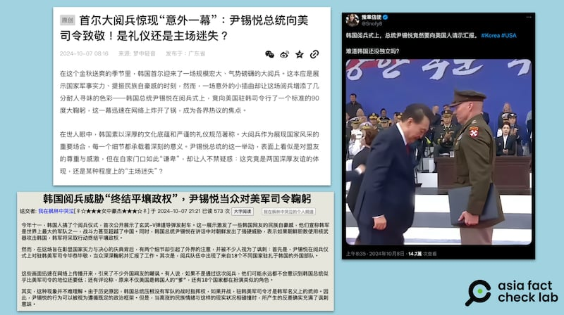

# 事實查覈｜尹錫悅在閱兵典禮上對美軍司令行禮？

作者：董喆

2024.10.10 14:27 EDT

## 查覈結果：錯誤

## 一分鐘完讀：

韓國10月1日舉行建軍日閱兵，近日中國社羣平臺流傳一張照片，稱韓國總統尹錫悅在典禮上畢恭畢敬地向美軍司令鞠躬，自貶國格。亞洲事實查覈實驗室查證，此畫面確實取自建軍日閱兵，但根據直播視頻，該畫面擷取自尹錫悅將徽章別上將領的衣領、稍微低頭向後退的瞬間，尹錫悅全程僅向該將領點頭示意，並未鞠躬，且該名軍官並非美軍駐韓司令。

## 深度分析：

韓國10月1日舉行建軍76週年閱兵活動，但場上一幕在中國社羣平臺引發討論。照片中着美軍裝者直挺站立，韓國總統尹錫悅在左側低頭彎腰，貌似向美軍鞠躬。

搜狐網有帳號以" [首爾大閱兵驚現"意外一幕":尹錫悅總統向美司令致敬!是禮儀還是主場迷失?](https://archive.ph/fYWET) "爲題,稱尹錫悅在閱兵式上向美國駐韓司令行90度大鞠躬,並以此爲基礎長篇分析此舉是爲宣示美韓合作更加緊密。

中國論壇上亦以此照片爲基礎，批評尹錫悅一邊在閱兵典禮的講話中對北韓發出強硬訊息，但一邊卻向美國“認爹”。 Ｘ（原推特）帳號則嘲諷“難道韓國還沒獨立嗎？”並將畫面解讀爲尹錫悅巡視三軍後向美軍彙報，更稱韓國網民因爲此畫面而“羣體崩潰”。

中國社媒傳韓國總統尹錫悅在閱兵活動上向美軍司令“鞠躬”。（X，搜狐截圖）

亞洲事實查覈實驗室查證發現，此張照片確實截取自閱兵活動現場畫面，但尹錫悅全程並未向美軍鞠躬，此照片僅捕捉了尹錫悅低頭向後退的瞬間，是斷章取義的錯誤資訊。

首先,根據韓國阿里郎國際放送上傳的 [片段](https://www.youtube.com/watch?v=w_VcMju1-CY&ab_channel=ArirangTV),該名將領爲美軍上校Paul Staeheli,屬於負責指揮駐韓美軍的第八軍團,目前職位爲 [參謀長](https://www.facebook.com/Eighth.Army.Korea/photos/congratulations-to-ms-sun-nam-choe-she-is-our-pacific-victor-of-the-week-she-rec/909034977919586/)(Eighth Army chief of staff),並非司令,目前 [美國第八軍團司令](https://www.usfk.mil/Media/Images/igphoto/2002519666/)爲Willard M. Burleson III中將。

尹錫悅與Paul Staeheli的完整互動過程則完整記錄於尹錫悅官方Youtube頻道：

在視頻 [26分49秒](https://www.youtube.com/live/6rtilZQ4pAY?si=l-L5yJh_FukHIlE_&t=1609)起爲尹錫悅表揚Paul Staeheli的環節,Paul Staeheli向尹錫悅敬禮,尹點頭回應並頒發獎狀,兩人握手後,尹錫悅替Paul Staeheli別上徽章,隨後低頭確認定位並退後一步,最後向Paul Staeheli點頭致意。

根據影片26分49秒至27分13秒，尹錫悅皆未向Paul Staeheli鞠躬，網傳照片僅恰巧捕捉了尹錫悅低頭向後退的瞬間，塑造尹錫悅向美軍鞠躬的錯覺，是斷章取義的錯誤訊息。

且以關鍵字在韓網搜尋，也並沒有有韓國網民轉傳此照片，也並無如社媒信息所稱的“集體崩潰”。

*亞洲事實查覈實驗室(Asia Fact Check Lab)針對當今複雜媒體環境以及新興傳播生態而成立。我們本於新聞專業主義,提供專業查覈報告及與信息環境相關的傳播觀察、深度報道,幫助讀者對公共議題獲得多元而全面的認識。讀者若對任何媒體及社交軟件傳播的信息有疑問,歡迎以電郵*  [*afcl@rfa.org*](mailto:afcl@rfa.org)  *寄給亞洲事實查覈實驗室,由我們爲您查證覈實。* *亞洲事實查覈實驗室在X、臉書、IG開張了,歡迎讀者追蹤、分享、轉發。X這邊請進:中文*  [*@asiafactcheckcn*](https://twitter.com/asiafactcheckcn)  *;英文:*  [*@AFCL\_eng*](https://twitter.com/AFCL_eng)  *、*  [*FB在這裏*](https://www.facebook.com/asiafactchecklabcn)  *、*  [*IG也別忘了*](https://www.instagram.com/asiafactchecklab/)  *。*

[Original Source](https://www.rfa.org/mandarin/shishi-hecha/hc-korean-president-saluted-to-us-rumor-10102024142727.html)