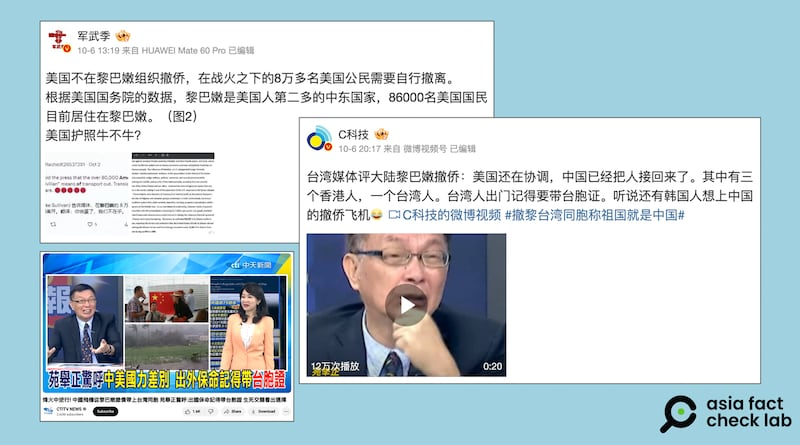

# 事實查覈｜美國政府不組織黎巴嫩僑民撤離？

作者：莊敬

2024.10.11 15:12 EDT

## 查覈結果：錯誤

## 一分鐘完讀：

近日有微博“大V”用戶發文，稱“美國不在黎巴嫩組織撤僑”“美國還在協調（黎巴嫩撤僑），中國已經把人接回來了”，但這些說法並非事實。根據美國國務院的說明和多家媒體報道，美國從10月2日起安排撤僑航班，迄今已有逾千名美國公民和家屬搭乘政府組織的航班離開黎巴嫩。

## 深度分析：

以色列與黎巴嫩軍事組織真主黨(Hezbollah)之間的衝突加劇,美國、法國等多個國家紛紛展開撤僑行動, [中國](https://www.mfa.gov.cn/web/fyrbt_673021/202410/t20241008_11503801.shtml)也已安排兩批次共215位公民撤離。亞洲事實查覈實驗室(Asia Fact Check Lab,下簡稱AFCL)注意到,中文輿論場上有網民借撤僑行動宣傳"中國國力強大",同時也有部分評論人士與社媒用戶傳播有關美國撤僑行動的不實信息。

例如,在微博上擁有三百多萬粉絲的大V博主 ["軍武季"](https://m.weibo.cn/detail/5086468135717098)10月6日發文,稱"美國不在黎巴嫩組織撤僑,在戰火之下的8萬多名美國公民需要自行撤離。"

擁有兩百多萬粉絲的微博視頻號 ["C科技"](https://m.weibo.cn/detail/5086573428741245)也在10月6日發文寫道,"臺灣媒體評大陸黎巴嫩撤僑:美國還在協調,中國已經把人接回來了。"帖文附帶的20秒短視頻是中國官媒平臺"看臺海"轉發的臺灣政治評論員苑舉正10月4日在臺灣政論節目 ["盧秀芳辣晚報"](https://www.youtube.com/watch?v=LgBls7nf5n8)中的發言。苑舉正說:"目前聽到撤僑的有英國、有美國,拖拖拉拉,美國到現在還在協調,還在簽約,大陸人都已經回到家了。"

中文社媒用戶近日發文，稱美國不在黎巴嫩組織撤僑、美國還在協調。圖取自微博、YouTube

事實上,在上述社媒用戶發帖之前,美國已採取撤僑行動。根據美國國務院發言人米勒(Matthew Miller)在 [10月2日](https://www.state.gov/briefings/department-press-briefing-october-2-2024/)、 [10月3日](https://www.state.gov/?post_type=state_briefing&%3Bp=92333)例行記者會上的說明,以及 [路透社](https://www.reuters.com/world/middle-east/us-organized-flight-out-beirut-americans-seek-leave-lebanon-says-state-dept-2024-10-02/)等多家媒體的報道,美國已於10月2日陸續安排撤僑航班。

根據路透社10月10日的 [報道](https://www.reuters.com/world/us/us-moved-1000-citizens-out-war-hit-lebanon-via-turkey-2024-10-10/),美國駐伊斯坦堡總領事茱莉·艾德(Julie Eadeh)受訪表示,已有1000多名美國公民和家屬搭乘美國組織的航班離開黎巴嫩,抵達土耳其暫時停留。據美國與土耳其之間的協議,搭乘撤僑航班抵達土耳其的美國公民與家屬,須在抵達土國的72小時之內離開該國。

報道指出，除了飛往伊斯坦堡的航班，最近還有兩班美國撤僑專機從貝魯特飛往法蘭克福和多哈，美國政府將繼續爲仍在黎巴嫩的數千名美國公民提供這類專機服務。

黎巴嫩真主黨成員在9月17日、18日連續遭遇電子設備爆炸,造成多人死傷,此後真主黨與以色列多次交火,衝突升級。美國國務院於9月21日更新對黎巴嫩的 [旅遊警示](https://lb.usembassy.gov/security-alert-u-s-embassy-beirut-lebanon-september-21-2024/),敦促美國公民在仍有商業航班選擇時離開該國。

9月28日,美國國務院 [下令](https://travel.state.gov/content/travel/en/traveladvisories/traveladvisories/lebanon-travel-advisory.html)駐貝魯特大使館人員家屬及部分員工離開黎巴嫩,並再度敦促所有美國公民,把握目前仍可通過商業航班離開當地的機會。大規模撤離居住海外的美國公民並非政府的標準程序,這些在 [美國國務院領事事務局網站](https://travel.state.gov/content/travel/en/international-travel/emergencies/what-state-dept-can-cant-do-crisis.html)都有說明。

AFCL觀察到,從2023年蘇丹撤僑事件,到今年黎巴嫩撤僑行動,都有人 [抱怨](https://www.aljazeera.com/news/2024/10/3/as-if-we-dont-exist-under-bombs-in-lebanon-americans-feel-abandoned)美國政府撤僑的反應與速度,而這些抱怨聲音很快傳到中文輿論場上,成爲"中美國力差別"的證據,AFCL亦曾針對蘇丹撤僑事件發佈 [查覈報告](https://www.rfa.org/cantonese/news/factcheck/us-05042023145447.html)。

*亞洲事實查覈實驗室(Asia Fact Check Lab)針對當今複雜媒體環境以及新興傳播生態而成立。我們本於新聞專業主義,提供專業查覈報告及與信息環境相關的傳播觀察、深度報道,幫助讀者對公共議題獲得多元而全面的認識。讀者若對任何媒體及社交軟件傳播的信息有疑問,歡迎以電郵*  [*afcl@rfa.org*](mailto:afcl@rfa.org)  *寄給亞洲事實查覈實驗室,由我們爲您查證覈實。* *亞洲事實查覈實驗室在X、臉書、IG開張了,歡迎讀者追蹤、分享、轉發。X這邊請進:中文*  [*@asiafactcheckcn*](https://twitter.com/asiafactcheckcn)  *;英文:*  [*@AFCL\_eng*](https://twitter.com/AFCL_eng)  *、*  [*FB在這裏*](https://www.facebook.com/asiafactchecklabcn)  *、*  [*IG也別忘了*](https://www.instagram.com/asiafactchecklab/)  *。*

[Original Source](https://www.rfa.org/mandarin/shishi-hecha/hc-us-evacuation-effort-in-lebanon-10112024151208.html)