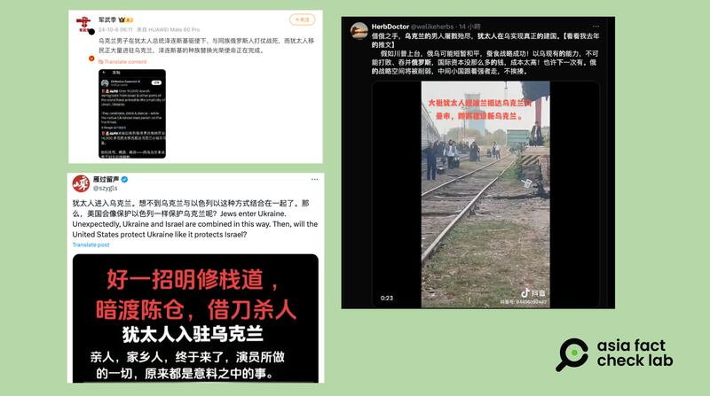
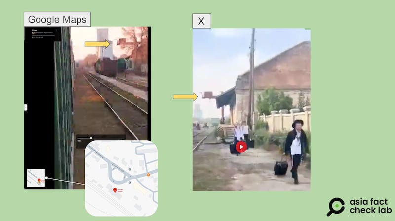

# 事實查覈｜大批猶太人湧進烏克蘭要"建新國家"？

作者：董喆

2024.10.14 14:35 EDT

## 查覈結果：錯誤

## 一分鐘完讀：

近期社羣平臺上簡體中文帳號廣傳，目前有大量猶太人湧入烏克蘭，目的是爲了建設新烏克蘭，並附上猶太人羣在烏克蘭一處火車站活動的視頻與截圖。

亞洲事實查覈實驗室查證，今（2024）年10月2日至4日爲猶太教新年，猶太教哈西迪教派根據習俗會前往烏克蘭烏曼鎮朝聖，因此近期大量猶太人進入烏克蘭是一項傳統宗教活動，並非流言所稱爲了“建設新烏克蘭”。

## 深度分析：

“烏克蘭的男人屠戰殆盡，猶太人在烏實現真正的建國。”10月初有大量簡體中文帳號在Ｘ（原推特）上傳播大批猶太人經由波蘭進入烏克蘭烏曼市(Умань)的消息，部分視頻畫面中大量身穿猶太教服裝的男性帶着行李，沿着鐵道步行。

微博、X等社交媒體流傳視頻，稱有大批猶太人湧入烏克蘭，打算"建國"。（微博、X、抖音截圖）

網傳消息稱這些猶太人要建設新烏克蘭,並稱是猶太人在俄烏戰場上把斯拉夫人消耗完畢,爲自己騰出空間建國 ( [1](https://archive.ph/IDtej), [2](https://archive.ph/ORFPn), [3](https://archive.ph/echan))。中國社交媒體微博平臺上,粉絲近五百萬的軍事大V"軍武季" [更稱](https://archive.ph/HAOdC)烏克蘭總統澤連斯基正完成其種族替換的使命。

網傳視頻右下角浮水印信息顯示,原始發佈者爲一名叫"大貓"的抖音視頻主,但本文撰寫之時,他已經將此視頻在其帳號下架,但該視頻依然通過轉發在傳播,並進一步被截去簡中字幕,在英文世界轉傳,由X帳號"SilencedSirs"轉傳的 [貼文](https://archive.ph/WuNrG)已經突破百萬次瀏覽。

亞洲事實查覈實驗室（以下簡稱AFCL）查證發現，今（2024）年10月2日至4日爲猶太新年，哈西迪教派根據習俗會前往烏克蘭烏曼市朝聖，根據Google Map比對網傳視頻的畫面，地點應爲烏曼市火車站，與朝聖地點一致，不過並沒有近一步線索可鑑定影片發生的確切時間，不過以Google以圖反搜，所得出結果的發佈時間皆在今年，且都被用作同樣的敘事。

網傳圖片與Google Map實景圖對比，可知網傳視頻拍攝所在地爲烏克蘭烏曼市，猶太教哈西迪教派朝聖地。（谷歌地圖、網傳視頻截圖）

根據耶路撒冷全球華人敬拜中心 [出版刊物](https://canwf-jerusalem.org/content/uploads/2023/08/CAN305%E6%9C%9F.pdf)以及猶太資訊網站"My Jewish Learning"的 [專文](https://www.myjewishlearning.com/article/why-do-some-jews-visit-uman-for-rosh-hashanah/),哈西迪猶太教徒在每年的朝聖期間,會聚集在哈西迪教派創始人納赫曼(Nachman of Breslov)的墳墓所在地。

另外，影像中僅出現猶太教男性，也引發各傳傳聞。創建臺灣第一座猶太社區中心的薛智偉坣娜猶臺文化交流協會（Jeffrey D. Schwartz and NaTang Jewish Taiwan Cultural Association，JTCA）告訴AFCL，女性朝聖者鮮少，反映了猶太人的家庭觀念。因爲朝聖活動路程辛苦、風險高，大多哈西迪教派的猶太家庭會有6至7個甚至更多的孩子，所以多數時間父母不會同時旅行，以防其中一方不幸遭遇意外，因此多數由丈夫作爲家庭代表前往。

自從俄烏戰爭爆發,烏克蘭政府每年皆勸誡 [猶太教徒暫緩朝聖](https://www.rti.org.tw/news/view/id/2145552),但根據《 [以色列時報](https://www.timesofisrael.com/35000-jewish-pilgrims-come-to-ukraine-for-rosh-hashana-despite-official-warnings/)》報導,今年仍湧入超過3萬5千人。

綜合上述資訊，前述網傳訊息使用了猶太教哈西迪教派到烏克蘭烏曼市朝聖的視頻、照片，錯誤解讀爲猶太人湧入烏克蘭建國，是移花接木的錯誤訊息。

*亞洲事實查覈實驗室(Asia Fact Check Lab)針對當今複雜媒體環境以及新興傳播生態而成立。我們本於新聞專業主義,提供專業查覈報告及與信息環境相關的傳播觀察、深度報道,幫助讀者對公共議題獲得多元而全面的認識。讀者若對任何媒體及社交軟件傳播的信息有疑問,歡迎以電郵*  [*afcl@rfa.org*](mailto:afcl@rfa.org)  *寄給亞洲事實查覈實驗室,由我們爲您查證覈實。* *亞洲事實查覈實驗室在X、臉書、IG開張了,歡迎讀者追蹤、分享、轉發。X這邊請進:中文*  [*@asiafactcheckcn*](https://twitter.com/asiafactcheckcn)  *;英文:*  [*@AFCL\_eng*](https://twitter.com/AFCL_eng)  *、*  [*FB在這裏*](https://www.facebook.com/asiafactchecklabcn)  *、*  [*IG也別忘了*](https://www.instagram.com/asiafactchecklab/)  *。*

[Original Source](https://www.rfa.org/mandarin/shishi-hecha/hc-jews-go-to-ukraine-to-build-new-nation-fact-check-10142024143101.html)