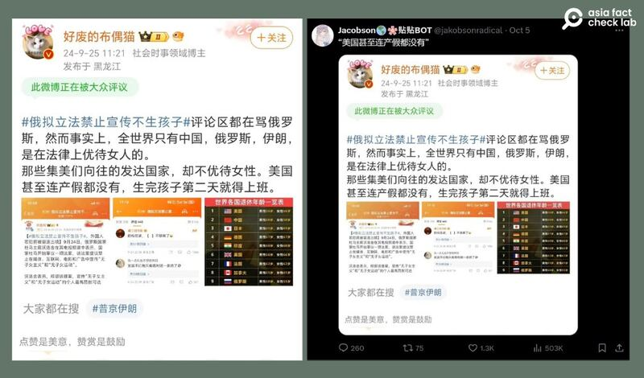

# 事實查覈｜美國沒有產假？全世界"只有中、俄和伊朗優待女性"？

作者：艾倫

2024.10.14 14:29 EDT

## 查覈結果：錯誤

## 一分鐘完讀：

近日，俄羅斯擬立法禁止宣傳“女性不生育的生活方式”引發媒體熱議。9月底，有微博“大V”發文稱，全世界只有中國、俄羅斯和伊朗是在法律上優待女人的，而美國則“連產假都沒有”。

亞洲事實查覈實驗室查覈後發現，美國的法定產假雖然沒有中國長，但並非完全沒有，美國聯邦和各州有不同的立法保障女性的生育權益。此外，世界上還有許多國家立法對女性提供生育保障，並非“只有”這三個國家。

## 深度分析：

9月25日,新浪微博上出現話題標籤"#俄擬立法禁止宣傳不生孩子",博主"好廢的布偶貓" [發文](https://archive.ph/MVPPn)稱,全世界只有"中國、俄羅斯、伊朗"在法律上優待女性,而"美國甚至連產假都沒有"。截至發稿時,該帖文已獲超過三千點贊數和超過五百則評論。

該文的截圖也在十月初在X上被 [轉發](https://x.com/jakobsonradical/status/1842362769682866187),並在兩天內獲得超過五十萬閱讀量。

近期中文社媒上出現的評論俄羅斯、中國、伊朗和美國生育保障制度的貼文（微博、X截圖）

## 美國沒有產假嗎？

[美國勞工部的官方網站](https://www.dol.gov/general/topic/benefits-leave/fmla)引用《家庭與醫療假法》(FMLA)對僱員休產假的依據進行了解釋,該法律爲符合條件的特定員工提供每年最高12周的無薪、工作受保障的休假。

根據該解釋，FMLA適用於所有公共機構、所有公私立小學和中學，以及擁有50名或以上員工的公司，這些僱主必須爲符合資格的特定員工提供每年最多12周，且工作受到法律保障的無薪休假。這類員工不僅包括需要照顧新生兒的父母，也包括需要照顧重病親人或者因爲軍事原因需要休假的人（對於照顧在軍事服務中受傷或者病重的家庭成員，FMLA提供了更長的，每年至多26周的工作受保障的無薪休假）。

雖然美國聯邦法律規定的產假"沒有支薪",但其實各州仍有不同的產假規範,例如全美洲議會聯合會(NCSL)就曾發佈報告指出,目前已經有 12個州和首都華盛頓特區都已經通過立法,規定了不同類型的 [有薪產假](https://www.ncsl.org/labor-and-employment/state-family-and-medical-leave-laws),大多數州的項目通過員工支付的工資稅資助,有些還部分由僱主支付的工資稅資助。紐約州的項目有所不同,它要求僱主從私人保險公司購買帶薪假期保險。

因此，“美國完全沒有產假”的說法是錯誤的。

## 產假長等於"優待女性"嗎？

如果就以法定產假時長來算,根據世界銀行的 [數據](https://wbl.worldbank.org/en/data/exploretopics/wbl_hc.com/country-rankings/maternity-leave-by-country),中、俄、伊三個國家都爲剛生完小孩的女性提供了最少14周的有薪產假,且14周爲"最低標準",每個國家的不同地區也可能頒佈自己的規定。以中國爲例,2012年頒佈的 [《女職工勞動保護特別規定》](https://www.gov.cn/zwgk/2012-05/07/content_2131567.htm)爲女性勞工提供了最低98天的產假,但 [江蘇省](https://www.wuxi.gov.cn/jczwpt/doc/2022/12/26/3854746.shtml)在這個基準上延長了60天,最終產假可達158天。

因此比起美國聯邦法律規定的產假期限，中、俄、伊朗的法定產假時間確實更長。然而，產假的長度是否能直接解釋爲“優待女性”，則有待商榷。

儘管中國規定用人單位不得在女性孕產期和哺乳期降低其基本工資或者解除勞動合同,但在實際操作中,不少單位爲了控制成本不願意招錄女性。中國官方媒體《法治日報》也曾探討如何解決 [女性面臨的就業歧視](https://app.xinhuanet.com/news/article.html?articleId=6d6be52c134d503d449987022a189901)。此外,中國執行嚴格計劃生育政策長達30年,產假也與計劃生育的政策相綁定,超計劃生育、婚外生育的女性,並不能享受產假。

在伊朗,婦女可以享受多達6個月的產假,但伊朗女性正常生活工作、學習等基本權益並不受保障,很難談的上被"優待"。2022年,因爲伊朗女子瑪莎·阿米尼因未恰當佩戴頭巾被警察拘留、隨後死亡的事件,以及一系列侵害女性權益的事件,伊朗在聯合國婦女地位委員會的 [成員資格被撤銷](https://news.un.org/zh/story/2022/12/1113402)。

如果僅以產假的長度來說，也有一些國家的產假比這三國的規定更長。

例如, [保加利亞](https://ec.europa.eu/social/main.jsp?catId=1103&langId=en&intPageId=5037)的法定產假長達410天; [瑞典](https://sweden.se/work-business/working-in-sweden/work-life-balance)則爲父母雙方提供合計480天的全薪水給付產假(父母雙方各自享有240天); [挪威](https://www.norden.org/en/info-norden/parental-benefit-and-parental-leave-norway#:~:text=In%20addition%20to%20the%20first,also%20be%20entitled%20to%20leave.)則提供至少一年的全額給付產假及育嬰假,且父母有需求可續申請第二年產假。這些國家在生育保障方面都享有盛譽。

因此，全世界只有中、俄、伊朗三個國家“在法律上優待女人”的說法，也沒有根據。

*亞洲事實查覈實驗室（Asia Fact Check Lab）針對當今複雜媒體環境以及新興傳播生態而成立。我們本於新聞專業主義，提供專業查覈報告及與信息環境相關的傳播觀察、深度報道，幫助讀者對公共議題獲得多元而全面的認識。讀者若對任何媒體及社交軟件傳播的信息有疑問，歡迎以電郵afcl@rfa.org寄給亞洲事實查覈實驗室，由我們爲您查證覈實。*

*亞洲事實查覈實驗室在X、臉書、IG開張了,歡迎讀者追蹤、分享、轉發。X這邊請進:中文*  [*@asiafactcheckcn*](https://twitter.com/asiafactcheckcn)  *;英文:*  [*@AFCL\_eng*](https://twitter.com/AFCL_eng)  *、*  [*FB在這裏*](https://www.facebook.com/asiafactchecklabcn)  *、*  [*IG也別忘了*](https://www.instagram.com/asiafactchecklab/)  *。*

[Original Source](https://www.rfa.org/mandarin/shishi-hecha/hc-us-does-not-provide-maternity-leave-fact-check-10142024142356.html)