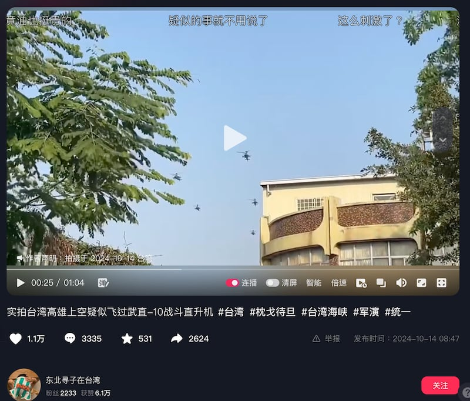
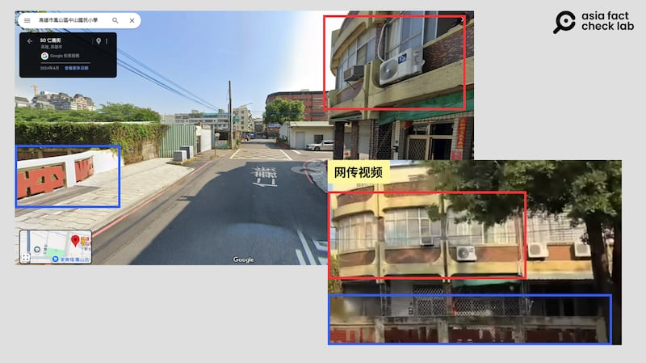
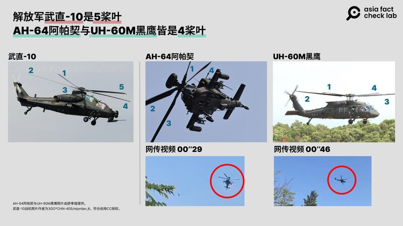
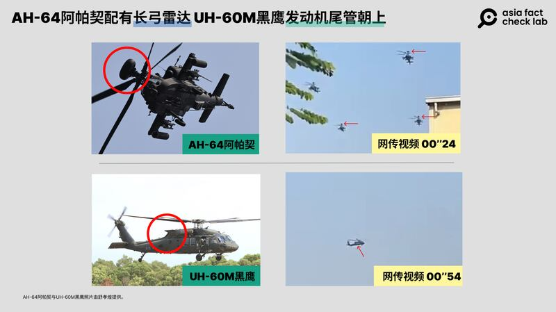
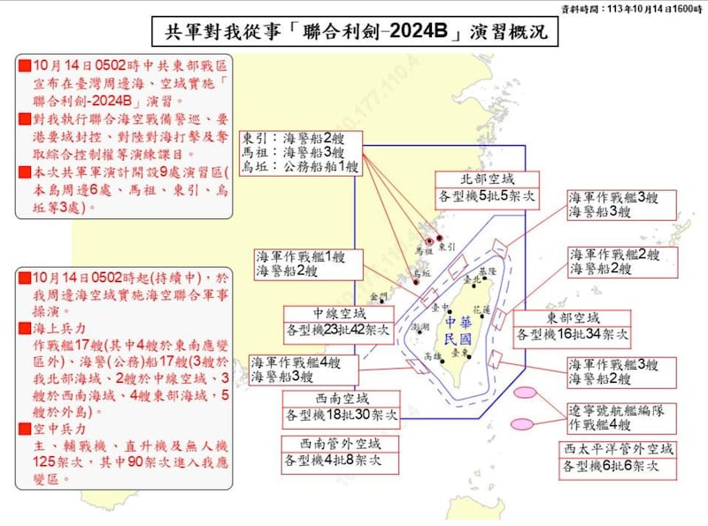

# 事實查覈｜圍臺軍演日，解放軍直升機穿越臺灣？

作者：董喆

2024.10.15 16:40 EDT

## 查覈結果：錯誤

## 一分鐘完讀：

解放軍10月14日圍臺軍演引發廣泛關注，抖音上流傳的視頻消息稱解放軍的“武直-10”（WZ-10）直升機在軍演期間飛越臺灣高雄上空。亞洲事實查覈實驗室訪問軍事專家，比對影片中的戰機，發現其應爲AH-64阿帕契以及UH-60M黑鷹直升機而並非解放軍的“武直-10”。臺灣陸軍航空特戰指揮部也回應稱，影片中的AH-64E、UH-60M直升機是臺灣執行例行訓練的機隊，且該影片與解放軍的這次軍演無關。

## 深度分析：

中國14日展開"聯合利劍-2024B"圍臺軍演,中國社羣平臺抖音賬號"東北尋子在臺灣"發佈一則戰機飛越天空的 [視頻](https://www.douyin.com/video/7425426498741456147),稱是軍演期間捕捉的畫面,並且在留言中表示視頻中"疑似飛過武直-10戰鬥直升機",正在飛越臺灣高雄上空,有網友留言表示羨慕,稱"還沒見過武直-10長啥樣"。

網傳視頻稱"實拍臺灣高雄上空疑似飛過武直-10戰鬥直升機"（抖音截圖）

亞洲事實查覈實驗室（以下簡稱AFCL）首先發現視頻中出現“中山”字樣圍牆，以及兒童遊具，判斷拍攝地點應是在國小或是幼兒園校園，因此“中山、國小”關鍵詞在高雄區域地圖上搜索，發現鼓山區與鳳山區各有一座中山國小。以周邊街景以及圍牆樣式，確定視頻中出現的是高雄鳳山區中山國小，以周邊建築比對Google街景發現，視頻拍攝方位是在靠近仁義街的校區，確定該影片拍攝地點確實在臺灣高雄。

網傳視頻與高雄谷歌街景比對（谷歌截圖）

但視頻中的戰機有可能是解放軍的“武直-10”嗎？

國防安全研究院中共政軍與作戰概念研究所副研究員舒孝煌協助亞洲事實查覈實驗室檢視視頻內容，他解釋影片中的戰機分別是“AH-64”阿帕契直升機以及“UH-60M”黑鷹直升機，並不是“武直-10”直升機。

舒孝煌解釋，解放軍的“武直-10”是5槳葉，但“AH-64”阿帕契與“UH-60M”黑鷹皆是4槳葉。

"武直-10"與"AH-64"阿帕契及"UH-60M"黑鷹對比（AFCL製圖）

另外， “AH-64”阿帕契發動機艙外露亦是明顯的辨識特徵，且視頻24秒起的3架“AH-64”阿帕契皆配有長弓雷達頂在旋翼前端，而“武直-10”並沒有此配備。視頻46秒起，可以見到機體發動機尾管朝上，這則是“UH-60M”黑鷹的明顯特徵。

網傳視頻中的直升機與"AH-64"阿帕契及"UH-60M"黑鷹細節對比（AFCL製圖）

根據臺灣國防部14日公佈的監測結果，“聯合利劍-2024B”的空中兵力共有主、輔戰機、直升機及無人機125架次，其中90架次進入臺灣應變區，不過皆未飛越臺灣上空。

臺灣國防部公佈解放軍"聯合利劍-2024B"演習概況（圖源：臺灣國防部）

臺灣陸軍航空特戰指揮部發言人王信爲少將告訴AFCL，影片中的機隊爲AH-64E、UH-60M直升機，當天是在執行例行訓練，並非網傳的解放軍直升機。

至於影片拍攝的時間，儘管“東北尋子在臺灣”強調是10月14日軍演當天拍攝；但王信爲說，這部影片並非近期所拍攝，與中共軍演無關。

中共對臺軍演時,社羣媒體上經常流傳號稱"實時畫面"的錯假資訊,AFCL在2023年解放軍東部戰區舉行環島軍演時,就曾發現中方官媒挪用臺灣觀光景點的YouTube即時影像作爲"軍演實況"播出。( [事實查覈|中國官媒實況轉播環臺軍演圍島進逼](https://www.rfa.org/cantonese/news/factcheck/tw-08222023075327.html?encoding=simplified)?),有關軍演的錯假資訊,容易引發民衆對戰爭的恐慌,AFCL亦曾撰寫專文分析軍演假資訊的現象。( [事實查覈|深度|中國對臺軍演 不實消息滿天飛](https://www.rfa.org/cantonese/news/factcheck/tw-04142023173232.html?encoding=simplified))。

*亞洲事實查覈實驗室(Asia Fact Check Lab)針對當今複雜媒體環境以及新興傳播生態而成立。我們本於新聞專業主義,提供專業查覈報告及與信息環境相關的傳播觀察、深度報道,幫助讀者對公共議題獲得多元而全面的認識。讀者若對任何媒體及社交軟件傳播的信息有疑問,歡迎以電郵*  [*afcl@rfa.org*](mailto:afcl@rfa.org)  *寄給亞洲事實查覈實驗室,由我們爲您查證覈實。* *亞洲事實查覈實驗室在X、臉書、IG開張了,歡迎讀者追蹤、分享、轉發。X這邊請進:中文*  [*@asiafactcheckcn*](https://twitter.com/asiafactcheckcn)  *;英文:*  [*@AFCL\_eng*](https://twitter.com/AFCL_eng)  *、*  [*FB在這裏*](https://www.facebook.com/asiafactchecklabcn)  *、*  [*IG也別忘了*](https://www.instagram.com/asiafactchecklab/)  *。*

[Original Source](https://www.rfa.org/mandarin/shishi-hecha/hc-pla-helicoptes-cross-taiwan-during-drills-fact-check-10152024162607.html)