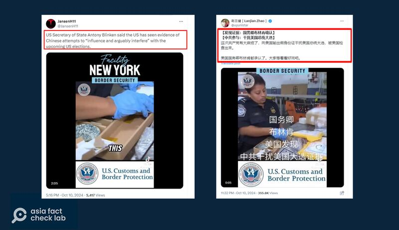
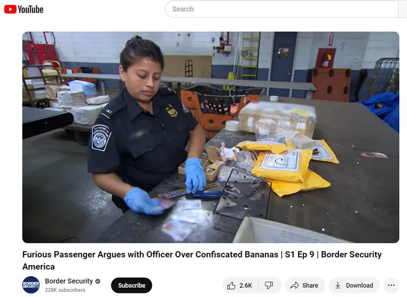

# 事實查覈｜布林肯稱中國製造假證件干擾美國選舉？

作者：鄭崇生

2024.10.16 15:07 EDT

## 查覈結果：錯誤

## 一分鐘完讀：

“美國國務卿布林肯確認，中共輸出假身份證、干擾美國總統大選。”

近日,類似的謠言在社交平臺上流傳。例如前中國媒體記者趙蘭健在X平臺上 [發文](https://archive.ph/N55sX),並附上一段美國海關查獲假身份證的英文短視頻。稱這就是布林肯指控的證據。

然而，亞洲事實查覈實驗室（AFCL）查覈顯示，雖然布林肯今年4月受訪時的確曾表示關切中國試圖干預美國選舉。但沒有任何報道顯示他曾經提到假身份證。而社交媒體上流傳的海關查獲身份證的影片，是2016年播出的一部紀錄片片段，與選舉也並無關係。

## 深度分析：

趙蘭健10日推文提到，“布林肯表示，美國已看到中國試圖'影響並可能干涉'美國即將到來的大選的證據”，推文並附上“JansenH11”取自TikTok其他帳號、約2分20秒長的視頻片段，影片上有美國海關與邊境保護局（CBP）的標誌，並標註這是來自美國紐約肯尼迪（JFK）機場的國際郵件中心，CBP工作人員從來自中國的包裹中發現僞造的美國駕照。

## 布林肯受訪怎麼說？

趙蘭健的貼文已獲得幾十萬次觀看，AFCL以圖反搜發現，同樣來自X上的一個名爲“JansenH11”的英文帳號也發出了類似內容的英文內容與影片。

中、英X賬號傳播布林肯稱中國"用假身份證干擾總統大選"的錯誤說法（X截圖）

布林肯是否做出過這些表態? AFCL查覈發現,布林肯今年4月訪問中國、在北京接受 [美國有線電視新聞網(CNN)專訪](https://amp.cnn.com/cnn/2024/04/26/politics/blinken-china-interview-intl-hnk)時的確提到對中國敢於選舉的擔心,但並未提及"假身份證"。

根據CNN，記者當時提問布林肯：2023年底，中國國家主席習近平和美國總統拜登會面時雖然重申，中國不會干預美國選舉，但一些報道指出，網絡上許多和中國有關聯的帳號，錯誤附和一些川普支持者的發文，你覺得這算是習近平違反了自己的承諾嗎？

布林肯答：我和習主席見面的時候，重申了拜登總統去年拜習會時的立場，也就是中國任何企圖介入美國選舉的舉措，我們都是非常仔細審視的，這是完全不可接受的。他接着說，“我無法談論你所說的那些具體個案情況，但總的來說，我們已經看到了試圖影響、甚至干預的證據，我們希望確保（中國）儘快停止這種行爲。”

此外，也沒有其它可信公開報道顯示，布林肯曾經表示中國試圖以“僞造身份證件”的方式干預美國選舉。

## 被稱作"證據"的視頻是哪裏來的？

經查覈,上述兩則中、英文貼文中傳播的視頻,是來自TikTok上名爲"AU Border Security"的帳號,至發稿前,這一帳號已將影片 [移除](https://archive.ph/bhPQn)。 AFCL進一步搜索比對發現,在YouTube上一個名叫"邊境安全"(Border Security)的帳號上傳了《邊境安全:美國前線》(Border Security: America's Front Line)的 [紀錄片視頻](https://youtu.be/jarh0LMA3D4?si=t6YBOx3nsUZkQDSC),經比對就是"JansenH11"與趙蘭健刊出的原始來源,"JansenH11"將影片02"05與09"05處開始的重複內容剪輯在一起,而趙蘭健則是隻截取執法人員發現來自中國製造的仿冒證件片段。

在原始影片中，邊檢工作人員指出，這些僞造駕照多半會流入美國大學生手中，有時候也可能成爲恐怖分子或身份盜用者用來從事違法行爲，但整個影片中都沒有提到選舉投票舞弊。

網傳視頻中邊檢查獲假冒證件的圖像來自於8年前的紀錄片，與此次選舉並無關係。（Youtube截圖）

根據 [網絡影視資料庫(IMDb)上的數據](https://www.imdb.com/title/tt9740998/episodes/?season=1),該紀錄片於2016年6月5日播出,已經有8年之久。

## 無證據顯示假證件可影響選情

這並不是第一次出現“中國製造假證件干擾選情”的假信息。

早在2020年美國總統大選前,美國海關與邊境保護局(CBP)發佈新聞稿( [1](https://www.cbp.gov/newsroom/local-media-release/over-19k-fraudulent-ids-seized-cbp-officers-chicago)、 [2](https://www.cbp.gov/newsroom/local-media-release/cbp-intercepts-counterfeit-driver-s-licenses))公示有關查獲中國製假證件的情況, [相關報道](https://nypost.com/2019/11/28/cbp-seizes-thousands-of-fake-ids-headed-from-china-to-new-york/?utm_campaign=SocialFlow&utm_medium=SocialFlow&utm_source=NYPTwitter)曾引起所謂"仿冒證件持有者可以註冊爲選民,參與投票,造成選舉舞弊"的陰謀論流傳,美國事實查覈機構當時發佈過 [查覈報告](https://www.factcheck.org/2020/09/baseless-claim-turns-fake-ids-story-into-voter-fraud-tale/)明確指出,沒有證據顯示拿假駕照可以登記註冊爲合格選民,並參與投票。

到了選舉熱季，僞造證件究是否對公正選舉造成影響，總會成爲美國社會關注議題，但目前並無可新證據顯示有假證件干預選舉的問題發生。

不同於中國或臺灣的身份證件系統，多數美國人以駕照爲“附有照片的身份證件”（photo ID），沒有駕照的人則根據所居住州不同的要求條件另外辦理有照片身份證。

在選舉人登記與審查上, [美國各州自有程序](https://vote.gov/register),多數情況下,民衆需提前主動向各州選民辦公室、機動車管理局(DMV)或其它提供選民登記服務的機構註冊、郵寄相關資料或在各州選舉辦公室官網上登記爲選舉人,才能投票,但不論通過何種途徑註冊登記,各州都有審覈確認身份過程,包括覈對駕照號碼與社會安全碼是否相符、查覈是否因犯罪紀錄遭褫奪投票權等,要求註冊登記的時間也不一。

但 [例如加州](https://www.sos.ca.gov/elections/voter-registration/same-day-reg),民衆就算沒能在註冊截止日期前登記,也可於投票日當天辦理"有條件式選民註冊並投票",而這會先登記爲臨時選票,待選務人員覈實身份無誤後,纔會計入選票統計。

美國的投票方式也非常多種,在完成註冊登記並通過各州審覈後,美國合格選民可於所在州選擇缺席投票(通常以郵寄選票或網絡遠端存取方式投票),或是投票日當天親自到投票所投票。另外,根據 [全美州立法機構委員會(National Conference of State Legislatures)](https://www.ncsl.org/elections-and-campaigns/early-in-person-voting),美國有47個州、華盛頓特區及海外屬地設有可親自(in person)提早投票(Early Voting)制度,合格選民最早可提前投票的時間點,各州也不同。

至於選舉日當天親自投票,各州對是否再次覈對證件也有不同做法。全美州立法機構委員會的 [統計顯示](https://www.ncsl.org/elections-and-campaigns/voter-id#table1),美國有36個州要求選民投票須出示有照片或無照片的身份證明文件,16個州與華盛頓特區則不要求出示身份證件。

*亞洲事實查覈實驗室(Asia Fact Check Lab)針對當今複雜媒體環境以及新興傳播生態而成立。我們本於新聞專業主義,提供專業查覈報告及與信息環境相關的傳播觀察、深度報道,幫助讀者對公共議題獲得多元而全面的認識。讀者若對任何媒體及社交軟件傳播的信息有疑問,歡迎以電郵*  [*afcl@rfa.org*](mailto:afcl@rfa.org)  *寄給亞洲事實查覈實驗室,由我們爲您查證覈實。* *亞洲事實查覈實驗室在X、臉書、IG開張了,歡迎讀者追蹤、分享、轉發。X這邊請進:中文*  [*@asiafactcheckcn*](https://twitter.com/asiafactcheckcn)  *;英文:*  [*@AFCL\_eng*](https://twitter.com/AFCL_eng)  *、*  [*FB在這裏*](https://www.facebook.com/asiafactchecklabcn)  *、*  [*IG也別忘了*](https://www.instagram.com/asiafactchecklab/)  *。*

[Original Source](https://www.rfa.org/mandarin/shishi-hecha/hc-blinken-says-china-uses-fake-personal-id-to-interfere-us-elections-fact-check-10162024150129.html)