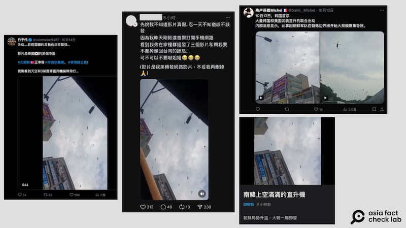
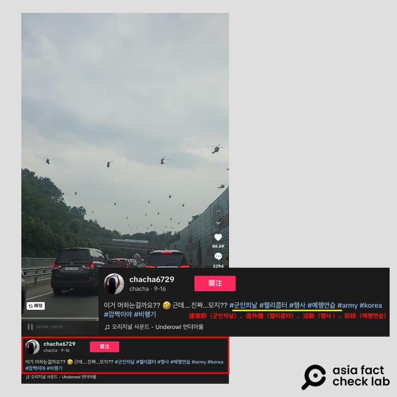
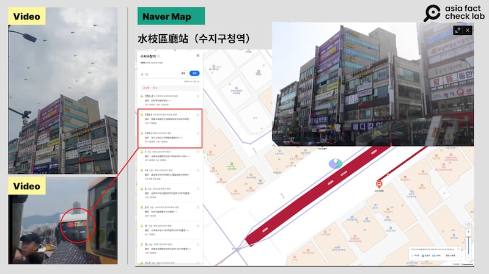
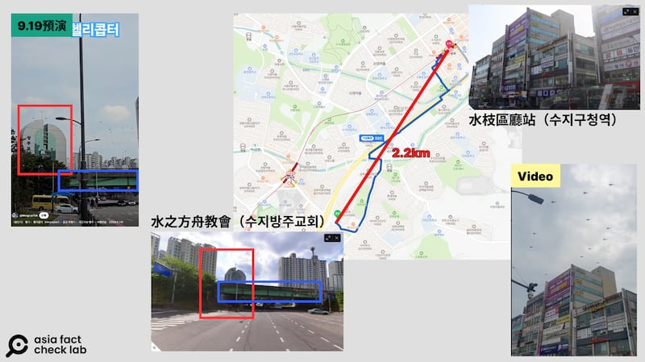
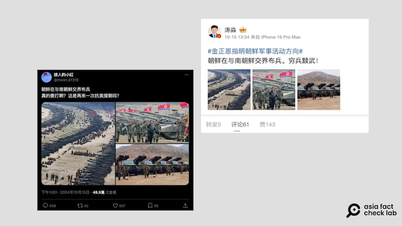
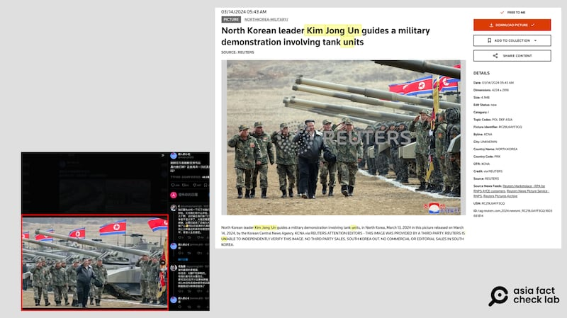
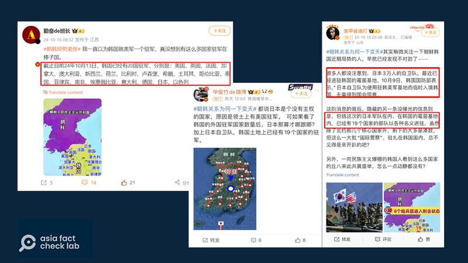
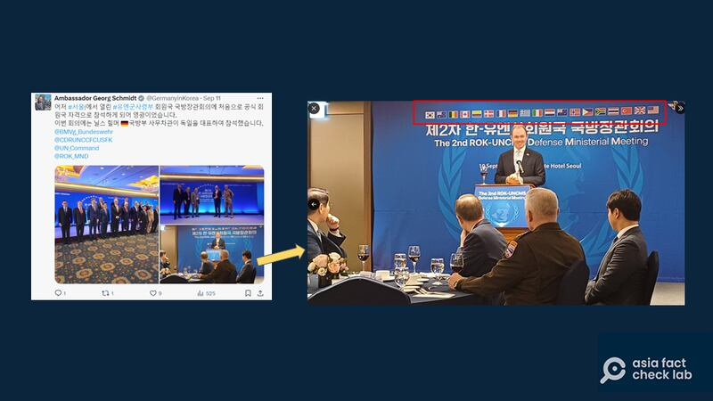

# 事實快查｜朝鮮半島局勢升溫，錯假消息大行其道

作者：董喆、鄭崇生、莊敬

2024.10.17 18:51 EDT

近日，朝鮮半島關係緊張，14日，朝鮮稱爲了應對韓國“無人機入侵平壤”，指示邊境炮兵做好射擊準備；15日，朝鮮再將連結韓國的部分鐵公路炸燬，致半島局勢升溫，雙方都傳出政府在調動部隊的消息。同時，有不少錯假信息在網上流傳，亞洲事實查覈實驗室(Asia Fact Check Lab)針對下列幾則廣傳的信息做了查覈：

## 一、網傳影片顯示“大量韓國武裝直升機飛往韓朝邊境”？

## 查覈結果：錯誤／證據不足

中文社羣平臺 [X](https://archive.ph/4ibR8)、Threads、Dcard上出現兩則視頻,稱韓國派出大批直升機編隊集結到韓朝邊界,甚至有評論懷疑視頻是戰爭已經打響的證據。

社媒平臺上多個賬戶發佈視頻稱韓國大批直升機集結到韓朝邊界 圖截取自X、Threads、Dcard

但這是錯誤資訊，兩則視頻均在這次事件之前已經出現於互聯網，更可能來自於今年韓國慶祝建軍76週年慶典時，直升機在空中進行分列式預演的畫面。

第一則視頻畫面中,形似高速公路的道路上方有多架次的直升機飛越。亞洲事實查覈實驗室以圖反搜,發現最早上傳這則短視頻的是TikTok賬號"chacha6729", [視頻上傳時間](https://www.tiktok.com/@chacha6729/video/7415212839914179848)爲2024年9月16日,早於此次兩韓衝突整整一個月,該賬號爲此視頻下了標籤"建軍節(군인의날)、直升機(헬리콥터)、活動(행사 )、彩排(예행연습)"等字眼。

一個月前出現於網絡上的相同視頻 圖截取自TikTok

不過,我們無法證實該視頻的確切拍攝日期,但根據韓國《中央日報》報道,至少在 [8月14日](https://koreajoongangdaily.joins.com/news/2024-09-19/national/socialAffairs/Seoul-to-reroute-traffic-for-Armed-Forces-Day-parade-on-Oct-1/2137375?detailWord=)與 [9月24日](https://koreajoongangdaily.joins.com/news/2024-09-24/national/defense/Military-helicopters-assemble-for-flight-rehearsal-ahead-of-Armed-Forces-Day/2140897)都有舉行直升機編隊的彩排,且自8月起至10月1日建軍節,首爾市政府多次向居民的手機發送空中表演排練噪音的安全警報。

第二則視頻，AFCL以韓國地圖工具Naver檢索，根據視頻中出現的建物招牌以及公車路線，確定拍攝地點爲京畿道龍仁市水枝區一帶，拍攝者應位在水枝區廳站（수지구청역）。

視頻中的場景與京畿道龍仁市水枝區一帶街景相符 圖截取自Naver

進一步以建軍節(군인의날)、龍仁市(용인시)、彩排(예행연습)等關鍵字在YouTube搜尋,可以找到一則9月19日拍攝的 [視頻](https://www.youtube.com/shorts/3yYQs7nzULw),大批直升機飛越的地點同樣在龍仁市水枝區,根據地面景觀判斷拍攝者位於水之方舟教會(수지방주교회)周圍,此地與網傳影片水枝區廳站僅相距2.2公里,有可能是在不同地點拍攝的同一場飛行活動的畫面。

兩則視頻的拍攝位置接近 製圖/AFCL

根據上述線索，網傳大量韓國直升機飛往朝韓邊境的視頻應爲韓國76週年建軍節表演彩排畫面。此外，目前並無證據顯示有大量韓國武裝直升機飛往韓朝邊境。

## 二、網傳照片顯示朝鮮在韓朝邊界處布兵？

## 查覈結果：移花接木

近日在 [微博](https://m.weibo.cn/detail/5089733527736440)、 [X](https://twitter.com/miren_41319/status/1846053537173983705)上,有中文用戶傳播三張照片,稱"朝鮮在與南朝鮮交界(處)布兵"。

網傳圖片顯示軍隊集結，發佈者稱是朝鮮在韓朝邊境布兵 圖截取自新浪微博、X

亞洲事實查覈實驗室以圖反搜，三張照片都與最近朝鮮半島的局勢無關。

第一張照片爲 [2017年朝鮮軍演畫面](https://edition.cnn.com/2017/04/26/asia/north-korea-official-nuclear/index.html),地點在東部的元山地區,並非與韓國交界處。之前也有網民用這張照片傳播"解放軍海岸集結劍指臺灣"的消息,已有相關 [查覈報告](https://tfc-taiwan.org.tw/articles/7976)發佈。

第二張照片是2024年3月金正恩測試新型坦克時的舊照，根據路透社圖庫，此照片由朝鮮中央通訊社提供。

網傳圖片與朝中社舊圖對比 圖源/路透社

第三張照片爲朝鮮人民軍火箭炮部隊的資料照,已經在過往 [報道](https://www.newdaily.co.kr/site/data/html/2013/05/17/2013051700018.html)中出現過,最早可追溯到2014年5月17日,被用在韓國網路媒體"뉴데일리"(New Daily)的報道中,並非最近的畫面。

## 三、日本自衛隊進駐朝鮮半島？

## 查覈結果：證據不足

朝鮮半島局勢升級後，新浪微博與抖音等平臺流傳“19個（或20個）國家進駐韓國，連日本自衛隊也來了”的消息，甚至還有“中國可能又要再一次抗美援朝”的討論出現。

然而，這些消息卻極可能是扭曲誤讀了韓國媒體的報道。

中文社交媒體近日出現的圖文消息稱包括日本在內的多國軍隊進駐韓國 圖截取自新浪微博

上述截圖中,有700萬粉絲"勤奮的班長" [發文指出](https://archive.ph/qkoto),"截至目前24年10月13日,韓國已有20國駐軍";另外兩則的發文也類似,但稱是有了"19國駐軍",其中,賬號"裝甲省油燈" [提到](https://archive.ph/Rd2s5),"10月9日,韓國國防部表示,日本自衛隊爲使用駐韓美軍基地而臨時入境韓國,無需得到國會同意",接着推論稱"包含這次的日本軍隊在內,在韓國的美軍基地內,已經有19個國家的部隊以各種名義進駐。"

AFCL發現，韓國立場親左的報刊《民族日報》10月8日曾報道稱，最大在野黨共同民主黨議員洪起元7日透露，韓國國防部日前告訴他“（日本）自衛隊爲了使用駐韓美軍基地而臨時進入（朝鮮半島），無須得到（韓國）國會同意。”

報道稱，洪起元轉述國防部的回覆指出，若日本是“‘臨時進入’，不屬於韓國憲法規定必須得到國會同意的‘領土內駐留’。”

洪起元質疑，“必須確認國防部的解釋，是基於什麼活動範圍和時間標準，且應表明‘違反韓國民意的日本自衛隊進入韓半島是絕對不可接受的’。”洪起元的立場也凸顯在“日本自衛隊進駐韓國”這一議題上，是韓國內部高度敏感與爭議性的話題。

然而，他只是在表達自己的觀點而非描述事實，中文社交媒體賬號則是將“日本自衛隊進駐美軍駐韓基地”當作已經發生的事實進行傳播。

日本自衛隊有可能悄然進駐駐韓美軍基地嗎？ 有多年駐韓經歷的退役美軍上校麥克斯威爾（David Maxwell）告訴AFCL，考慮到韓國和日本的歷史以及兩國的政治局勢，他認爲這不太可能發生。首先，他認爲美軍絕對不會試圖悄悄地把日本自衛隊帶進韓國。他說：“在沒得到韓國政府的許可下，日本自衛隊沒有任何可能悄然進駐”，且依照韓國的社會情況，日本自衛隊人員不管在韓國何處，都會受到韓國公民的觀察和通報。

他回憶說：“根據我從1980年代至今的經驗，我不記得日本自衛隊因爲任何原因而曾到韓國部署。”

德國今年8月宣佈參與了以美國爲首的美軍聯合國軍司令部(UNC),根據 [路透社](https://www.reuters.com/world/germany-joins-us-led-un-command-south-korea-policing-armistice-border-2024-08-02/),德國是第18個參與UNC的國家,聯合國軍司令與聯合國無關,參與的國家中有些是提供醫療資源,有些則會派軍與美軍爲主的聯合國軍駐守兩韓交界的板門店。

根據UNC官方X賬號消息，今年9月在首爾舉行的UNC防長會議上，德國駐韓大使施密特（Georg Schmidt）致詞時現場背景板上，標示着包括韓國在內共19國的國旗，其中也並沒有日本。

UNC 防長會議資料顯示日本不在美軍聯合國軍司令部名單內 圖截取自X

另外,在抖音上有幾個相同腳本的視頻 [1](https://v.douyin.com/iBoyR91o/)、 [2](https://v.douyin.com/iBoUWCVw/)也稱日本自衛隊"已經正式入境韓國"。然而,亞洲事實查覈實驗室發現,對照 [Arirang News發佈的影片](https://youtu.be/I610qy5m9Ps?si=OYf9qihkO06pm9S2),抖音上的視頻挪用韓國今年10月1日慶祝建軍節76年,在首爾舉辦的遊行活動,講述成這是"日本自衛隊進駐"。

至截稿，美軍駐韓司令部（USFK）及日本防務省都沒有回覆查詢。

*亞洲事實查覈實驗室(Asia Fact Check Lab)針對當今複雜媒體環境以及新興傳播生態而成立。我們本於新聞專業主義,提供專業查覈報告及與信息環境相關的傳播觀察、深度報道,幫助讀者對公共議題獲得多元而全面的認識。讀者若對任何媒體及社交軟件傳播的信息有疑問,歡迎以電郵*  [*afcl@rfa.org*](mailto:afcl@rfa.org)  *寄給亞洲事實查覈實驗室,由我們爲您查證覈實。* *亞洲事實查覈實驗室在X、臉書、IG開張了,歡迎讀者追蹤、分享、轉發。X這邊請進:中文*  [*@asiafactcheckcn*](https://twitter.com/asiafactcheckcn)  *;英文:*  [*@AFCL\_eng*](https://twitter.com/AFCL_eng)  *、*  [*FB在這裏*](https://www.facebook.com/asiafactchecklabcn)  *、*  [*IG也別忘了*](https://www.instagram.com/asiafactchecklab/)  *。*

[Original Source](https://www.rfa.org/mandarin/shishi-hecha/hc-korean-peninsula-tension-fake-news-10172024183746.html)