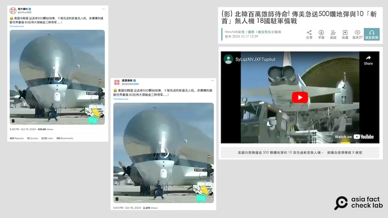

# 事實查覈｜朝韓局勢升溫，視頻顯示美國給韓國送武器？ 18國聯軍集結？

作者：董喆

2024.10.18 15:11 EDT

## 查覈結果：錯誤

## 一分鐘完讀：

朝韓局勢緊張之際，X帳號有消息流傳，美國已經向韓國運了“500顆鑽地炸彈以及10架斬首無人機”，並附視頻爲證，臺灣新聞媒體新頭殼也引用這則視頻。另有一則網傳視頻則稱，有18個國家的駐軍正往朝韓軍事分界“三八線”處集結。

亞洲事實查覈實驗室進一步檢視此兩條視頻，發現第一則視頻是2013年美國運輸兩架退役T-38飛機的舊畫面，並非美國向韓國運輸軍備；而另一則中所謂“18個國家的駐軍集結”的畫面，其實是2023年韓國建軍節遊行。

## 深度分析：

## “美向韓送武器”實爲多年前飛機退役畫面

朝鮮半島局勢升溫,X上有多個帳號發表同一則視頻( [1](https://archive.ph/IWO2l), [2](https://archive.ph/jjuCZ)),稱美國緊急向韓國運送500顆鑽地彈以及10架斬首無人機,臺灣網路媒體新頭殼的新聞報道中亦 [引述該視頻](https://archive.ph/VcRWN)。

網傳“美國向韓國提供”無人機影片，與2013年NASA發佈的飛機退役影片畫面相同，（X、NASA Youtube頻道截圖）

【圖2】網傳“美國向韓國提供”無人機影片，與2013年NASA發佈的飛機退役影片畫面相同，（X、NASA Youtube頻道截圖）

根據視頻描述，2013年3月26日NASA使用“超級大白鯨”運輸兩架退役T-38飛機，運往德州埃爾帕索進行後續拆解及回收。超級大白鯨正式名稱爲“空中巴士A300-600ST”，是用大型貨物的特殊用途貨機。

NASA阿姆斯壯飛行研究中心(NASA Armstrong Flight Research Center)的Youtube亦可找到對此事件的 [記錄](https://www.youtube.com/watch?v=aSxFe93pYCA&ab_channel=NASAArmstrongFlightResearchCenter)。

## 網傳“18國聯軍”實爲韓國建軍節慶祝視頻

另外,新頭殼報道中亦引述 [X消息](https://archive.ph/IWQMa),稱已經進駐首爾的"18國聯軍"準備開往三八線 ,開始進入緊急備戰狀態。 AFCL根據影片中出現多組軍儀仗隊以及路旁兩側有民衆夾道,推測應是建軍節等活動畫面。但根據今年韓國建軍節直播,天氣晴朗,與網傳視頻民衆有撐傘的天氣不符。

部分X賬號、臺灣媒體新頭殼再傳有“18國聯軍”進駐朝韓邊境的錯誤信息。（X、youtube截圖）

因此再往前推至 [2023年KBS的直播畫面](https://www.youtube.com/watch?v=REjEC2_R56k&ab_channel=KBSNews),可以看到當天天氣陰雨,且有兩段畫面與網傳視頻出現的軍種相同,分別是35分26秒處持船槳的士兵以及36秒34分處空軍儀仗隊。

對比可見，所謂“18國聯軍”進駐朝韓邊境，與2023年韓國建軍節慶祝畫面相似。（網傳視頻、KBS Youtube 頻道截圖）

根據KBS視頻資訊，遊行起迄點爲崇禮門與光化門，網傳視頻中不斷出現一個知名連鎖咖啡廳的標誌，AFCL以韓國地圖服務Naver進行檢索，發現在崇禮門與光化門之間的星巴克首爾政府廳R店，與網傳視頻畫面一致，因此確定網傳視頻其實是2023年建軍節遊行，並非“18國聯軍集結”。

網傳畫面中街景，與2023年建軍節慶祝遊行路線中的首爾街景相符。（網傳視頻、Naver地圖截圖）

綜合上述發現，兩則網傳視頻街與朝韓衝突無關，是移花接木的錯誤資訊。

*亞洲事實查覈實驗室(Asia Fact Check Lab)針對當今複雜媒體環境以及新興傳播生態而成立。我們本於新聞專業主義,提供專業查覈報告及與信息環境相關的傳播觀察、深度報道,幫助讀者對公共議題獲得多元而全面的認識。讀者若對任何媒體及社交軟件傳播的信息有疑問,歡迎以電郵*  [*afcl@rfa.org*](mailto:afcl@rfa.org)  *寄給亞洲事實查覈實驗室,由我們爲您查證覈實。* *亞洲事實查覈實驗室在X、臉書、IG開張了,歡迎讀者追蹤、分享、轉發。X這邊請進:中文*  [*@asiafactcheckcn*](https://twitter.com/asiafactcheckcn)  *;英文:*  [*@AFCL\_eng*](https://twitter.com/AFCL_eng)  *、*  [*FB在這裏*](https://www.facebook.com/asiafactchecklabcn)  *、*  [*IG也別忘了*](https://www.instagram.com/asiafactchecklab/)  *。*

[Original Source](https://www.rfa.org/mandarin/shishi-hecha/hc-the-two-koreas-relation-10182024151023.html)