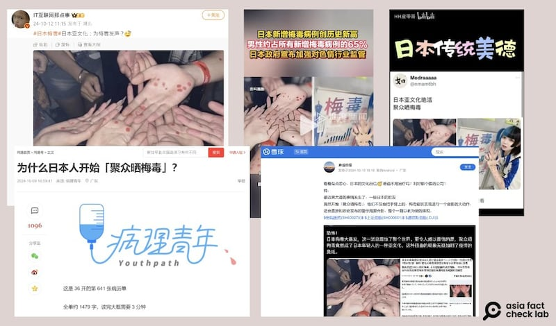
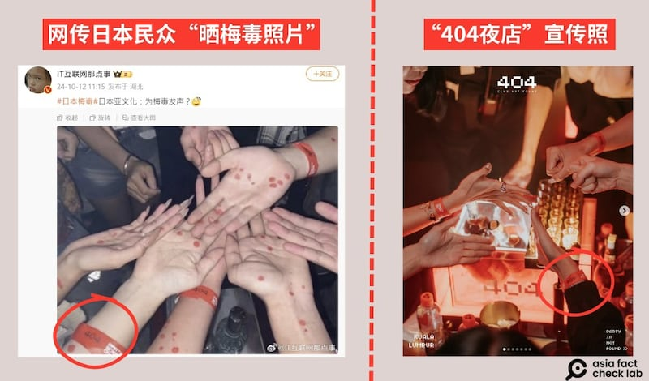

# 事實查覈｜網傳照片顯示日本人聚衆“曬梅毒照”？

作者：艾倫

2024.10.19 12:22 EDT

## 查覈結果：錯誤

## 一分鐘完讀：

10月初，多箇中文社媒及網路平臺盛傳日本人在梅毒感染爆發期間，聚衆“曬梅毒照”，並附上照片，圖中顯示一羣人正在展示帶有紅點的手臂。

亞洲事實查覈實驗室（Asia Fact Check Lab，下稱AFCL）查覈其中一張流傳較廣的圖片，發現該圖的拍攝地點應該是在中國，而不是日本，而圖片內容其實是民衆在夜店參加主題派對的造型，和梅毒疾病無關。

## 深度分析：

10月8日至14日, [微博](https://weibo.com/1839300134/OBbbz2fyd)、 [抖音](https://www.douyin.com/video/7424914669778767130)、 [網易](https://www.163.com/dy/article/JE33ATO205319HYL.html)、 [嗶哩嗶哩](https://www.bilibili.com/video/BV1EG2EY6ELY/?spm_id_from=333.788.recommend_more_video.7)等社交平臺及 [投資網絡社區"雪球"](https://xueqiu.com/5669998349/307526286)都在傳播一則消息:有日本人"聚衆曬梅毒照",並附上一張數隻手上帶有紅點的照片作爲證據,微博博主甚至稱:"日本亞文化:爲梅毒發聲?"

[梅毒](https://www.who.int/zh/news-room/fact-sheets/detail/syphilis)是世界上發病率最高的 [性接觸感染疾病之一](https://www.who.int/zh/news-room/fact-sheets/detail/sexually-transmitted-infections-(stis))。今年9月,日本衛生部門通報,日本新增梅毒案例創歷史新高,該新聞被多家主流中文媒體 [轉載傳播](https://m.gmw.cn/2024-10/12/content_1303869547.htm),在中國引發不少討論。然而,梅毒疫情並非日本獨有,是困擾許多國家的傳染病,有科普作者 [發文解釋](https://new.qq.com/rain/a/20241012Q06D3B00),中國的梅毒案例絕對數量是日本的30多倍,發病比例也比日本高出三四倍,同時美國、英國、澳大利亞等國的疫情也不樂觀。

一開始傳播"日本聚衆曬梅毒照"消息的爲X上中文 [帳號](https://x.com/nmamtbh)"Modraaaaa",該用戶寫道:"日本亞文化絕活"、"聚衆曬梅毒",並附上其他帳號也轉傳過的"梅毒症狀"照片。不過,原文目前已遭刪除。

曾轉傳此消息的社媒用戶還包括AFCL查覈多次的微博大V“孤煙暮蟬”，但和“Modraaaaa”的狀況一樣，該帳號也已刪文。

近期，中文社交媒體出現日本人羣聚“曬梅毒照”的傳言。（圖取自微博、抖音、網易、雪球）

檢視"日本人集體秀梅毒"的照片,會看到圖裏的手環上印有"404"及"party"等字樣。 AFCL再以關鍵字反搜,找到中國ICG娛樂集團旗下的"404 Club Not Found"夜店,其 [官網](https://www.404clubnotfound.com/)和Instagram( [1](https://www.instagram.com/p/C4xxlSCBm1j/), [2](https://www.instagram.com/p/C5S9_NnR8Nx/?img_index=2))上多張活動照片中都有顧客佩戴橘色、且印有"404 "字樣的夜店手環,與網傳照片中的手環非常類似。

網傳“梅毒照”上羣衆戴的手環，和中國夜店品牌404 Club Not Found的宣傳照所示相同。（微博、Instagram截圖）

根據官網信息，404夜店除了在中國包含上海、杭州等30多個城市營業，版圖也已擴張到馬來西亞吉隆坡，但並沒有在日本經營。因此，傳言所稱的聚衆的照片並非攝於日本。

AFCL向“404夜店”查詢網傳照片是不是店內活動照片，該夜店吉隆坡分店一名工作人員在與廣西南寧店求證後，向AFCL證實，這張圖是一羣顧客在廣西南寧的該夜店玩“滴蠟”遊戲時所攝，圖中的紅點應爲蠟燭印記。

此外,也有微博博主"紀春生在美國"也曾 [發文](https://weibo.com/5662005485/OBbNwgJ1N)駁斥這則傳言,附上一張據稱是攝於404夜店的"滴蠟派對"照片,該照片雖然與網傳照片細節不同,但背景、人物佩戴的手環樣式,均和網傳照片相似,提供了網傳照片並非"日本梅毒照"的進一步佐證。

中國事實查覈中心 [NJU核真錄](https://news.ifeng.com/c/8djeJgDCgrg)也對該信息進行了查覈。

*亞洲事實查覈實驗室(Asia Fact Check Lab)針對當今複雜媒體環境以及新興傳播生態而成立。我們本於新聞專業主義,提供專業查覈報告及與信息環境相關的傳播觀察、深度報道,幫助讀者對公共議題獲得多元而全面的認識。讀者若對任何媒體及社交軟件傳播的信息有疑問,歡迎以電郵*  [*afcl@rfa.org*](mailto:afcl@rfa.org)  *寄給亞洲事實查覈實驗室,由我們爲您查證覈實。* *亞洲事實查覈實驗室在X、臉書、IG開張了,歡迎讀者追蹤、分享、轉發。X這邊請進:中文*  [*@asiafactcheckcn*](https://twitter.com/asiafactcheckcn)  *;英文:*  [*@AFCL\_eng*](https://twitter.com/AFCL_eng)  *、*  [*FB在這裏*](https://www.facebook.com/asiafactchecklabcn)  *、*  [*IG也別忘了*](https://www.instagram.com/asiafactchecklab/)  *。*

[Original Source](https://www.rfa.org/mandarin/shishi-hecha/hc-japan-std-photos-10182024151849.html)