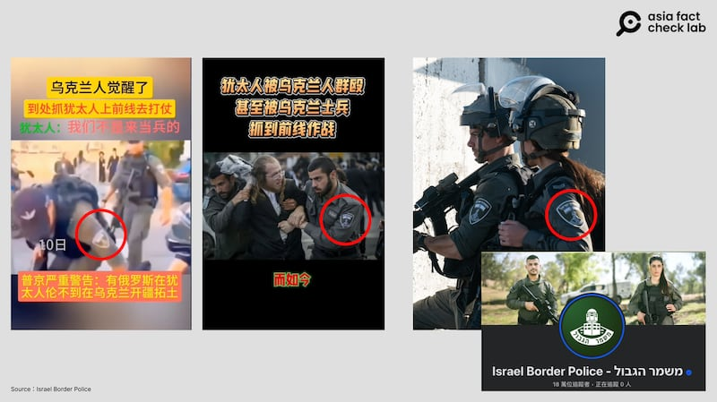
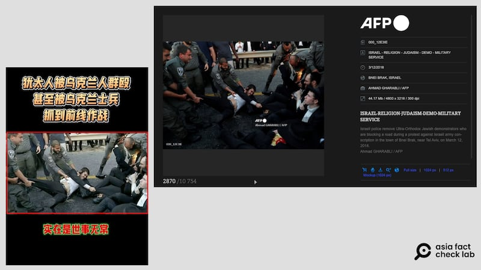
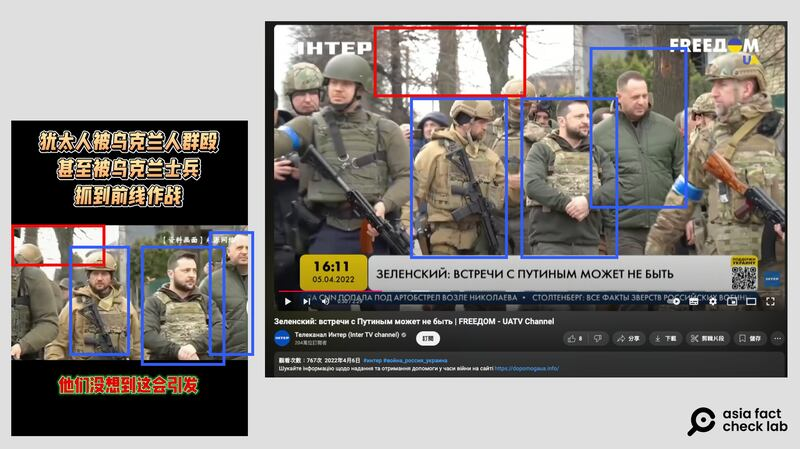

# 事實查覈｜網傳視頻中烏克蘭士兵抓猶太人上前線？

作者：董喆

2024.10.21 14:27 EDT

## 查覈結果：錯誤

## 一分鐘完讀：

中國社羣平臺抖音上有網民發文，稱烏克蘭士兵“正大量抓捕猶太人上前線作戰”，並附上視頻作爲“證據”。

經查覈發現，該視頻中被稱爲是在“抓捕猶太教正統派信衆”的執法人員，身着的是以色列的軍警制服，與烏克蘭無關。且視頻中部分畫面出自多年前“正統派”中的“哈西迪教派”信衆上街頭抗議兵役問題的舊照，網傳烏軍抓捕猶太人上前線的視頻爲錯誤資訊。

## 深度分析：

10月初正逢猶太新年，猶太教哈西迪教派根據習俗前往烏克蘭烏曼市朝聖，此宗教活動被中國社羣平臺部分帳號曲解，稱猶太人要在烏克蘭“建設新國家”，亞洲事實查覈實驗室曾對此發表查覈報告。

* [事實查覈|大批猶太人湧進烏克蘭要"建新國家"?](2024-10-14_事實查覈｜大批猶太人湧進烏克蘭要"建新國家"？.md)

近期,這項傳言有了新的變形,中國社羣平臺抖音出現視頻( [1](https://v.douyin.com/iBK1Wyo9/), [2](https://v.douyin.com/iBKmVREu/)),稱烏軍不滿大量猶太人湧入烏克蘭領土,因此展開抓捕,要"送猶太人到前線作戰"。

亞洲事實查覈實驗室根據影片中的多個片段進行查覈，發現這些視頻移花接木大量以色列境內的警民衝突畫面，並與烏克蘭總統澤連斯基過往巡視烏克蘭戰場的畫面拼湊，並未有任何烏軍實際抓捕猶太教徒的畫面。

首先,視頻中身着制服抓捕猶太教徒者,根據其制服臂章,判斷其爲 [以色列邊境警察](https://www.facebook.com/ILBorderPolice),而非烏克蘭軍人。

網傳視頻中的“烏克蘭士兵”實爲以色列邊境警察。（抖音、以色列邊境警察臉書專頁截圖）

近一步以視頻中照片反搜，可以發現中一張照片出自法新社的攝影記者Ahmad Gharabli，事發時間爲2018年3月12日，以色列警方在特拉維夫附近的貝內布拉克鎮，清除封鎖道路抗議以色列徵兵的正統猶太教示威者，亦與烏軍抓捕猶太人無關。

網傳視頻中烏克蘭士兵“羣毆”猶太人的畫面，實爲2018年以色列國內的抗議畫面。（抖音、AFP截圖）

另外,視頻中穿插剪輯了烏克蘭總統澤連斯基的軍服照,亞洲事實查覈實驗室比對烏克蘭地方電視臺Інтер的 [新聞畫面](https://www.youtube.com/watch?v=4ZKb32-ovNY&ab_channel=%D0%A2%D0%B5%D0%BB%D0%B5%D0%BA%D0%B0%D0%BD%D0%B0%D0%BB%D0%98%D0%BD%D1%82%D0%B5%D1%80%28InterTVchannel%29),此爲2022年4月澤連斯基走訪遭俄軍大規模屠殺的布查市,雖抖音視頻標註資料畫面,但加上無中生有的字卡,易生誤解。

網傳視頻中澤連斯基的畫面，則來自2022年的烏克蘭電視新聞畫面。（抖音、烏克蘭Інтер電視臺截圖）

中國抖音視頻散佈錯誤資訊，實際利用了以色列國內多年來爭議不休的正統派猶太教兵役爭議抗爭。

根據 [《德國之聲》報道](https://www.dw.com/en/israel-parliament-passes-law-to-conscript-ultra-orthodox-jews/a-17489303),以色列國會在2014年3月修法,撤銷1984年以來一系列建國以來免除極正統猶太教派免服兵役的條款,該法案自2017年生效,引發極正統派猶太教圖不滿,多次爆發街頭抗爭。

近期因以色列在加薩走廊的衝突未歇,爲了徵召更多兵力, [《以色列時報》報道](https://www.timesofisrael.com/the-army-must-soon-begin-enlisting-ultra-orthodox-men-how-will-that-work/),以國最高法院6月裁定軍方立刻開始徵招極正統猶太教男性服役,再度引發街頭抗爭。

*亞洲事實查覈實驗室(Asia Fact Check Lab)針對當今複雜媒體環境以及新興傳播生態而成立。我們本於新聞專業主義,提供專業查覈報告及與信息環境相關的傳播觀察、深度報道,幫助讀者對公共議題獲得多元而全面的認識。讀者若對任何媒體及社交軟件傳播的信息有疑問,歡迎以電郵*  [*afcl@rfa.org*](mailto:afcl@rfa.org)  *寄給亞洲事實查覈實驗室,由我們爲您查證覈實。* *亞洲事實查覈實驗室在X、臉書、IG開張了,歡迎讀者追蹤、分享、轉發。X這邊請進:中文*  [*@asiafactcheckcn*](https://twitter.com/asiafactcheckcn)  *;英文:*  [*@AFCL\_eng*](https://twitter.com/AFCL_eng)  *、*  [*FB在這裏*](https://www.facebook.com/asiafactchecklabcn)  *、*  [*IG也別忘了*](https://www.instagram.com/asiafactchecklab/)  *。*

[Original Source](https://www.rfa.org/mandarin/shishi-hecha/hc-ukraine-war-jewish-soldiers-10212024142641.html)