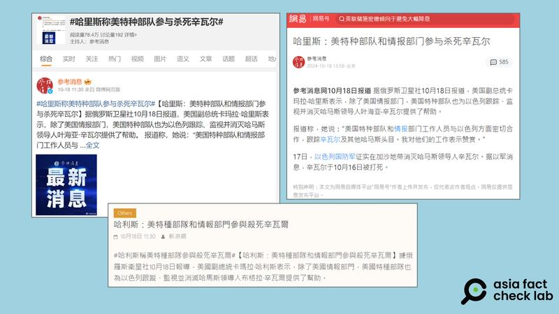

# 事實查覈｜副總統哈里斯證實“美國參與殺死辛瓦爾”？

作者：莊敬

2024.10.22 13:10 EDT

## 查覈結果：誤導

## 一分鐘完讀：

巴勒斯坦武裝組織哈馬斯領導人辛瓦爾遭以色列部隊擊斃。許多中國媒體報道了相關消息，其中《參考消息》、新浪網等媒體和網絡平臺以“哈里斯：美特種部隊和情報部門參與殺死辛瓦爾”爲題發表文章，在社媒上迅速傳播。

前述標題“引用”了美國副總統哈里斯的談話，但經查,她的原話並非如此，在一次演講中，她表示，美國特種作戰和情報人員與以色列同行密切合作，尋找和追蹤辛瓦爾和其他哈馬斯領導人，並不是“美國參與殺死辛瓦爾”。

## 深度分析：

根據《 [紐約時報](https://cn.nytimes.com/world/20241018/hamas-sinwar-gaza-israel/zh-hant/)》、《 [美國之音](https://www.voacantonese.com/a/israel-kills-hamas-leader-in-gaza-who-was-architect-of-last-octobers-terror-attack-20241017/7826620.html)》等媒體報道,以色列10月17日宣佈,已擊斃巴勒斯坦武裝組織哈馬斯(Hamas)領導人辛瓦爾(Yahya Sinwar),他是策劃2023年10月7日襲擊以色列行動、引發加沙戰爭的關鍵人物。此後,以色列一直在追捕辛瓦爾,直到最近的一場軍事行動中,以軍擊斃幾名哈馬斯成員,經比對DNA後發現其中一名死者是辛瓦爾。

以色列證實擊斃辛瓦爾後,美國總統 [拜登](https://www.whitehouse.gov/briefing-room/statements-releases/2024/10/17/statement-from-president-joe-biden-on-the-death-of-yahya-sinwar/)、副總統暨11月大選民主黨總統候選人 [哈里斯](https://www.whitehouse.gov/briefing-room/speeches-remarks/2024/10/17/remarks-by-vice-president-harris-on-the-death-of-yahya-sinwar/)(Kamala Harris,又譯賀錦麗)皆針對此事發言。拜登表示,在去年10月7日大屠殺事件後,他指示特別行動人員和情報專家,與以色列方面合作,幫助尋找並追蹤躲藏在加薩地區的辛瓦爾等哈馬斯領袖。

亞洲事實查覈實驗室(Asia Fact Check Lab,下簡稱AFCL)注意到,中國官方媒體《參考消息》的 [微博賬號](https://m.weibo.cn/detail/5090789242178996)於10月18日發佈報道《 [哈里斯:美特種部隊和情報部門參與殺死辛瓦爾](https://m.weibo.cn/detail/5090789242178996)》,並在微博引領話題"#哈里斯稱美特種部隊參與殺死辛瓦爾#",消息迅速傳入各大平臺,包括 [新浪網](https://portal.sina.com.hk/others/sina/2024/10/18/1011708/%E5%93%88%E5%88%A9%E6%96%AF%EF%BC%9A%E7%BE%8E%E7%89%B9%E7%A8%AE%E9%83%A8%E9%9A%8A%E5%92%8C%E6%83%85%E5%A0%B1%E9%83%A8%E9%96%80%E5%8F%83%E8%88%87%E6%AE%BA%E6%AD%BB%E8%BE%9B%E7%93%A6%E7%88%BE/)、 [網易](https://m.163.com/dy/article/JEPNL5MB0514BQ68.html?clickfrom=subscribe&spss=adap_pc)、 [抖音](https://www.douyin.com/video/7426997070814301494),都能看到這個標題。

《參考消息》等中國媒體發文，標題爲“哈里斯：美特種部隊和情報部門參與殺死辛瓦爾”。（圖取自微博、新浪網、網易）

《參考消息》內文指出,它是根據《俄羅斯衛星通訊社》10月18日的報道。經查, [俄羅斯衛星通訊社](https://big5.sputniknews.cn/20241018/1062113930.html)10月18日發佈相關報道,標題是《哈里斯:美國特種部隊爲以色列跟蹤監視哈馬斯領導人提供了幫助》,內容寫到哈里斯說:"美國特種部隊和情報部門工作人員與以色列方面密切合作,計算並跟蹤辛瓦爾及其他哈馬斯頭目,我對他們的工作表示讚賞。"

上述哈里斯的發言出自她在得知辛瓦爾遭擊斃後,於威斯康辛大學密爾瓦基分校發表的談話。根據白宮發佈的 [文字記錄](https://www.whitehouse.gov/briefing-room/speeches-remarks/2024/10/17/remarks-by-vice-president-harris-on-the-death-of-yahya-sinwar/),哈里斯確實說到美國人員與以色列密切合作,幫助追蹤辛瓦爾,但她並沒有說"美國參與殺死辛瓦爾"。

至於美國是否直接參與襲擊辛瓦爾的行動，美國國防部發言人萊德（Pat Ryder）在10月17日記者會上明確說明，這是以色列的一次行動，沒有美軍直接參與其中；美國幫助提供追蹤哈馬斯領袖的有關信息與情報。

美國在該行動的具體參與情況，AFCL並無法查覈，然而，公開報道中，副總統哈里斯並沒有“承認美國參與殺死辛瓦爾”。中國媒體和社交媒體傳播的“哈里斯稱美特種部隊參與殺死辛瓦爾”的說法爲誤導信息。

*亞洲事實查覈實驗室(Asia Fact Check Lab)針對當今複雜媒體環境以及新興傳播生態而成立。我們本於新聞專業主義,提供專業查覈報告及與信息環境相關的傳播觀察、深度報道,幫助讀者對公共議題獲得多元而全面的認識。讀者若對任何媒體及社交軟件傳播的信息有疑問,歡迎以電郵*  [*afcl@rfa.org*](mailto:afcl@rfa.org)  *寄給亞洲事實查覈實驗室,由我們爲您查證覈實。* *亞洲事實查覈實驗室在X、臉書、IG開張了,歡迎讀者追蹤、分享、轉發。X這邊請進:中文*  [*@asiafactcheckcn*](https://twitter.com/asiafactcheckcn)  *;英文:*  [*@AFCL\_eng*](https://twitter.com/AFCL_eng)  *、*  [*FB在這裏*](https://www.facebook.com/asiafactchecklabcn)  *、*  [*IG也別忘了*](https://www.instagram.com/asiafactchecklab/)  *。*

[Original Source](https://www.rfa.org/mandarin/shishi-hecha/hc-hamas-leader-yahya-sinwar-killed-in-gaza-10222024130942.html)