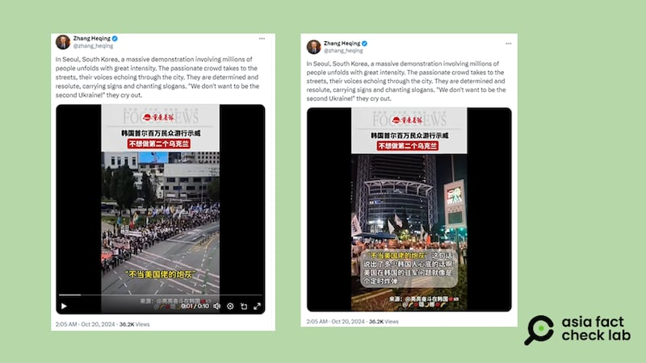
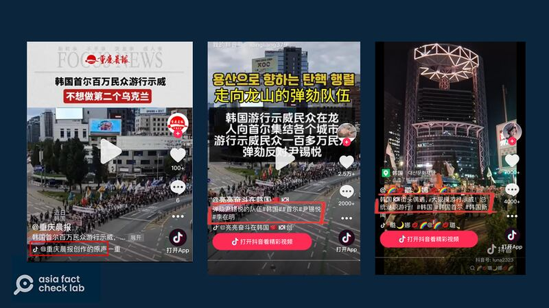
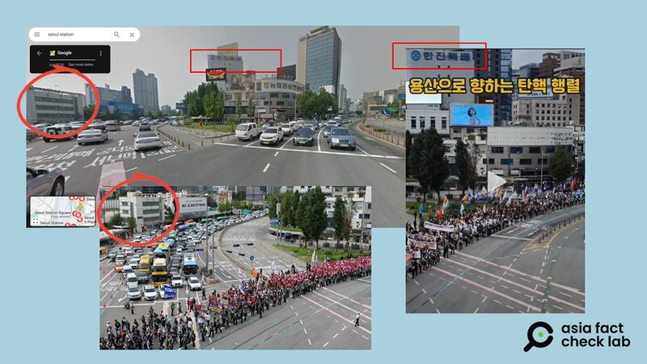
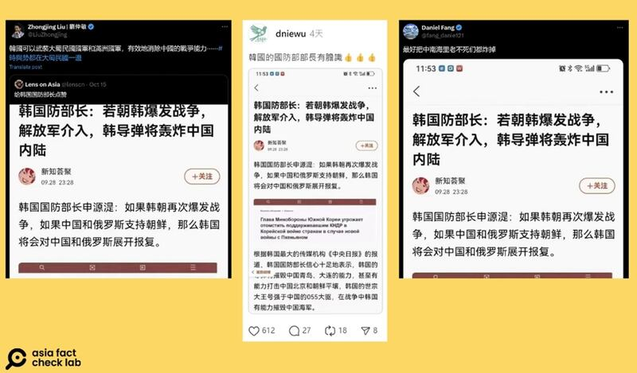

# 事實快查｜韓國百萬人遊行反戰？中國遭韓國導彈恐嚇？

作者：鄭崇生、艾倫

2024.10.23 18:34 EDT

隨着朝鮮半島局勢升級,中文社媒平臺上相關虛假訊息也不斷傳出,亞洲事實查覈實驗室繼日前發佈兩篇相關查覈報告( [1](2024-10-17_事實快查｜朝鮮半島局勢升溫，錯假消息大行其道.md)、 [2](2024-10-18_事實查覈｜朝韓局勢升溫，視頻顯示美國給韓國送武器？ 18國聯軍集結？.md))後,持續查覈並發現了以下不實信息:

## 一、百萬韓國人遊行抗議，不想成爲烏克蘭第二？

## 查覈結果：移花接木

中國駐巴基斯坦外交官張和清20日在X平臺 [發文](https://archive.ph/KXW9v),稱"上百萬人走上首爾街頭,他們意志堅定地高喊着:不想成爲第二個烏克蘭",推文附有來自地方官媒 [《重慶晨報》官方抖音賬號](https://v.douyin.com/iSrHqHRR/)的視頻,這段視頻中的中文字幕寫着"不當美國佬的炮灰,是許多韓國人的心裏話。"

張和清發帖稱韓國民衆“不想成爲第二個烏克蘭”，首爾發生百萬人遊行。 圖截取自X

亞洲事實查覈實驗室發現,《重慶晨報》引用的視頻上,有 ["亮亮奮鬥在韓國"](https://www.douyin.com/video/7425777949460221238)以及 ["璐娜"](https://www.douyin.com/video/7422232222511467827)兩個抖音賬號的標誌。覈對兩個賬號發佈的原視頻發現,《重慶晨報》對視頻的聲音進行了重新加工,用其中一段視頻的喊口號聲覆蓋了另一段,被覆蓋的一段原本並沒有口號聲。

此外，《重慶晨報》也變造了原影像的字幕。查覈發現，原本“亮亮奮鬥在韓國”和“璐娜”兩則視頻的下方都註明這是首爾民衆抗議現任總統尹錫悅，要求彈劾他（如下截圖）。

《重慶晨報》的視頻（左），合成了中與右的內容，但兩者都註明是“要求彈劾尹錫悅”。（截圖取自抖音/AFCL製圖）

爲了查覈這場示威活動的詳細信息，亞洲事實查覈實驗室先將“亮亮奮鬥在韓國”上傳的視頻和韓聯社照片相對照，並在谷歌地圖中搜索影像中的建築物與道路，確定地點是鄰近首爾站的世宗大路與統一路的交叉口。

接着搜索與之相關的新聞發現, [《韓國先驅報》](https://news.koreaherald.com/common/newsprint.php?ud=20240928050094)(Korean Herald)等媒體報道了這場示威活動,這是今年9月28日,以韓國最大在野黨共同民主黨爲首的團體,集結民衆上街要求彈劾尹錫悅的遊行示威活動,報道引述了韓國警方的估計稱當時參與的人數約5000人。

抖音視頻中的場景與9月28日活動現場新聞圖片的對照 圖取自谷歌地圖、韓聯社及抖音

9月28日的遊行與10月半島的緊張局勢無關，當時現場民衆的訴求也不是“不要做第二個烏克蘭”及“不當美國佬炮灰”，《重慶晨報》發佈的影片字幕與視頻中的事件無關。而張和清引用了《重慶晨報》的錯誤解讀，將編造字幕的視頻從抖音搬運到X上發表，繼續傳播了不實信息。

## 二、韓防長威脅中國不準插手半島，否則將“導彈炸內陸”？

## 查覈結果：錯誤

朝鮮半島緊張之際, [Threads](https://www.threads.net/@dniewu/post/DBNnp4sSfHp)及X( [1](https://x.com/lenscn/status/1846107250395697349), [2](https://x.com/LiuZhongjing/status/1846149057716043827), [3](https://x.com/DXDWX999/status/1846353100376101347), [4](https://x.com/fang_danie121/status/1846166323753373867), [5](https://x.com/zhihui999/status/1846391220513222819))上有消息宣稱韓國國防部長申源湜警告,如果朝韓再次爆發戰爭,而中國和俄羅斯又介入並支持朝鮮,韓國將展開報復。

相關帖文均附有截圖，宣稱申源湜的談話引述自韓國《中央日報》，該報道稱申源湜指出韓國的軍力有能力摧毀中國青島、大連、北京，以及中國海軍。

十月中，社媒上出現大量“韓國將轟炸中國內陸”的文章。圖取自X、Threads

將截圖內文章的標題文字在谷歌上搜尋，發現網易曾發佈同標題文章，文章的跟帖區可看到許多中國網民對韓國如此“發言”持嗤之以鼻的態度。有評論稱：“如果中俄真的支援朝鮮，美帝軍隊都會逃之夭夭”

由此可看出，網傳所謂韓國的新聞，引用的照片卻是俄文消息，且該標題經翻譯後也未出現“中國”二字。

AFCL以上述標題翻成韓文，再以關鍵字於韓國網站上反搜，查無任何官方或可信的報道曾提及申源湜說過類似的話。

《中央日報》全國新聞組記者Jieun Seo（韓文名：서지은）也告訴AFCL，該報不曾報道過申源湜有類似說法。AFCL也已致信韓國駐美及駐中大使館，但至截稿日（10月22日）尚未獲回應。

因此，不僅網傳申源湜的說法沒有根據，所謂引述《中央日報》的報道也是錯假信息。

（自由亞洲電臺韓語組記者Jaywoo Park對本篇報告有貢獻）

*亞洲事實查覈實驗室(Asia Fact Check Lab)針對當今複雜媒體環境以及新興傳播生態而成立。我們本於新聞專業主義,提供專業查覈報告及與信息環境相關的傳播觀察、深度報道,幫助讀者對公共議題獲得多元而全面的認識。讀者若對任何媒體及社交軟件傳播的信息有疑問,歡迎以電郵*  [*afcl@rfa.org*](mailto:afcl@rfa.org)  *寄給亞洲事實查覈實驗室,由我們爲您查證覈實。* *亞洲事實查覈實驗室在X、臉書、IG開張了,歡迎讀者追蹤、分享、轉發。X這邊請進:中文*  [*@asiafactcheckcn*](https://twitter.com/asiafactcheckcn)  *;英文:*  [*@AFCL\_eng*](https://twitter.com/AFCL_eng)  *、*  [*FB在這裏*](https://www.facebook.com/asiafactchecklabcn)  *、*  [*IG也別忘了*](https://www.instagram.com/asiafactchecklab/)  *。*

[Original Source](https://www.rfa.org/mandarin/shishi-hecha/hc-million-south-koreans-hold-anti-war-protest-fact-check-10232024182711.html)