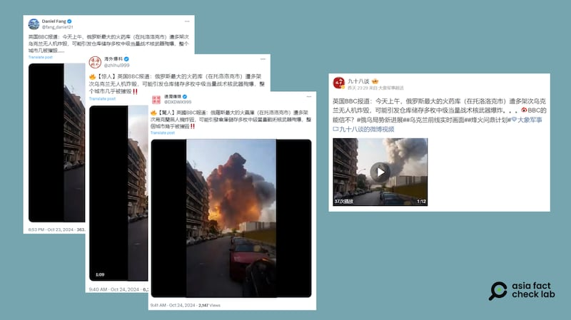

# 事實查覈｜烏克蘭無人機炸燬俄羅斯最大火藥庫？

作者：莊敬

2024.10.24 12:35 EDT

## 查覈結果：錯誤

## 一分鐘完讀：

近日有X、微博用戶傳播一段視頻，畫面看起來是某處發生大規模爆炸，其配文稱俄羅斯最大的火藥庫遭多架次烏克蘭無人機炸燬，可能引發倉庫儲存多枚中級當量戰術核武器殉爆。經查，視頻畫面爲2020年黎巴嫩貝魯特港口爆炸事故，部分社媒用戶挪用無關影像傳播錯誤信息。

## 深度分析：

在X上擁有"藍勾勾"的中文賬號 ( [1](https://twitter.com/fang_danie121/status/1849041484059996536), [2](https://x.com/DXDWX999/status/1849264940454150653), [3](https://twitter.com/zhihui999/status/1849264620994695361))於10月23日至24日間,發佈一段一分多鐘的視頻,畫面是某個地方發生大規模爆炸,配文寫道:"英國BBC報道:今天上午,俄羅斯最大的火藥庫(在託洛洛克市)遭多架次烏克蘭無人機炸燬,可能引發倉庫儲存多枚中級當量戰術核武器殉爆,整個城市幾被摧毀"。亦有微博 ["大V"用戶](https://m.weibo.cn/detail/5092782290764851)近日發佈相同的視頻,以及相似的配文。

中文社媒用戶近日發文稱俄羅斯最大的火藥庫遭烏克蘭無人機炸燬 圖取自X、微博

亞洲事實查覈實驗室（Asia Fact Check Lab，下簡稱AFCL）注意到，視頻29秒處建築外牆上出現“MAVERICK’S CAFE BAR”字樣，經查，這是一家餐廳的名字，這家餐廳位於黎巴嫩。而且在用Google搜尋時，推薦搜索菜單中出現餐廳名與 “explosion（爆炸）”相連的選項，進一步搜尋後所獲得的資訊爲2020年黎巴嫩貝魯特港口爆炸事故。

將網傳視頻分段截圖並以圖反搜後發現,視頻0秒至7秒的場景符合X賬號" [Open Source Intel](https://twitter.com/Osint613/status/1290766295315644416)"於2020年8月初發布的影像。8秒至12秒的場景,則曾出現在" [Global News](https://www.youtube.com/watch?v=LNDhIGR-83w&t=23s)"於2020年8月播出的片段。13秒至20秒的畫面,出自影音授權公司 ["ViralHog"](https://www.youtube.com/watch?v=BnWvq9bQkp0)2020年8月上傳在YouTube的影像。21秒至28秒的畫面,亦曾出現在 ["Sky News](https://www.youtube.com/watch?v=FnSr820S2Mk)"2020年8月播出的影片。29秒至37秒的畫面,符合X賬號" [Jack G. Issa](https://twitter.com/Yaacoubissa/status/1290945819487739904)"於2020年8月初發布的影像。 網傳視頻中的片段還曾重複出現在各類新聞報道中。

上述以圖反搜找到的畫面,都是在2020年8月發佈,且搭配的文字描述都與黎巴嫩貝魯特港口爆炸事故有關。由此可知,最近中文社媒賬號傳播的所謂"俄羅斯火藥庫爆炸"視頻,實際是由多個黎巴嫩貝魯特港口爆炸影像拼湊而成。而黎巴嫩貝魯特港口爆炸事故的影像,過去也曾被網民用來傳播不實資訊,並已有機構發佈 [查覈報告](https://tfc-taiwan.org.tw/articles/9089)。

此外,中文社媒用戶稱消息來自"BBC報道",但並未附上原始新聞。AFCL以英文關鍵字搜尋,僅找到今年9月的 [一篇報道](https://www.bbc.com/news/videos/cwy9pkrpyjdo)與網傳話題接近,內容是烏克蘭打擊位於俄羅斯齊赫列茨克(Tikhoretsk)附近的一座軍火庫,但現場畫面顯示爆發發生於夜晚的郊外而非網傳視頻顯示的白天的城區,報道也沒有說這是俄羅斯"最大"的軍火庫。進一步搜尋,也並沒有查到國際主流媒體在近日報道與網路傳聞情節相同的事件。

*亞洲事實查覈實驗室(Asia Fact Check Lab)針對當今複雜媒體環境以及新興傳播生態而成立。我們本於新聞專業主義,提供專業查覈報告及與信息環境相關的傳播觀察、深度報道,幫助讀者對公共議題獲得多元而全面的認識。讀者若對任何媒體及社交軟件傳播的信息有疑問,歡迎以電郵*  [*afcl@rfa.org*](mailto:afcl@rfa.org)  *寄給亞洲事實查覈實驗室,由我們爲您查證覈實。* *亞洲事實查覈實驗室在X、臉書、IG開張了,歡迎讀者追蹤、分享、轉發。X這邊請進:中文*  [*@asiafactcheckcn*](https://twitter.com/asiafactcheckcn)  *;英文:*  [*@AFCL\_eng*](https://twitter.com/AFCL_eng)  *、*  [*FB在這裏*](https://www.facebook.com/asiafactchecklabcn)  *、*  [*IG也別忘了*](https://www.instagram.com/asiafactchecklab/)  *。*

[Original Source](https://www.rfa.org/mandarin/shishi-hecha/hc-ukraine-bombing-russia-10242024123517.html)