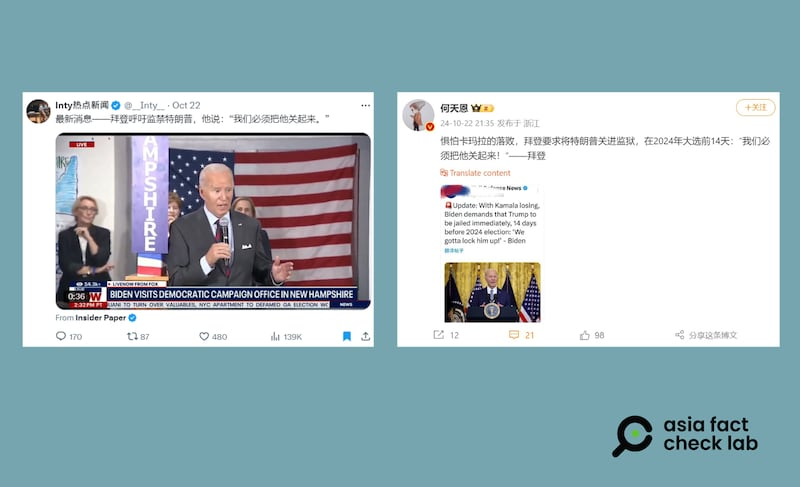

# 事實查覈｜拜登說要把特朗普“關起來”?

作者：鄭崇生

2024.10.25 15:21 EDT

## 查覈結果：誤導

## 一分鐘完讀：

美國總統大選進入最後衝刺階段，中文媒體和社交平臺繼續熱議選舉相關資訊。美國總統拜登（Joe Biden）近日爲民主黨總統候選人哈里斯（Kamala Harris，又譯賀錦麗）助選時談及特朗普，稱要在“政治上封鎖他（ politically lock him up）”，但相關內容在微博上則被斷章取義爲拜登表態要把特朗普“關起來”（lock him up），誤導受衆。

## 深度分析：

所謂拜登要把特朗普”關起來”(lock him up)的發言，出現在他在新罕布什爾州爲哈里斯競選拉票的行程中。

根據路透社的報道，拜登訪問當地民主黨競選辦公室時，先細數特朗普過去針對教育與法制上的一些談話後，緊接着他說道：”我的意思是，我知道這聽起來很奇怪，聽起來就像……如果我5年前這麼說，你們會把我關起來。但我們得把他關起來……（聽衆鼓掌）政治上封鎖他，把他排除在外，這纔是我們該做的。”

拜登談話的英文原文如下：

“ I mean, so I know it sounds bizarre, it sounds like… If I said this five years ago, you would lock me up. We gotta lock him up…… (Applaud) Politically lock him up. Lock him out, that's what we have to do.”

拜登先說了一次”把他(特朗普)關起來”，被現場聽衆掌聲打斷，掌聲過後，拜登補充了一句：“政治上封鎖他”(politically lock him up)。

拜登談話之後,包括X上的" [Inty熱點新聞](https://archive.ph/EQ9Gy)"、以及微博上近300萬粉絲的大V" [何天恩](https://archive.ph/SzEyr)"都在22日當天發佈拜登在新罕布什爾州所謂"lock him up"的談話,但他們的發文都漏掉了拜登緊接着說的""政治上地"(politically)這個字,去脈絡的結果,造成誤導。

中文社媒廣傳美國總統拜登稱要把特朗普“關起來”，但並沒有完整傳播他的原話。（X、微博截圖）

拜登的這番談話確實在美國引發熱烈討論,根據 [福斯新聞](https://www.foxnews.com/media/commentators-insiders-deride-biden-calling-politically-lock-trump-up-no-cleanup-possible)(Fox News),特朗普的競選團隊當天立刻回應,拜登這番說法等於承認了他和哈里斯"一直計劃要在政治上迫害他們的對手特朗普總統,因爲他們無法公平公正地擊敗他。"

大多數美國媒體報道時都完整指出，拜登在說完“把他關起來”這具爭議性的口號後、緊接着補充是指政治上的隔絕特朗普，並加上了特朗普團隊的回應以及所謂“關起來”這句口號在美國政治上的背景，其實是來自特朗普首次競選總統時、他與支持者訴求要將當時的對手希拉里∙克林頓（Hilary Clinton）關起來（Lock her up）。

*亞洲事實查覈實驗室(Asia Fact Check Lab)針對當今複雜媒體環境以及新興傳播生態而成立。我們本於新聞專業主義,提供專業查覈報告及與信息環境相關的傳播觀察、深度報道,幫助讀者對公共議題獲得多元而全面的認識。讀者若對任何媒體及社交軟件傳播的信息有疑問,歡迎以電郵*  [*afcl@rfa.org*](mailto:afcl@rfa.org)  *寄給亞洲事實查覈實驗室,由我們爲您查證覈實。* *亞洲事實查覈實驗室在X、臉書、IG開張了,歡迎讀者追蹤、分享、轉發。X這邊請進:中文*  [*@asiafactcheckcn*](https://twitter.com/asiafactcheckcn)  *;英文:*  [*@AFCL\_eng*](https://twitter.com/AFCL_eng)  *、*  [*FB在這裏*](https://www.facebook.com/asiafactchecklabcn)  *、*  [*IG也別忘了*](https://www.instagram.com/asiafactchecklab/)  *。*

[Original Source](https://www.rfa.org/mandarin/shishi-hecha/hc-biden-trump-10252024152129.html)